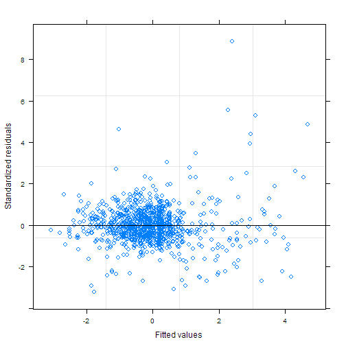
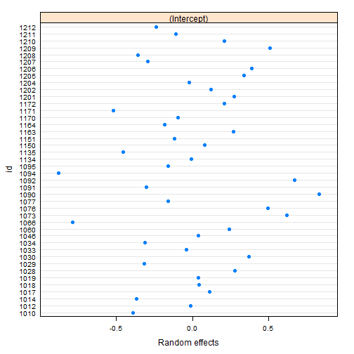
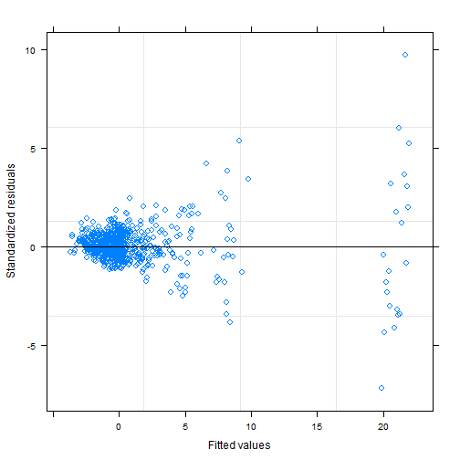
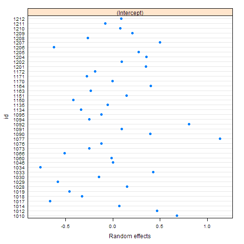
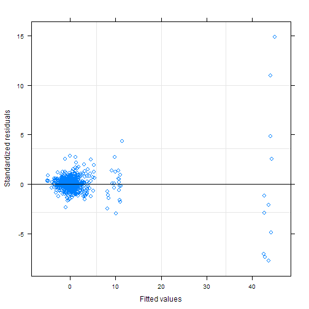
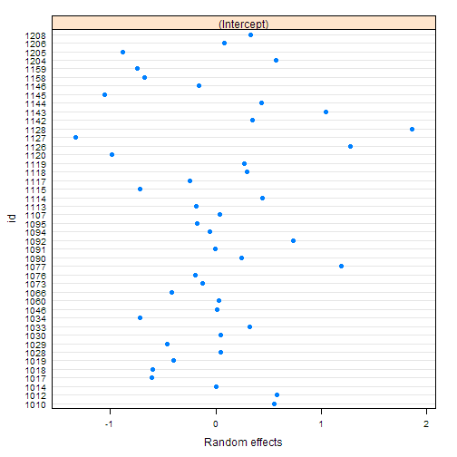

---

# Preamble

Load libraries.


```r
library(readxl)
library(magrittr)
library(dplyr)
```

```
## 
## Attaching package: 'dplyr'
```

```
## The following objects are masked from 'package:stats':
## 
##     filter, lag
```

```
## The following objects are masked from 'package:base':
## 
##     intersect, setdiff, setequal, union
```

```r
library(nlme)
```

```
## 
## Attaching package: 'nlme'
```

```
## The following object is masked from 'package:dplyr':
## 
##     collapse
```

```r
library(broom)
library(ggplot2)
```

```
## Registered S3 methods overwritten by 'ggplot2':
##   method         from 
##   [.quosures     rlang
##   c.quosures     rlang
##   print.quosures rlang
```

```r
library(svglite)
library(knitr)
library(doParallel)
```

```
## Loading required package: foreach
```

```
## Loading required package: iterators
```

```
## Loading required package: parallel
```

Reproducibility steps.


```r
sessionInfo()
```

```
## R version 3.6.0 (2019-04-26)
## Platform: x86_64-w64-mingw32/x64 (64-bit)
## Running under: Windows 10 x64 (build 17134)
## 
## Matrix products: default
## 
## locale:
## [1] LC_COLLATE=English_United States.1252 
## [2] LC_CTYPE=English_United States.1252   
## [3] LC_MONETARY=English_United States.1252
## [4] LC_NUMERIC=C                          
## [5] LC_TIME=English_United States.1252    
## 
## attached base packages:
## [1] parallel  stats     graphics  grDevices utils     datasets  methods  
## [8] base     
## 
## other attached packages:
##  [1] doParallel_1.0.14 iterators_1.0.10  foreach_1.4.4    
##  [4] svglite_1.2.1     ggplot2_3.1.0     broom_0.5.1      
##  [7] nlme_3.1-137      dplyr_0.8.0.1     magrittr_1.5     
## [10] readxl_1.3.1      rmarkdown_1.12    knitr_1.22       
## [13] checkpoint_0.4.5 
## 
## loaded via a namespace (and not attached):
##  [1] Rcpp_1.0.1       cellranger_1.1.0 pillar_1.3.1     compiler_3.6.0  
##  [5] plyr_1.8.4       tools_3.6.0      digest_0.6.18    evaluate_0.13   
##  [9] tibble_2.1.1     gtable_0.3.0     lattice_0.20-38  pkgconfig_2.0.2 
## [13] rlang_0.3.3      xfun_0.5         withr_2.1.2      stringr_1.4.0   
## [17] gdtools_0.1.7    generics_0.0.2   grid_3.6.0       tidyselect_0.2.5
## [21] glue_1.3.1       R6_2.4.0         purrr_0.3.2      tidyr_0.8.3     
## [25] codetools_0.2-16 backports_1.1.3  scales_1.0.0     htmltools_0.3.6 
## [29] assertthat_0.2.1 colorspace_1.4-1 stringi_1.4.3    lazyeval_0.2.2  
## [33] munsell_0.5.0    crayon_1.3.4
```

```r
set.seed(as.integer(as.Date("2016-11-18")))
```

Source user-defined functions.


```r
sapply(list.files("lib", full.names = TRUE), source)
```

```
##         lib/library.R
## value   ?            
## visible FALSE
```

---

# Read data

Import the data.
Data files are locally stored.

## Aim 1-a

Import Aim 1 Amino Acids and TCA Cycle intermediates (Neg).


```r
f <- "data/raw/Z scores Aim 1 Neg-aa.xlsx"
L1a <- importDataToList(f)
L1a[["file"]]
```

```
## [1] "data/raw/Z scores Aim 1 Neg-aa.xlsx"
```

```r
L1a[["dim"]]
```

```
## [1] 984   5
```

```r
L1a[["names"]]
```

```
## [1] "condition"  "id"         "metabolite" "z_value"    "genotype"
```

```r
L1a[["head"]]
```

```
## # A tibble: 6 x 5
##   condition    id metabolite z_value genotype
##   <fct>     <dbl> <fct>        <dbl> <fct>   
## 1 Exercise   1010 FUMARIC     -0.934 KO      
## 2 Exercise   1012 FUMARIC     -1.21  KO      
## 3 Exercise   1014 FUMARIC      0.196 KO      
## 4 Exercise   1017 FUMARIC      0.455 KO      
## 5 Exercise   1018 FUMARIC     -0.580 KO      
## 6 Exercise   1019 FUMARIC     -0.593 KO
```

```r
L1a[["data"]] %>% pull(condition) %>% levels()
```

```
## [1] "Rest"     "Exercise"
```

```r
L1a[["data"]] %>% pull(genotype) %>% levels()
```

```
## [1] "WT" "KO"
```

```r
L1a[["data"]] %>% pull(metabolite) %>% levels()
```

```
##  [1] "alaninesarcosine" "arginine"         "asparagine"      
##  [4] "AsparticAcid"     "CITRIC"           "FUMARIC"         
##  [7] "glutamic"         "glutamine"        "glycine"         
## [10] "histidine"        "isoleucine"       "LACTIC"          
## [13] "leucine"          "lysine"           "MALIC"           
## [16] "methionine"       "METHYLSUCCINIC"   "Phenylalanine"   
## [19] "serine"           "SUCCINIC2"        "threonine"       
## [22] "Tryptophan"       "Tyrosine"         "valine"
```

```r
D1a <- L1a[["data"]]
```

## Aim 1-b

Import Aim 1 Acylcarnitines.


```r
f <- "data/raw/Z scores Aim 1 AC.xlsx"
L1b <- importDataToList(f)
L1b[["file"]]
```

```
## [1] "data/raw/Z scores Aim 1 AC.xlsx"
```

```r
L1b[["dim"]]
```

```
## [1] 899   5
```

```r
L1b[["names"]]
```

```
## [1] "condition"  "id"         "metabolite" "z_value"    "genotype"
```

```r
L1b[["head"]]
```

```
## # A tibble: 6 x 5
##   condition    id metabolite      z_value genotype
##   <fct>     <dbl> <fct>             <dbl> <fct>   
## 1 Exercise   1010 acetylcarnitine   -1.84 KO      
## 2 Exercise   1012 acetylcarnitine   -2.15 KO      
## 3 Exercise   1014 acetylcarnitine   -2.04 KO      
## 4 Exercise   1017 acetylcarnitine   -2.43 KO      
## 5 Exercise   1018 acetylcarnitine   -2.49 KO      
## 6 Exercise   1019 acetylcarnitine   -1.83 KO
```

```r
L1b[["data"]] %>% pull(condition) %>% levels()
```

```
## [1] "Rest"     "Exercise"
```

```r
L1b[["data"]] %>% pull(genotype) %>% levels()
```

```
## [1] "WT" "KO"
```

```r
L1b[["data"]] %>% pull(metabolite) %>% levels()
```

```
##  [1] "2methylbutyrylcarnitine" "3HMG"                   
##  [3] "acetylcarnitine"         "butyrylcarnitine"       
##  [5] "C101total"               "C12"                    
##  [7] "C141total"               "C142total"              
##  [9] "C151total"               "C161total"              
## [11] "C171total"               "C181total"              
## [13] "C182total"               "C191total"              
## [15] "carnitine"               "ethylmalonylcarnitine"  
## [17] "isobutyrylcarnitine"     "methylsuccinylcarnitine"
## [19] "ndecanoylcarnitine"      "nhexanoylcarnitine"     
## [21] "noctanoylcarnitine"      "propionylcarnitine"
```

```r
D1b <- L1b[["data"]]
```

## Aim 2-a

Import Aim 2 Amino Acids and TCA Cycle intermediates (Neg).


```r
f <- "data/raw/Z scores Aim 2 Neg-aa.xlsx"
L2a <- importDataToList(f)
L2a[["file"]]
```

```
## [1] "data/raw/Z scores Aim 2 Neg-aa.xlsx"
```

```r
L2a[["dim"]]
```

```
## [1] 1035    5
```

```r
L2a[["names"]]
```

```
## [1] "condition"  "id"         "metabolite" "z_value"    "genotype"
```

```r
L2a[["head"]]
```

```
## # A tibble: 6 x 5
##   condition    id metabolite z_value genotype
##   <fct>     <dbl> <fct>        <dbl> <fct>   
## 1 C7         1120 FUMARIC      -3.23 KO      
## 2 C7         1126 FUMARIC      -3.22 KO      
## 3 C7         1127 FUMARIC      -3.49 KO      
## 4 C7         1128 FUMARIC      -2.31 KO      
## 5 C7         1142 FUMARIC      -1.73 KO      
## 6 C7         1144 FUMARIC      -1.71 KO
```

```r
L2a[["data"]] %>% pull(condition) %>% levels()
```

```
## [1] "Exercise" "C7"       "C8"
```

```r
L2a[["data"]] %>% pull(genotype) %>% levels()
```

```
## [1] "WT" "KO"
```

```r
L2a[["data"]] %>% pull(metabolite) %>% levels()
```

```
##  [1] "alaninesarcosine" "arginine"         "asparagine"      
##  [4] "AsparticAcid"     "CITRIC"           "FUMARIC"         
##  [7] "glutamic"         "glutamine"        "glycine"         
## [10] "histidine"        "isoleucine"       "LACTIC"          
## [13] "leucine"          "lysine"           "MALIC"           
## [16] "methionine"       "METHYLSUCCINIC"   "Phenylalanine"   
## [19] "serine"           "SUCCINIC2"        "threonine"       
## [22] "Tryptophan"       "Tyrosine"         "valine"
```

```r
D2a <- L2a[["data"]]
```

## Aim 2-b

Import Aim 2 Acylcarnitines.


```r
f <- "data/raw/Z scores Aim 2 AC.xlsx"
L2b <- importDataToList(f)
L2b[["file"]]
```

```
## [1] "data/raw/Z scores Aim 2 AC.xlsx"
```

```r
L2b[["dim"]]
```

```
## [1] 948   5
```

```r
L2b[["names"]]
```

```
## [1] "condition"  "id"         "metabolite" "z_value"    "genotype"
```

```r
L2b[["head"]]
```

```
## # A tibble: 6 x 5
##   condition    id metabolite      z_value genotype
##   <fct>     <dbl> <fct>             <dbl> <fct>   
## 1 C7         1120 acetylcarnitine   -2.57 KO      
## 2 C7         1126 acetylcarnitine   -2.43 KO      
## 3 C7         1127 acetylcarnitine   -2.58 KO      
## 4 C7         1128 acetylcarnitine   -2.11 KO      
## 5 C7         1142 acetylcarnitine   -2.67 KO      
## 6 C7         1143 acetylcarnitine   -2.55 KO
```

```r
L2b[["data"]] %>% pull(condition) %>% levels()
```

```
## [1] "Exercise" "C7"       "C8"
```

```r
L2b[["data"]] %>% pull(genotype) %>% levels()
```

```
## [1] "WT" "KO"
```

```r
L2b[["data"]] %>% pull(metabolite) %>% levels()
```

```
##  [1] "2methylbutyrylcarnitine" "3HMG"                   
##  [3] "acetylcarnitine"         "butyrylcarnitine"       
##  [5] "C101total"               "C12"                    
##  [7] "C141total"               "C142total"              
##  [9] "C151total"               "C161total"              
## [11] "C171total"               "C181total"              
## [13] "C182total"               "C191total"              
## [15] "carnitine"               "ethylmalonylcarnitine"  
## [17] "isobutyrylcarnitine"     "methylsuccinylcarnitine"
## [19] "ndecanoylcarnitine"      "nhexanoylcarnitine"     
## [21] "noctanoylcarnitine"      "propionylcarnitine"
```

```r
D2b <- L2b[["data"]]
```

---

# Model

Basic data preprocessing steps:

1. Find and remove outliers using Grubbs.
2. Standardize by Z score.
3. Check for normality.
4. Transform and recheck normality. We decided not to use transformed data as it did not correct the few conditions with multiple skewed groups.


## Methods

A mixed linear effects model was estimated for each aim.
Fixed effects for Aim 1 were condition (wildtype-rest (ref), wildtype-exercise, knockout-rest, knockout-exercise), and metabolite.
Fixed effects for Aim 2 were condition (wildtype-exercise (ref), knockout-exercise, knockout-C7, knockout-C8), and metabolite.
All 2-way interactions between fixed effects were included in the models.
Animal ID was the random effect.
A compound symmetry correlation structure was assumed.
Estimates for the contrasts comparing each combination of condition and metabolite are presented.
P-values were adjusted to control the false discovery rate, the expected proportion of false discoveries amongst the rejected hypotheses.
The data was analyzed using R version 3.6.0 (2019-04-26) and the `nlme` package version 3.1.137.

Estimate model.
Specify the correlation structure using `cs`.
Use `corCompSymm`, *compound symmetry structure corresponding to a constant correlation*.

**References**

Benjamini, Y., and Hochberg, Y.
(1995).
Controlling the false discovery rate: a practical and powerful approach to multiple testing.
*Journal of the Royal Statistical Society Series B* 57, 289–300.


```r
citation()
```

```
## 
## To cite R in publications use:
## 
##   R Core Team (2019). R: A language and environment for
##   statistical computing. R Foundation for Statistical Computing,
##   Vienna, Austria. URL https://www.R-project.org/.
## 
## A BibTeX entry for LaTeX users is
## 
##   @Manual{,
##     title = {R: A Language and Environment for Statistical Computing},
##     author = {{R Core Team}},
##     organization = {R Foundation for Statistical Computing},
##     address = {Vienna, Austria},
##     year = {2019},
##     url = {https://www.R-project.org/},
##   }
## 
## We have invested a lot of time and effort in creating R, please
## cite it when using it for data analysis. See also
## 'citation("pkgname")' for citing R packages.
```

```r
citation("nlme")
```

```
## 
## Pinheiro J, Bates D, DebRoy S, Sarkar D, R Core Team (2018).
## _nlme: Linear and Nonlinear Mixed Effects Models_. R package
## version 3.1-137, <URL: https://CRAN.R-project.org/package=nlme>.
## 
## A BibTeX entry for LaTeX users is
## 
##   @Manual{,
##     title = {{nlme}: Linear and Nonlinear Mixed Effects Models},
##     author = {Jose Pinheiro and Douglas Bates and Saikat DebRoy and Deepayan Sarkar and {R Core Team}},
##     year = {2018},
##     note = {R package version 3.1-137},
##     url = {https://CRAN.R-project.org/package=nlme},
##   }
```

Set some constants


```r
random <- formula(~ 1 | id)
ctrl <- lmeControl(opt = "optim",
                   maxIter = 500, msMaxIter = 500,
                   tolerance = 1e-6, niterEM = 25, msMaxEval = 200, msTol = 1e-7)
```


## Aim 1

* WT-rest (ref)
* WT-exercise
* KO-rest
* KO-exercise


```r
fixed <- formula(z_value ~
                   genotype +
                   condition +
                   metabolite +
                   genotype * condition +
                   genotype * metabolite +
                   condition * metabolite +
                   genotype * condition * metabolite)
```

### Aim 1-a: Amino Acids and TCA Cycle intermediates (Neg)


```r
t0 <- Sys.time()
M <- estimateModel(data = D1a, fixed, random)
Sys.time() - t0
```

```
## Time difference of 2.177954 secs
```

```r
M %>% plot()
```



```r
M %>% ranef() %>% plot()
```



```r
M %>% anova() %>% kable()
```


|                              | numDF| denDF|    F-value|   p-value|
|:-----------------------------|-----:|-----:|----------:|---------:|
|(Intercept)                   |     1|   850|  0.6111944| 0.4345562|
|genotype                      |     1|    38|  0.0258576| 0.8731004|
|condition                     |     1|    38|  0.0136006| 0.9077740|
|metabolite                    |    23|   850| 10.5205817| 0.0000000|
|genotype:condition            |     1|    38|  1.1042985| 0.2999619|
|genotype:metabolite           |    23|   850|  3.2640881| 0.0000004|
|condition:metabolite          |    23|   850|  7.1521169| 0.0000000|
|genotype:condition:metabolite |    23|   850|  1.4379894| 0.0838042|

```r
fixef <- M %>% tidy(effects = "fixed") %>% filter(grepl("condition", term)) %>% adjustPvalue()
fixef %>% filter(sig) %>% kable()
```


|term                                   | estimate| std.error| statistic|   p.value| p.adjustBH|sig  |
|:--------------------------------------|--------:|---------:|---------:|---------:|----------:|:----|
|conditionExercise:metaboliteTryptophan | 3.233007| 0.8846537|  3.654545| 0.0002734|  0.0131252|TRUE |

```r
fixef %>% write.csv(file = "data/processed/lmeFixedCoefAim1a.csv", row.names = FALSE)
M1a <- M
```

Calculate contrasts of *Exercise vs Rest* given metabolite and genotype.


```r
metabolites <- L1a[["data"]] %>% pull(metabolite) %>% levels()
genotypes <- L1a[["data"]] %>% pull(genotype) %>% levels()
Ftests <- runClusters(D1a, metabolites, genotypes, fixed, random, "condition", "Exercise", ctrl)
```

```
## Loading required package: data.table
```

```
## 
## Attaching package: 'data.table'
```

```
## The following objects are masked from 'package:dplyr':
## 
##     between, first, last
```

```r
Ftests %>% kable(digits = 5)
```


|contrast |metabolite       |genotype |     beta|      se| denDF|  lowerCL|  upperCL|        t| p.value| p.adjustBH|sig   |
|:--------|:----------------|:--------|--------:|-------:|-----:|--------:|--------:|--------:|-------:|----------:|:-----|
|Exercise |alaninesarcosine |WT       | -0.37426| 0.65644|    38| -1.66086|  0.91233| -0.57015| 0.33567|    0.39629|FALSE |
|Exercise |arginine         |WT       | -1.20541| 0.65644|    38| -2.49200|  0.08118| -1.83629| 0.07552|    0.24166|FALSE |
|Exercise |asparagine       |WT       | -0.34403| 0.65644|    38| -1.63063|  0.94256| -0.52409| 0.34440|    0.39629|FALSE |
|Exercise |AsparticAcid     |WT       | -0.63171| 0.67086|    38| -1.94656|  0.68315| -0.94165| 0.25276|    0.39629|FALSE |
|Exercise |CITRIC           |WT       |  1.08549| 0.67417|    38| -0.23586|  2.40685|  1.61011| 0.10943|    0.30768|FALSE |
|Exercise |FUMARIC          |WT       |  0.03760| 0.67417|    38| -1.28376|  1.35896|  0.05577| 0.39569|    0.39629|FALSE |
|Exercise |glutamic         |WT       | -0.00921| 0.65644|    38| -1.29580|  1.27738| -0.01403| 0.39629|    0.39629|FALSE |
|Exercise |glutamine        |WT       | -1.90178| 0.67411|    38| -3.22302| -0.58054| -2.82116| 0.00972|    0.05831|FALSE |
|Exercise |glycine          |WT       | -0.63369| 0.65644|    38| -1.92029|  0.65290| -0.96535| 0.24710|    0.39629|FALSE |
|Exercise |histidine        |WT       | -1.40926| 0.65644|    38| -2.69585| -0.12267| -2.14684| 0.04252|    0.15699|FALSE |
|Exercise |isoleucine       |WT       | -0.07105| 0.65595|    38| -1.35669|  1.21460| -0.10831| 0.39395|    0.39629|FALSE |
|Exercise |LACTIC           |WT       |  0.05173| 0.67417|    38| -1.26963|  1.37309|  0.07673| 0.39513|    0.39629|FALSE |
|Exercise |leucine          |WT       | -0.73412| 0.65595|    38| -2.01977|  0.55152| -1.11917| 0.21058|    0.39629|FALSE |
|Exercise |lysine           |WT       | -2.17233| 0.67411|    38| -3.49357| -0.85109| -3.22249| 0.00357|    0.02445|TRUE  |
|Exercise |MALIC            |WT       |  1.74236| 0.67417|    38|  0.42100|  3.06371|  2.58443| 0.01686|    0.08848|FALSE |
|Exercise |methionine       |WT       | -1.06207| 0.67408|    38| -2.38325|  0.25910| -1.57559| 0.11538|    0.30768|FALSE |
|Exercise |METHYLSUCCINIC   |WT       | -0.58806| 0.70970|    38| -1.97904|  0.80293| -0.82860| 0.27952|    0.39629|FALSE |
|Exercise |Phenylalanine    |WT       |  0.40919| 0.68760|    38| -0.93848|  1.75685|  0.59510| 0.33075|    0.39629|FALSE |
|Exercise |serine           |WT       | -0.86079| 0.65644|    38| -2.14738|  0.42581| -1.31130| 0.16721|    0.39629|FALSE |
|Exercise |SUCCINIC2        |WT       | -0.35796| 0.67417|    38| -1.67932|  0.96340| -0.53096| 0.34313|    0.39629|FALSE |
|Exercise |threonine        |WT       | -1.52864| 0.67086|    38| -2.84350| -0.21379| -2.27864| 0.03262|    0.14232|FALSE |
|Exercise |Tryptophan       |WT       |  2.85874| 0.65644|    38|  1.57215|  4.14534|  4.35494| 0.00015|    0.00354|TRUE  |
|Exercise |Tyrosine         |WT       |  2.27737| 0.65595|    38|  0.99172|  3.56301|  3.47183| 0.00184|    0.01472|TRUE  |
|Exercise |valine           |WT       |  0.51861| 0.65595|    38| -0.76704|  1.80426|  0.79062| 0.28832|    0.39629|FALSE |
|Exercise |alaninesarcosine |KO       | -0.46080| 0.65395|    38| -1.74251|  0.82091| -0.70465| 0.30769|    0.39629|FALSE |
|Exercise |arginine         |KO       | -0.80571| 0.65367|    38| -2.08688|  0.47546| -1.23260| 0.18452|    0.39629|FALSE |
|Exercise |asparagine       |KO       |  0.12812| 0.65312|    38| -1.15197|  1.40821|  0.19617| 0.38858|    0.39629|FALSE |
|Exercise |AsparticAcid     |KO       |  0.21643| 0.65362|    38| -1.06465|  1.49751|  0.33112| 0.37467|    0.39629|FALSE |
|Exercise |CITRIC           |KO       | -0.41523| 0.66783|    38| -1.72414|  0.89368| -0.62177| 0.32534|    0.39629|FALSE |
|Exercise |FUMARIC          |KO       |  0.18169| 0.67117|    38| -1.13379|  1.49716|  0.27070| 0.38171|    0.39629|FALSE |
|Exercise |glutamic         |KO       | -0.45677| 0.65278|    38| -1.73621|  0.82266| -0.69973| 0.30877|    0.39629|FALSE |
|Exercise |glutamine        |KO       | -1.65687| 0.65114|    38| -2.93307| -0.38067| -2.54458| 0.01843|    0.08848|FALSE |
|Exercise |glycine          |KO       | -0.20159| 0.66912|    38| -1.51304|  1.10986| -0.30127| 0.37831|    0.39629|FALSE |
|Exercise |histidine        |KO       | -1.02948| 0.64606|    38| -2.29573|  0.23676| -1.59349| 0.11227|    0.30768|FALSE |
|Exercise |isoleucine       |KO       |  0.51308| 0.64786|    38| -0.75670|  1.78285|  0.79196| 0.28802|    0.39629|FALSE |
|Exercise |LACTIC           |KO       | -0.13608| 0.65540|    38| -1.42065|  1.14849| -0.20763| 0.38766|    0.39629|FALSE |
|Exercise |leucine          |KO       |  2.65159| 0.66366|    38|  1.35083|  3.95235|  3.99538| 0.00042|    0.00474|TRUE  |
|Exercise |lysine           |KO       | -1.41055| 0.64700|    38| -2.67864| -0.14245| -2.18014| 0.03981|    0.15699|FALSE |
|Exercise |MALIC            |KO       |  0.30216| 0.66593|    38| -1.00303|  1.60736|  0.45375| 0.35669|    0.39629|FALSE |
|Exercise |methionine       |KO       | -0.82512| 0.64705|    38| -2.09332|  0.44308| -1.27520| 0.17506|    0.39629|FALSE |
|Exercise |METHYLSUCCINIC   |KO       |  0.21199| 0.65473|    38| -1.07125|  1.49522|  0.32378| 0.37560|    0.39629|FALSE |
|Exercise |Phenylalanine    |KO       |  0.75605| 0.66271|    38| -0.54283|  2.05494|  1.14086| 0.20551|    0.39629|FALSE |
|Exercise |serine           |KO       | -0.31942| 0.66518|    38| -1.62315|  0.98431| -0.48020| 0.35222|    0.39629|FALSE |
|Exercise |SUCCINIC2        |KO       | -1.25729| 0.65510|    38| -2.54126|  0.02668| -1.91923| 0.06524|    0.22369|FALSE |
|Exercise |threonine        |KO       |  0.37703| 0.64778|    38| -0.89260|  1.64666|  0.58203| 0.33334|    0.39629|FALSE |
|Exercise |Tryptophan       |KO       |  2.55778| 0.64869|    38|  1.28637|  3.82919|  3.94298| 0.00049|    0.00474|TRUE  |
|Exercise |Tyrosine         |KO       |  3.80816| 0.68056|    38|  2.47427|  5.14204|  5.59559| 0.00000|    0.00015|TRUE  |
|Exercise |valine           |KO       |  2.69917| 0.64774|    38|  1.42962|  3.96872|  4.16705| 0.00026|    0.00412|TRUE  |

```r
Ftests %>% write.csv(file = "data/processed/contrastsAim1a.csv", row.names = FALSE)
```

### Aim 1-b: Acylcarnitines


```r
t0 <- Sys.time()
M <- estimateModel(data = D1b, fixed, random)
Sys.time() - t0
```

```
## Time difference of 0.640398 secs
```

```r
M %>% plot()
```



```r
M %>% ranef() %>% plot()
```



```r
M %>% anova() %>% kable()
```


|                              | numDF| denDF|    F-value|   p-value|
|:-----------------------------|-----:|-----:|----------:|---------:|
|(Intercept)                   |     1|   773| 28.4004530| 0.0000001|
|genotype                      |     1|    38| 13.4275328| 0.0007537|
|condition                     |     1|    38|  0.0005077| 0.9821416|
|metabolite                    |    21|   773| 87.1190391| 0.0000000|
|genotype:condition            |     1|    38|  1.9545142| 0.1702088|
|genotype:metabolite           |    21|   773| 96.9402594| 0.0000000|
|condition:metabolite          |    21|   773|  2.2555214| 0.0010851|
|genotype:condition:metabolite |    21|   773|  1.3496214| 0.1352562|

```r
fixef <- M %>% tidy(effects = "fixed") %>% filter(grepl("condition", term)) %>% adjustPvalue()
fixef %>% filter(sig) %>% kable()
```


|term | estimate| std.error| statistic| p.value| p.adjustBH|sig |
|:----|--------:|---------:|---------:|-------:|----------:|:---|

```r
fixef %>% write.csv(file = "data/processed/lmeFixedCoefAim1b.csv", row.names = FALSE)
M1b <- M
```

Calculate contrasts of *Exercise vs Rest* given metabolite and genotype.


```r
metabolites <- L1b[["data"]] %>% pull(metabolite) %>% levels()
genotypes <- L1b[["data"]] %>% pull(genotype) %>% levels()
Ftests <- runClusters(D1b, metabolites, genotypes, fixed, random, "condition", "Exercise", ctrl)
Ftests %>% kable(digits = 5)
```


|contrast |metabolite              |genotype |     beta|      se| denDF|  lowerCL|  upperCL|        t| p.value| p.adjustBH|sig   |
|:--------|:-----------------------|:--------|--------:|-------:|-----:|--------:|--------:|--------:|-------:|----------:|:-----|
|Exercise |2methylbutyrylcarnitine |WT       |  2.34938| 0.85655|    38|  0.67057|  4.02819|  2.74284| 0.01170|    0.17164|FALSE |
|Exercise |3HMG                    |WT       | -0.38240| 0.80788|    38| -1.96581|  1.20101| -0.47334| 0.35340|    0.39624|FALSE |
|Exercise |acetylcarnitine         |WT       | -0.22584| 0.80788|    38| -1.80925|  1.35757| -0.27955| 0.38076|    0.39624|FALSE |
|Exercise |butyrylcarnitine        |WT       | -0.64051| 0.80788|    38| -2.22392|  0.94290| -0.79283| 0.28781|    0.39624|FALSE |
|Exercise |C101total               |WT       |  0.36503| 0.84741|    38| -1.29586|  2.02592|  0.43076| 0.36041|    0.39624|FALSE |
|Exercise |C12                     |WT       | -0.15053| 0.80788|    38| -1.73394|  1.43288| -0.18633| 0.38933|    0.39624|FALSE |
|Exercise |C141total               |WT       | -0.27016| 0.80788|    38| -1.85357|  1.31326| -0.33440| 0.37426|    0.39624|FALSE |
|Exercise |C142total               |WT       | -0.49882| 0.80788|    38| -2.08223|  1.08459| -0.61744| 0.32622|    0.39624|FALSE |
|Exercise |C151total               |WT       | -0.38852| 0.80788|    38| -1.97193|  1.19489| -0.48091| 0.35210|    0.39624|FALSE |
|Exercise |C161total               |WT       | -0.90280| 0.82991|    38| -2.52939|  0.72380| -1.08783| 0.21795|    0.39624|FALSE |
|Exercise |C171total               |WT       | -0.56444| 0.80788|    38| -2.14786|  1.01897| -0.69867| 0.30900|    0.39624|FALSE |
|Exercise |C181total               |WT       | -0.54518| 0.82991|    38| -2.17178|  1.08141| -0.65692| 0.31800|    0.39624|FALSE |
|Exercise |C182total               |WT       | -1.30465| 0.82991|    38| -2.93124|  0.32195| -1.57203| 0.11600|    0.39624|FALSE |
|Exercise |C191total               |WT       | -0.06808| 0.82991|    38| -1.69468|  1.55851| -0.08204| 0.39496|    0.39624|FALSE |
|Exercise |carnitine               |WT       |  1.39532| 0.80788|    38| -0.18810|  2.97873|  1.72714| 0.09079|    0.39624|FALSE |
|Exercise |ethylmalonylcarnitine   |WT       |  2.72676| 0.80788|    38|  1.14335|  4.31018|  3.37521| 0.00239|    0.05247|FALSE |
|Exercise |isobutyrylcarnitine     |WT       |  1.02763| 0.84741|    38| -0.63327|  2.68852|  1.21267| 0.18902|    0.39624|FALSE |
|Exercise |methylsuccinylcarnitine |WT       |  3.62902| 0.80788|    38|  2.04560|  5.21243|  4.49203| 0.00010|    0.00431|TRUE  |
|Exercise |ndecanoylcarnitine      |WT       | -0.76046| 0.80788|    38| -2.34388|  0.82295| -0.94131| 0.25284|    0.39624|FALSE |
|Exercise |nhexanoylcarnitine      |WT       |  0.07801| 0.80788|    38| -1.50540|  1.66142|  0.09656| 0.39443|    0.39624|FALSE |
|Exercise |noctanoylcarnitine      |WT       |  0.63598| 0.80788|    38| -0.94743|  2.21939|  0.78722| 0.28911|    0.39624|FALSE |
|Exercise |propionylcarnitine      |WT       |  1.78886| 0.80788|    38|  0.20545|  3.37227|  2.21427| 0.03718|    0.32720|FALSE |
|Exercise |2methylbutyrylcarnitine |KO       | -0.09179| 0.89069|    38| -1.83751|  1.65393| -0.10306| 0.39417|    0.39624|FALSE |
|Exercise |3HMG                    |KO       | -0.18368| 0.83102|    38| -1.81246|  1.44510| -0.22103| 0.38652|    0.39624|FALSE |
|Exercise |acetylcarnitine         |KO       | -0.83419| 0.80908|    38| -2.41996|  0.75158| -1.03104| 0.23142|    0.39624|FALSE |
|Exercise |butyrylcarnitine        |KO       | -1.48886| 0.80905|    38| -3.07456|  0.09684| -1.84027| 0.07500|    0.39624|FALSE |
|Exercise |C101total               |KO       |  0.30529| 0.80790|    38| -1.27817|  1.88876|  0.37788| 0.36837|    0.39624|FALSE |
|Exercise |C12                     |KO       |  0.08062| 0.83091|    38| -1.54793|  1.70917|  0.09703| 0.39442|    0.39624|FALSE |
|Exercise |C141total               |KO       |  0.04435| 0.83145|    38| -1.58527|  1.67396|  0.05334| 0.39575|    0.39624|FALSE |
|Exercise |C142total               |KO       | -0.53978| 0.80912|    38| -2.12562|  1.04607| -0.66711| 0.31583|    0.39624|FALSE |
|Exercise |C151total               |KO       | -0.55002| 0.80806|    38| -2.13380|  1.03376| -0.68066| 0.31291|    0.39624|FALSE |
|Exercise |C161total               |KO       |  0.46848| 0.80808|    38| -1.11532|  2.05228|  0.57975| 0.33379|    0.39624|FALSE |
|Exercise |C171total               |KO       | -0.61092| 0.80969|    38| -2.19788|  0.97605| -0.75451| 0.29657|    0.39624|FALSE |
|Exercise |C181total               |KO       |  0.83388| 0.81037|    38| -0.75442|  2.42217|  1.02901| 0.23190|    0.39624|FALSE |
|Exercise |C182total               |KO       | -1.89566| 0.80969|    38| -3.48263| -0.30869| -2.34121| 0.02864|    0.31502|FALSE |
|Exercise |C191total               |KO       | -0.95253| 0.80874|    38| -2.53762|  0.63257| -1.17780| 0.19697|    0.39624|FALSE |
|Exercise |carnitine               |KO       | -0.57328| 0.82654|    38| -2.19326|  1.04670| -0.69360| 0.31011|    0.39624|FALSE |
|Exercise |ethylmalonylcarnitine   |KO       | -0.05218| 0.80915|    38| -1.63809|  1.53374| -0.06448| 0.39548|    0.39624|FALSE |
|Exercise |isobutyrylcarnitine     |KO       |  1.56599| 0.89089|    38| -0.18012|  3.31209|  1.75779| 0.08630|    0.39624|FALSE |
|Exercise |methylsuccinylcarnitine |KO       |  0.01727| 0.82712|    38| -1.60386|  1.63839|  0.02088| 0.39624|    0.39624|FALSE |
|Exercise |ndecanoylcarnitine      |KO       | -0.32063| 0.82639|    38| -1.94031|  1.29906| -0.38798| 0.36692|    0.39624|FALSE |
|Exercise |nhexanoylcarnitine      |KO       | -1.00752| 0.80899|    38| -2.59312|  0.57808| -1.24540| 0.18166|    0.39624|FALSE |
|Exercise |noctanoylcarnitine      |KO       | -0.30141| 0.84883|    38| -1.96509|  1.36226| -0.35509| 0.37153|    0.39624|FALSE |
|Exercise |propionylcarnitine      |KO       | -0.34830| 0.82620|    38| -1.96762|  1.27102| -0.42157| 0.36186|    0.39624|FALSE |

```r
Ftests %>% write.csv(file = "data/processed/contrastsAim1b.csv", row.names = FALSE)
```


## Aim 2

* WT-exer (ref)
* KO-C7
* KO-C8
* KO-exer


```r
fixed <- formula(z_value ~
                   genotype +
                   condition +
                   metabolite +
                   genotype * metabolite +
                   condition * metabolite)
```

### Aim 2-a: Amino Acids and TCA Cycle intermediates (Neg)


```r
t0 <- Sys.time()
M <- estimateModel(data = D2a, fixed, random)
Sys.time() - t0
```

```
## Time difference of 1.775332 secs
```

```r
M %>% plot()
```



```r
M %>% ranef() %>% plot()
```


```r
M %>% anova() %>% kable()
```


|                     | numDF| denDF|  F-value|   p-value|
|:--------------------|-----:|-----:|--------:|---------:|
|(Intercept)          |     1|   899| 42.19271| 0.0000000|
|genotype             |     1|    40| 14.19040| 0.0005326|
|condition            |     2|    40| 29.42175| 0.0000000|
|metabolite           |    23|   899| 67.07559| 0.0000000|
|genotype:metabolite  |    23|   899| 20.33245| 0.0000000|
|condition:metabolite |    46|   899| 68.37677| 0.0000000|

```r
fixef <- M %>% tidy(effects = "fixed") %>% filter(grepl("condition", term)) %>% adjustPvalue()
fixef %>% filter(sig) %>% kable()
```


|term                                 |  estimate| std.error| statistic|  p.value| p.adjustBH|sig  |
|:------------------------------------|---------:|---------:|---------:|--------:|----------:|:----|
|conditionC8:metaboliteMETHYLSUCCINIC | 43.411562|  1.251743| 34.680903| 0.00e+00|  0.0000000|TRUE |
|conditionC7:metabolitethreonine      |  7.925089|  1.223553|  6.477112| 0.00e+00|  0.0000000|TRUE |
|conditionC8:metabolitethreonine      |  4.855778|  1.240702|  3.913736| 9.77e-05|  0.0015638|TRUE |

```r
fixef %>% write.csv(file = "data/processed/lmeFixedCoefAim2a.csv", row.names = FALSE)
M2a <- M
```

Calculate contrasts of *C7 vs Exercise* given metabolite and genotype.


```r
metabolites <- L2a[["data"]] %>% pull(metabolite) %>% levels()
genotypes <- "KO"
Ftests <- runClusters(D2a, metabolites, genotypes, fixed, random, "condition", "C7", ctrl)
Ftests %>% kable(digits = 5)
```


|contrast |metabolite       |genotype |     beta|      se| denDF|  lowerCL| upperCL|        t| p.value| p.adjustBH|sig   |
|:--------|:----------------|:--------|--------:|-------:|-----:|--------:|-------:|--------:|-------:|----------:|:-----|
|C7       |alaninesarcosine |KO       | -0.75307| 0.91745|    40| -2.55125| 1.04510| -0.82083| 0.28150|    0.39493|FALSE |
|C7       |arginine         |KO       |  0.26262| 0.91494|    40| -1.53063| 2.05587|  0.28703| 0.38008|    0.39493|FALSE |
|C7       |asparagine       |KO       |  0.10770| 0.92151|    40| -1.69843| 1.91383|  0.11687| 0.39369|    0.39493|FALSE |
|C7       |AsparticAcid     |KO       |  1.53575| 0.91691|    40| -0.26135| 3.33286|  1.67493| 0.09879|    0.39493|FALSE |
|C7       |CITRIC           |KO       |  0.32495| 0.96380|    40| -1.56407| 2.21396|  0.33715| 0.37405|    0.39493|FALSE |
|C7       |FUMARIC          |KO       | -1.65952| 0.96197|    40| -3.54494| 0.22589| -1.72514| 0.09105|    0.39493|FALSE |
|C7       |glutamic         |KO       |  0.75804| 0.91425|    40| -1.03386| 2.54994|  0.82914| 0.27957|    0.39493|FALSE |
|C7       |glutamine        |KO       | -0.89905| 0.91740|    40| -2.69712| 0.89902| -0.98000| 0.24376|    0.39493|FALSE |
|C7       |glycine          |KO       | -0.34322| 0.91753|    40| -2.14153| 1.45510| -0.37407| 0.36907|    0.39493|FALSE |
|C7       |histidine        |KO       |  0.43143| 0.92134|    40| -1.37437| 2.23724|  0.46827| 0.35442|    0.39493|FALSE |
|C7       |isoleucine       |KO       | -0.85566| 0.90875|    40| -2.63678| 0.92545| -0.94159| 0.25294|    0.39493|FALSE |
|C7       |LACTIC           |KO       | -1.03397| 0.94422|    40| -2.88460| 0.81666| -1.09506| 0.21638|    0.39493|FALSE |
|C7       |leucine          |KO       | -1.62320| 0.92658|    40| -3.43926| 0.19287| -1.75182| 0.08711|    0.39493|FALSE |
|C7       |lysine           |KO       | -0.38320| 0.92073|    40| -2.18780| 1.42140| -0.41619| 0.36285|    0.39493|FALSE |
|C7       |MALIC            |KO       |  0.08376| 0.96367|    40| -1.80499| 1.97251|  0.08692| 0.39493|    0.39493|FALSE |
|C7       |methionine       |KO       |  0.76905| 0.89596|    40| -0.98699| 2.52509|  0.85836| 0.27271|    0.39493|FALSE |
|C7       |METHYLSUCCINIC   |KO       | -0.56608| 0.97401|    40| -2.47510| 1.34295| -0.58118| 0.33368|    0.39493|FALSE |
|C7       |Phenylalanine    |KO       | -1.02368| 0.92110|    40| -2.82901| 0.78165| -1.11136| 0.21254|    0.39493|FALSE |
|C7       |serine           |KO       |  0.76323| 0.90600|    40| -1.01250| 2.53896|  0.84242| 0.27646|    0.39493|FALSE |
|C7       |SUCCINIC2        |KO       |  1.10324| 0.94161|    40| -0.74229| 2.94877|  1.17165| 0.19851|    0.39493|FALSE |
|C7       |threonine        |KO       |  7.17202| 0.89413|    40|  5.41955| 8.92448|  8.02123| 0.00000|    0.00000|TRUE  |
|C7       |Tryptophan       |KO       | -0.62434| 0.89982|    40| -2.38796| 1.13928| -0.69385| 0.31023|    0.39493|FALSE |
|C7       |Tyrosine         |KO       | -0.86102| 0.91880|    40| -2.66184| 0.93979| -0.93712| 0.25401|    0.39493|FALSE |
|C7       |valine           |KO       | -1.72516| 0.90454|    40| -3.49802| 0.04771| -1.90722| 0.06657|    0.39493|FALSE |

```r
Ftests %>% write.csv(file = "data/processed/contrastsAim2ai.csv", row.names = FALSE)
```

Calculate contrasts of *C8 vs Exercise* given metabolite and genotype.


```r
metabolites <- L2a[["data"]] %>% pull(metabolite) %>% levels()
genotypes <- "KO"
Ftests <- runClusters(D2a, metabolites, genotypes, fixed, random, "condition", "C8", ctrl)
Ftests %>% kable(digits = 5)
```


|contrast |metabolite       |genotype |     beta|      se| denDF|  lowerCL|  upperCL|        t| p.value| p.adjustBH|sig   |
|:--------|:----------------|:--------|--------:|-------:|-----:|--------:|--------:|--------:|-------:|----------:|:-----|
|C8       |alaninesarcosine |KO       |  0.72519| 0.94020|    40| -1.11757|  2.56794|  0.77131| 0.29293|    0.37371|FALSE |
|C8       |arginine         |KO       | -0.28262| 0.91494|    40| -2.07587|  1.51063| -0.30890| 0.37756|    0.38522|FALSE |
|C8       |asparagine       |KO       |  1.10679| 0.92151|    40| -0.69934|  2.91293|  1.20106| 0.19177|    0.37371|FALSE |
|C8       |AsparticAcid     |KO       |  2.34730| 0.91691|    40|  0.55020|  4.14440|  2.56002| 0.01768|    0.08484|FALSE |
|C8       |CITRIC           |KO       |  0.70558| 0.94156|    40| -1.13984|  2.55099|  0.74937| 0.29790|    0.37371|FALSE |
|C8       |FUMARIC          |KO       | -0.21603| 0.91181|    40| -2.00313|  1.57108| -0.23692| 0.38522|    0.38522|FALSE |
|C8       |glutamic         |KO       |  1.11420| 0.91425|    40| -0.67770|  2.90610|  1.21870| 0.18776|    0.37371|FALSE |
|C8       |glutamine        |KO       |  0.76364| 0.91740|    40| -1.03443|  2.56171|  0.83239| 0.27880|    0.37371|FALSE |
|C8       |glycine          |KO       |  0.83115| 0.94027|    40| -1.01175|  2.67405|  0.88395| 0.26666|    0.37371|FALSE |
|C8       |histidine        |KO       | -0.44074| 0.92134|    40| -2.24654|  1.36506| -0.47837| 0.35270|    0.38477|FALSE |
|C8       |isoleucine       |KO       | -1.07744| 0.90875|    40| -2.85855|  0.70368| -1.18563| 0.19529|    0.37371|FALSE |
|C8       |LACTIC           |KO       | -2.10471| 0.92150|    40| -3.91081| -0.29861| -2.28401| 0.03212|    0.12849|FALSE |
|C8       |leucine          |KO       | -1.48342| 0.92658|    40| -3.29948|  0.33264| -1.60096| 0.11098|    0.33294|FALSE |
|C8       |lysine           |KO       |  0.57375| 0.92073|    40| -1.23085|  2.37835|  0.62315| 0.32523|    0.37371|FALSE |
|C8       |MALIC            |KO       | -0.57850| 0.94142|    40| -2.42365|  1.26664| -0.61450| 0.32700|    0.37371|FALSE |
|C8       |methionine       |KO       |  1.48672| 0.89596|    40| -0.26933|  3.24276|  1.65936| 0.10128|    0.33294|FALSE |
|C8       |METHYLSUCCINIC   |KO       | 44.13675| 0.92450|    40| 42.32476| 45.94874| 47.74108| 0.00000|    0.00000|TRUE  |
|C8       |Phenylalanine    |KO       | -1.31761| 0.92110|    40| -3.12293|  0.48772| -1.43047| 0.14257|    0.37371|FALSE |
|C8       |serine           |KO       |  3.58058| 0.92903|    40|  1.75971|  5.40144|  3.85410| 0.00061|    0.00489|TRUE  |
|C8       |SUCCINIC2        |KO       |  0.91528| 0.91883|    40| -0.88560|  2.71615|  0.99613| 0.23990|    0.37371|FALSE |
|C8       |threonine        |KO       |  5.58096| 0.89413|    40|  3.82850|  7.33342|  6.24178| 0.00000|    0.00000|TRUE  |
|C8       |Tryptophan       |KO       | -2.46543| 0.92297|    40| -4.27441| -0.65645| -2.67120| 0.01370|    0.08222|FALSE |
|C8       |Tyrosine         |KO       | -0.96228| 0.91880|    40| -2.76309|  0.83854| -1.04732| 0.22769|    0.37371|FALSE |
|C8       |valine           |KO       |  0.69025| 0.90454|    40| -1.08262|  2.46311|  0.76309| 0.29480|    0.37371|FALSE |

```r
Ftests %>% write.csv(file = "data/processed/contrastsAim2aii.csv", row.names = FALSE)
```

### Aim 2-b: Acylcarnitines


```r
t0 <- Sys.time()
M <- estimateModel(data = D2b, fixed, random)
Sys.time() - t0
```

```
## Time difference of 1.005056 secs
```

```r
M %>% plot()
```


```r
M %>% ranef() %>% plot()
```



```r
M %>% anova() %>% kable()
```


|                     | numDF| denDF|   F-value| p-value|
|:--------------------|-----:|-----:|---------:|-------:|
|(Intercept)          |     1|   820| 168.66220|       0|
|genotype             |     1|    40|  57.11361|       0|
|condition            |     2|    40| 134.46705|       0|
|metabolite           |    21|   820| 403.88745|       0|
|genotype:metabolite  |    21|   820| 135.18613|       0|
|condition:metabolite |    42|   820| 181.20434|       0|

```r
fixef <- M %>% tidy(effects = "fixed") %>% filter(grepl("condition", term)) %>% adjustPvalue()
fixef %>% filter(sig) %>% kable()
```


|term                            |  estimate| std.error| statistic|   p.value| p.adjustBH|sig  |
|:-------------------------------|---------:|---------:|---------:|---------:|----------:|:----|
|conditionC7:metaboliteC151total |  8.393486|  1.484185|  5.655281| 0.0000000|  0.0000003|TRUE |
|conditionC7:metaboliteC171total | 22.781971|  1.478920| 15.404469| 0.0000000|  0.0000000|TRUE |
|conditionC7:metaboliteC191total | 74.627489|  1.479847| 50.429211| 0.0000000|  0.0000000|TRUE |
|conditionC8:metaboliteC191total | -4.238711|  1.460994| -2.901251| 0.0038162|  0.0419786|TRUE |

```r
fixef %>% write.csv(file = "data/processed/lmeFixedCoefAim2b.csv", row.names = FALSE)
M2b <- M
```

Calculate contrasts of *C7 vs Exercise* given metabolite and genotype.


```r
metabolites <- L2b[["data"]] %>% pull(metabolite) %>% levels()
genotypes <- "KO"
Ftests <- runClusters(D2b, metabolites, genotypes, fixed, random, "condition", "C7", ctrl)
Ftests %>% kable(digits = 5)
```


|contrast |metabolite              |genotype |     beta|      se| denDF|  lowerCL|  upperCL|        t| p.value| p.adjustBH|sig   |
|:--------|:-----------------------|:--------|--------:|-------:|-----:|--------:|--------:|--------:|-------:|----------:|:-----|
|C7       |2methylbutyrylcarnitine |KO       |  1.04164| 1.11580|    40| -1.14528|  3.22857|  0.93354| 0.25486|    0.39503|FALSE |
|C7       |3HMG                    |KO       | -0.09379| 1.11656|    40| -2.28221|  2.09464| -0.08400| 0.39503|    0.39503|FALSE |
|C7       |acetylcarnitine         |KO       |  0.72174| 1.09219|    40| -1.41891|  2.86238|  0.66082| 0.31734|    0.39503|FALSE |
|C7       |butyrylcarnitine        |KO       |  0.79977| 1.11576|    40| -1.38709|  2.98662|  0.71679| 0.30519|    0.39503|FALSE |
|C7       |C101total               |KO       |  0.11886| 1.09210|    40| -2.02162|  2.25933|  0.10883| 0.39406|    0.39503|FALSE |
|C7       |C12                     |KO       |  2.83581| 1.11723|    40|  0.64607|  5.02554|  2.53824| 0.01856|    0.06806|FALSE |
|C7       |C141total               |KO       |  3.46376| 1.09244|    40|  1.32263|  5.60490|  3.17068| 0.00400|    0.02200|TRUE  |
|C7       |C142total               |KO       |  2.53300| 1.09231|    40|  0.39212|  4.67388|  2.31895| 0.02987|    0.08213|FALSE |
|C7       |C151total               |KO       |  9.43513| 1.09440|    40|  7.29014| 11.58012|  8.62125| 0.00000|    0.00000|TRUE  |
|C7       |C161total               |KO       |  1.56614| 1.09398|    40| -0.57802|  3.71029|  1.43160| 0.14234|    0.34795|FALSE |
|C7       |C171total               |KO       | 23.82361| 1.09262|    40| 21.68211| 25.96512| 21.80405| 0.00000|    0.00000|TRUE  |
|C7       |C181total               |KO       | -2.69885| 1.09438|    40| -4.84379| -0.55391| -2.46611| 0.02178|    0.06846|FALSE |
|C7       |C182total               |KO       |  0.63090| 1.09330|    40| -1.51193|  2.77373|  0.57706| 0.33449|    0.39503|FALSE |
|C7       |C191total               |KO       | 75.66913| 1.09482|    40| 73.52332| 77.81495| 69.11541| 0.00000|    0.00000|TRUE  |
|C7       |carnitine               |KO       |  0.46932| 1.11708|    40| -1.72011|  2.65876|  0.42013| 0.36224|    0.39503|FALSE |
|C7       |ethylmalonylcarnitine   |KO       |  0.21946| 1.11552|    40| -1.96691|  2.40584|  0.19674| 0.38867|    0.39503|FALSE |
|C7       |isobutyrylcarnitine     |KO       |  0.23245| 1.11793|    40| -1.95865|  2.42354|  0.20793| 0.38777|    0.39503|FALSE |
|C7       |methylsuccinylcarnitine |KO       |  0.16077| 1.14277|    40| -2.07902|  2.40057|  0.14069| 0.39246|    0.39503|FALSE |
|C7       |ndecanoylcarnitine      |KO       |  3.11149| 1.12077|    40|  0.91481|  5.30816|  2.77620| 0.01070|    0.04709|TRUE  |
|C7       |nhexanoylcarnitine      |KO       |  0.24265| 1.09105|    40| -1.89577|  2.38108|  0.22240| 0.38654|    0.39503|FALSE |
|C7       |noctanoylcarnitine      |KO       |  0.44525| 1.11780|    40| -1.74561|  2.63610|  0.39832| 0.36555|    0.39503|FALSE |
|C7       |propionylcarnitine      |KO       |  0.82286| 1.14284|    40| -1.41707|  3.06279|  0.72001| 0.30447|    0.39503|FALSE |

```r
Ftests %>% write.csv(file = "data/processed/contrastsAim2bi.csv", row.names = FALSE)
```

Calculate contrasts of *C8 vs Exercise* given metabolite and genotype.


```r
metabolites <- L2b[["data"]] %>% pull(metabolite) %>% levels()
genotypes <- "KO"
Ftests <- runClusters(D2b, metabolites, genotypes, fixed, random, "condition", "C8", ctrl)
Ftests %>% kable(digits = 5)
```


|contrast |metabolite              |genotype |     beta|      se| denDF|  lowerCL|  upperCL|        t| p.value| p.adjustBH|sig   |
|:--------|:-----------------------|:--------|--------:|-------:|-----:|--------:|--------:|--------:|-------:|----------:|:-----|
|C8       |2methylbutyrylcarnitine |KO       | -0.19151| 1.09067|    40| -2.32918|  1.94617| -0.17558| 0.39024|    0.39618|FALSE |
|C8       |3HMG                    |KO       |  0.26688| 1.09145|    40| -1.87233|  2.40609|  0.24452| 0.38450|    0.39618|FALSE |
|C8       |acetylcarnitine         |KO       |  1.10531| 1.09219|    40| -1.03533|  3.24596|  1.01202| 0.23611|    0.39618|FALSE |
|C8       |butyrylcarnitine        |KO       |  1.99465| 1.09047|    40| -0.14264|  4.13194|  1.82916| 0.07638|    0.39618|FALSE |
|C8       |C101total               |KO       |  0.30371| 1.11728|    40| -1.88612|  2.49354|  0.27183| 0.38174|    0.39618|FALSE |
|C8       |C12                     |KO       |  0.36026| 1.09198|    40| -1.77997|  2.50050|  0.32992| 0.37498|    0.39618|FALSE |
|C8       |C141total               |KO       | -0.13592| 1.11761|    40| -2.32640|  2.05455| -0.12162| 0.39346|    0.39618|FALSE |
|C8       |C142total               |KO       |  0.12148| 1.09231|    40| -2.01940|  2.26236|  0.11121| 0.39395|    0.39618|FALSE |
|C8       |C151total               |KO       | -0.10366| 1.09440|    40| -2.24865|  2.04133| -0.09472| 0.39464|    0.39618|FALSE |
|C8       |C161total               |KO       |  0.41539| 1.09398|    40| -1.72877|  2.55954|  0.37970| 0.36827|    0.39618|FALSE |
|C8       |C171total               |KO       | -1.13292| 1.09262|    40| -3.27442|  1.00858| -1.03688| 0.23018|    0.39618|FALSE |
|C8       |C181total               |KO       |  0.57256| 1.09438|    40| -1.57238|  2.71750|  0.52318| 0.34473|    0.39618|FALSE |
|C8       |C182total               |KO       | -0.88206| 1.09330|    40| -3.02489|  1.26077| -0.80679| 0.28476|    0.39618|FALSE |
|C8       |C191total               |KO       | -4.43022| 1.09482|    40| -6.57603| -2.28440| -4.04651| 0.00035|    0.00769|TRUE  |
|C8       |carnitine               |KO       |  0.41174| 1.11708|    40| -1.77769|  2.60118|  0.36859| 0.36984|    0.39618|FALSE |
|C8       |ethylmalonylcarnitine   |KO       |  0.09435| 1.11536|    40| -2.09171|  2.28042|  0.08459| 0.39501|    0.39618|FALSE |
|C8       |isobutyrylcarnitine     |KO       |  0.05969| 1.09269|    40| -2.08194|  2.20131|  0.05462| 0.39585|    0.39618|FALSE |
|C8       |methylsuccinylcarnitine |KO       |  0.18048| 1.14270|    40| -2.05918|  2.42014|  0.15794| 0.39142|    0.39618|FALSE |
|C8       |ndecanoylcarnitine      |KO       |  3.64522| 1.14532|    40|  1.40043|  5.89001|  3.18270| 0.00388|    0.04265|TRUE  |
|C8       |nhexanoylcarnitine      |KO       |  0.94482| 1.09105|    40| -1.19361|  3.08324|  0.86597| 0.27091|    0.39618|FALSE |
|C8       |noctanoylcarnitine      |KO       |  1.94276| 1.11780|    40| -0.24810|  4.13361|  1.73801| 0.08913|    0.39618|FALSE |
|C8       |propionylcarnitine      |KO       | -0.04142| 1.11817|    40| -2.23299|  2.15014| -0.03704| 0.39618|    0.39618|FALSE |

```r
Ftests %>% write.csv(file = "data/processed/contrastsAim2bii.csv", row.names = FALSE)
```


## Save

Save `lme` objects for interactive work.


```r
save(M1a, M1b, M2a, M2b, file = "data/processed/lmeObjects.RData")
```
