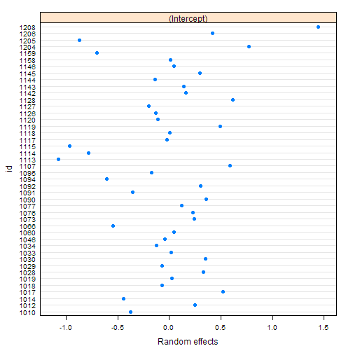
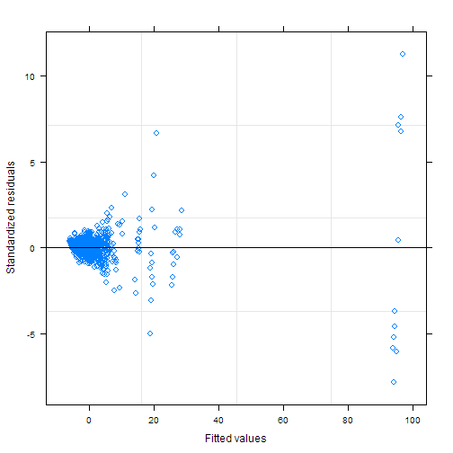

---

# Preamble

Load libraries.


```r
library(readxl)
library(magrittr)
library(dplyr)
```

```
## 
## Attaching package: 'dplyr'
```

```
## The following objects are masked from 'package:stats':
## 
##     filter, lag
```

```
## The following objects are masked from 'package:base':
## 
##     intersect, setdiff, setequal, union
```

```r
library(nlme)
```

```
## 
## Attaching package: 'nlme'
```

```
## The following object is masked from 'package:dplyr':
## 
##     collapse
```

```r
library(broom)
library(ggplot2)
library(svglite)
library(knitr)
library(doParallel)
```

```
## Loading required package: foreach
```

```
## Loading required package: iterators
```

```
## Loading required package: parallel
```

Reproducibility steps.


```r
sessionInfo()
```

```
## R version 3.5.3 (2019-03-11)
## Platform: x86_64-w64-mingw32/x64 (64-bit)
## Running under: Windows 10 x64 (build 17134)
## 
## Matrix products: default
## 
## locale:
## [1] LC_COLLATE=English_United States.1252 
## [2] LC_CTYPE=English_United States.1252   
## [3] LC_MONETARY=English_United States.1252
## [4] LC_NUMERIC=C                          
## [5] LC_TIME=English_United States.1252    
## 
## attached base packages:
## [1] parallel  stats     graphics  grDevices utils     datasets  methods  
## [8] base     
## 
## other attached packages:
##  [1] doParallel_1.0.14 iterators_1.0.10  foreach_1.4.4    
##  [4] svglite_1.2.1     ggplot2_3.1.0     broom_0.5.1      
##  [7] nlme_3.1-137      dplyr_0.8.0.1     magrittr_1.5     
## [10] readxl_1.3.1      rmarkdown_1.12    knitr_1.22       
## [13] checkpoint_0.4.5 
## 
## loaded via a namespace (and not attached):
##  [1] Rcpp_1.0.1       cellranger_1.1.0 pillar_1.3.1     compiler_3.5.3  
##  [5] plyr_1.8.4       tools_3.5.3      digest_0.6.18    evaluate_0.13   
##  [9] tibble_2.1.1     gtable_0.3.0     lattice_0.20-38  pkgconfig_2.0.2 
## [13] rlang_0.3.3      xfun_0.5         withr_2.1.2      stringr_1.4.0   
## [17] gdtools_0.1.8    generics_0.0.2   grid_3.5.3       tidyselect_0.2.5
## [21] glue_1.3.1       R6_2.4.0         purrr_0.3.2      tidyr_0.8.3     
## [25] codetools_0.2-16 backports_1.1.3  scales_1.0.0     htmltools_0.3.6 
## [29] assertthat_0.2.1 colorspace_1.4-1 stringi_1.4.3    lazyeval_0.2.2  
## [33] munsell_0.5.0    crayon_1.3.4
```

```r
set.seed(as.integer(as.Date("2016-11-18")))
```

Source user-defined functions.


```r
sapply(list.files("lib", full.names = TRUE), source)
```

```
##         lib/library.R
## value   ?            
## visible FALSE
```

---

# Read data

Import the data.
Data files are locally stored.

## Aim 1-a

Import Aim 1 Amino Acids and TCA Cycle intermediates (Neg).


```r
f <- "data/raw/Z scores Aim 1 Neg-aa.xlsx"
L1a <- importDataToList(f)
L1a[["file"]]
```

```
## [1] "data/raw/Z scores Aim 1 Neg-aa.xlsx"
```

```r
L1a[["dim"]]
```

```
## [1] 984   5
```

```r
L1a[["names"]]
```

```
## [1] "condition"  "id"         "metabolite" "z_value"    "genotype"
```

```r
L1a[["head"]]
```

```
## # A tibble: 6 x 5
##   condition    id metabolite z_value genotype
##   <fct>     <dbl> <fct>        <dbl> <fct>   
## 1 Exercise   1010 FUMARIC     -0.934 KO      
## 2 Exercise   1012 FUMARIC     -1.21  KO      
## 3 Exercise   1014 FUMARIC      0.196 KO      
## 4 Exercise   1017 FUMARIC      0.455 KO      
## 5 Exercise   1018 FUMARIC     -0.580 KO      
## 6 Exercise   1019 FUMARIC     -0.593 KO
```

```r
L1a[["data"]] %>% pull(condition) %>% levels()
```

```
## [1] "Rest"     "Exercise"
```

```r
L1a[["data"]] %>% pull(genotype) %>% levels()
```

```
## [1] "WT" "KO"
```

```r
L1a[["data"]] %>% pull(metabolite) %>% levels()
```

```
##  [1] "alaninesarcosine" "arginine"         "asparagine"      
##  [4] "AsparticAcid"     "CITRIC"           "FUMARIC"         
##  [7] "glutamic"         "glutamine"        "glycine"         
## [10] "histidine"        "isoleucine"       "LACTIC"          
## [13] "leucine"          "lysine"           "MALIC"           
## [16] "methionine"       "METHYLSUCCINIC"   "Phenylalanine"   
## [19] "serine"           "SUCCINIC2"        "threonine"       
## [22] "Tryptophan"       "Tyrosine"         "valine"
```

```r
D1a <- L1a[["data"]]
```

## Aim 1-b

Import Aim 1 Acylcarnitines.


```r
f <- "data/raw/Z scores Aim 1 AC.xlsx"
L1b <- importDataToList(f)
L1b[["file"]]
```

```
## [1] "data/raw/Z scores Aim 1 AC.xlsx"
```

```r
L1b[["dim"]]
```

```
## [1] 899   5
```

```r
L1b[["names"]]
```

```
## [1] "condition"  "id"         "metabolite" "z_value"    "genotype"
```

```r
L1b[["head"]]
```

```
## # A tibble: 6 x 5
##   condition    id metabolite      z_value genotype
##   <fct>     <dbl> <fct>             <dbl> <fct>   
## 1 Exercise   1010 acetylcarnitine   -1.84 KO      
## 2 Exercise   1012 acetylcarnitine   -2.15 KO      
## 3 Exercise   1014 acetylcarnitine   -2.04 KO      
## 4 Exercise   1017 acetylcarnitine   -2.43 KO      
## 5 Exercise   1018 acetylcarnitine   -2.49 KO      
## 6 Exercise   1019 acetylcarnitine   -1.83 KO
```

```r
L1b[["data"]] %>% pull(condition) %>% levels()
```

```
## [1] "Rest"     "Exercise"
```

```r
L1b[["data"]] %>% pull(genotype) %>% levels()
```

```
## [1] "WT" "KO"
```

```r
L1b[["data"]] %>% pull(metabolite) %>% levels()
```

```
##  [1] "2methylbutyrylcarnitine" "3HMG"                   
##  [3] "acetylcarnitine"         "butyrylcarnitine"       
##  [5] "C101total"               "C12"                    
##  [7] "C141total"               "C142total"              
##  [9] "C151total"               "C161total"              
## [11] "C171total"               "C181total"              
## [13] "C182total"               "C191total"              
## [15] "carnitine"               "ethylmalonylcarnitine"  
## [17] "isobutyrylcarnitine"     "methylsuccinylcarnitine"
## [19] "ndecanoylcarnitine"      "nhexanoylcarnitine"     
## [21] "noctanoylcarnitine"      "propionylcarnitine"
```

```r
D1b <- L1b[["data"]]
```

## Aim 2-a

Import Aim 2 Amino Acids and TCA Cycle intermediates (Neg).


```r
f <- "data/raw/Z scores Aim 2 Neg-aa.xlsx"
L2a <- importDataToList(f)
L2a[["file"]]
```

```
## [1] "data/raw/Z scores Aim 2 Neg-aa.xlsx"
```

```r
L2a[["dim"]]
```

```
## [1] 1035    5
```

```r
L2a[["names"]]
```

```
## [1] "condition"  "id"         "metabolite" "z_value"    "genotype"
```

```r
L2a[["head"]]
```

```
## # A tibble: 6 x 5
##   condition    id metabolite z_value genotype
##   <fct>     <dbl> <fct>        <dbl> <fct>   
## 1 C7         1120 FUMARIC      -3.23 KO      
## 2 C7         1126 FUMARIC      -3.22 KO      
## 3 C7         1127 FUMARIC      -3.49 KO      
## 4 C7         1128 FUMARIC      -2.31 KO      
## 5 C7         1142 FUMARIC      -1.73 KO      
## 6 C7         1144 FUMARIC      -1.71 KO
```

```r
L2a[["data"]] %>% pull(condition) %>% levels()
```

```
## [1] "Exercise" "C7"       "C8"
```

```r
L2a[["data"]] %>% pull(genotype) %>% levels()
```

```
## [1] "WT" "KO"
```

```r
L2a[["data"]] %>% pull(metabolite) %>% levels()
```

```
##  [1] "alaninesarcosine" "arginine"         "asparagine"      
##  [4] "AsparticAcid"     "CITRIC"           "FUMARIC"         
##  [7] "glutamic"         "glutamine"        "glycine"         
## [10] "histidine"        "isoleucine"       "LACTIC"          
## [13] "leucine"          "lysine"           "MALIC"           
## [16] "methionine"       "METHYLSUCCINIC"   "Phenylalanine"   
## [19] "serine"           "SUCCINIC2"        "threonine"       
## [22] "Tryptophan"       "Tyrosine"         "valine"
```

```r
D2a <- L2a[["data"]]
```

## Aim 2-b

Import Aim 2 Acylcarnitines.


```r
f <- "data/raw/Z scores Aim 2 AC.xlsx"
L2b <- importDataToList(f)
L2b[["file"]]
```

```
## [1] "data/raw/Z scores Aim 2 AC.xlsx"
```

```r
L2b[["dim"]]
```

```
## [1] 948   5
```

```r
L2b[["names"]]
```

```
## [1] "condition"  "id"         "metabolite" "z_value"    "genotype"
```

```r
L2b[["head"]]
```

```
## # A tibble: 6 x 5
##   condition    id metabolite      z_value genotype
##   <fct>     <dbl> <fct>             <dbl> <fct>   
## 1 C7         1120 acetylcarnitine   -2.57 KO      
## 2 C7         1126 acetylcarnitine   -2.43 KO      
## 3 C7         1127 acetylcarnitine   -2.58 KO      
## 4 C7         1128 acetylcarnitine   -2.11 KO      
## 5 C7         1142 acetylcarnitine   -2.67 KO      
## 6 C7         1143 acetylcarnitine   -2.55 KO
```

```r
L2b[["data"]] %>% pull(condition) %>% levels()
```

```
## [1] "Exercise" "C7"       "C8"
```

```r
L2b[["data"]] %>% pull(genotype) %>% levels()
```

```
## [1] "WT" "KO"
```

```r
L2b[["data"]] %>% pull(metabolite) %>% levels()
```

```
##  [1] "2methylbutyrylcarnitine" "3HMG"                   
##  [3] "acetylcarnitine"         "butyrylcarnitine"       
##  [5] "C101total"               "C12"                    
##  [7] "C141total"               "C142total"              
##  [9] "C151total"               "C161total"              
## [11] "C171total"               "C181total"              
## [13] "C182total"               "C191total"              
## [15] "carnitine"               "ethylmalonylcarnitine"  
## [17] "isobutyrylcarnitine"     "methylsuccinylcarnitine"
## [19] "ndecanoylcarnitine"      "nhexanoylcarnitine"     
## [21] "noctanoylcarnitine"      "propionylcarnitine"
```

```r
D2b <- L2b[["data"]]
```

---

# Model

Basic data preprocessing steps:

1. Find and remove outliers using Grubbs.
2. Standardize by Z score.
3. Check for normality.
4. Transform and recheck normality. We decided not to use transformed data as it did not correct the few conditions with multiple skewed groups.


## Methods

A mixed linear effects model was estimated for each aim.
Fixed effects for Aim 1 were condition (wildtype-rest (ref), wildtype-exercise, knockout-rest, knockout-exercise), and metabolite.
Fixed effects for Aim 2 were condition (wildtype-exercise (ref), knockout-exercise, knockout-C7, knockout-C8), and metabolite.
All 2-way interactions between fixed effects were included in the models.
Animal ID was the random effect.
A general correlation structure was assumed.
Estimates for the contrasts comparing each combination of condition and metabolite are presented.
P-values were adjusted to control the false discovery rate, the expected proportion of false discoveries amongst the rejected hypotheses.
The data was analyzed using R version 3.5.3 (2019-03-11) and the `nlme` package version 3.1.137.

Estimate model.
Specify the correlation structure using `cs`.
Use `corCompSymm`, *compound symmetry structure corresponding to a constant correlation*.

**References**

Benjamini, Y., and Hochberg, Y.
(1995).
Controlling the false discovery rate: a practical and powerful approach to multiple testing.
*Journal of the Royal Statistical Society Series B* 57, 289–300.


```r
citation()
```

```
## 
## To cite R in publications use:
## 
##   R Core Team (2019). R: A language and environment for
##   statistical computing. R Foundation for Statistical Computing,
##   Vienna, Austria. URL https://www.R-project.org/.
## 
## A BibTeX entry for LaTeX users is
## 
##   @Manual{,
##     title = {R: A Language and Environment for Statistical Computing},
##     author = {{R Core Team}},
##     organization = {R Foundation for Statistical Computing},
##     address = {Vienna, Austria},
##     year = {2019},
##     url = {https://www.R-project.org/},
##   }
## 
## We have invested a lot of time and effort in creating R, please
## cite it when using it for data analysis. See also
## 'citation("pkgname")' for citing R packages.
```

```r
citation("nlme")
```

```
## 
## Pinheiro J, Bates D, DebRoy S, Sarkar D, R Core Team (2018).
## _nlme: Linear and Nonlinear Mixed Effects Models_. R package
## version 3.1-137, <URL: https://CRAN.R-project.org/package=nlme>.
## 
## A BibTeX entry for LaTeX users is
## 
##   @Manual{,
##     title = {{nlme}: Linear and Nonlinear Mixed Effects Models},
##     author = {Jose Pinheiro and Douglas Bates and Saikat DebRoy and Deepayan Sarkar and {R Core Team}},
##     year = {2018},
##     note = {R package version 3.1-137},
##     url = {https://CRAN.R-project.org/package=nlme},
##   }
```

Set some constants


```r
random <- formula(~ 1 | id)
ctrl <- lmeControl(opt = "optim",
                   maxIter = 500, msMaxIter = 500,
                   tolerance = 1e-6, niterEM = 25, msMaxEval = 200, msTol = 1e-7)
```


## Aim 1

* WT-rest (ref)
* WT-exercise
* KO-rest
* KO-exercise


```r
fixed <- formula(z_value ~
                   genotype +
                   condition +
                   metabolite +
                   genotype * condition +
                   genotype * metabolite +
                   condition * metabolite +
                   genotype * condition * metabolite)
```

### Aim 1-a: Amino Acids and TCA Cycle intermediates (Neg)


```r
t0 <- Sys.time()
M <- estimateModel(data = D1a, fixed, random)
Sys.time() - t0
```

```
## Time difference of 1.817254 secs
```

```r
M %>% plot()
```


```r
M %>% ranef() %>% plot()
```


```r
M %>% anova() %>% kable()
```


|                              | numDF| denDF|    F-value|   p-value|
|:-----------------------------|-----:|-----:|----------:|---------:|
|(Intercept)                   |     1|   850|  0.6111944| 0.4345562|
|genotype                      |     1|    38|  0.0258576| 0.8731004|
|condition                     |     1|    38|  0.0136006| 0.9077740|
|metabolite                    |    23|   850| 10.5205817| 0.0000000|
|genotype:condition            |     1|    38|  1.1042985| 0.2999619|
|genotype:metabolite           |    23|   850|  3.2640881| 0.0000004|
|condition:metabolite          |    23|   850|  7.1521169| 0.0000000|
|genotype:condition:metabolite |    23|   850|  1.4379894| 0.0838042|

```r
fixef <- M %>% tidy(effects = "fixed") %>% filter(grepl("condition", term)) %>% adjustPvalue()
fixef %>% filter(sig) %>% kable()
```


|term                                   | estimate| std.error| statistic|   p.value| p.adjustBH|sig  |
|:--------------------------------------|--------:|---------:|---------:|---------:|----------:|:----|
|conditionExercise:metaboliteTryptophan | 3.233007| 0.8846537|  3.654545| 0.0002734|  0.0131252|TRUE |

```r
fixef %>% write.csv(file = "data/processed/lmeFixedCoefAim1a.csv", row.names = FALSE)
M1a <- M
```

Calculate contrasts of *Exercise vs Rest* given metabolite and genotype.


```r
metabolites <- L1a[["data"]] %>% pull(metabolite) %>% levels()
Ftests <- runClusters(D1a, metabolites, fixed, random, "condition", "Exercise", ctrl)
```

```
## Loading required package: data.table
```

```
## 
## Attaching package: 'data.table'
```

```
## The following objects are masked from 'package:dplyr':
## 
##     between, first, last
```

```r
Ftests %>% kable(digits = 5)
```


|contrast |metabolite       |genotype |     beta|      se| numDF| denDF|  F.value| p.value|  lowerCL|  upperCL| p.adjustBH|sig   |
|:--------|:----------------|:--------|--------:|-------:|-----:|-----:|--------:|-------:|--------:|--------:|----------:|:-----|
|Exercise |alaninesarcosine |WT       | -0.37426| 0.65644|     1|    38|  0.32507| 0.57194| -1.66086|  0.91233|    0.80434|FALSE |
|Exercise |arginine         |WT       | -1.20541| 0.65644|     1|    38|  3.37197| 0.07415| -2.49200|  0.08118|    0.23727|FALSE |
|Exercise |asparagine       |WT       | -0.34403| 0.65644|     1|    38|  0.27468| 0.60326| -1.63063|  0.94256|    0.80434|FALSE |
|Exercise |AsparticAcid     |WT       | -0.63171| 0.67086|     1|    38|  0.88670| 0.35232| -1.94656|  0.68315|    0.67646|FALSE |
|Exercise |CITRIC           |WT       |  1.08549| 0.67417|     1|    38|  2.59245| 0.11565| -0.23586|  2.40685|    0.32910|FALSE |
|Exercise |FUMARIC          |WT       |  0.03760| 0.67417|     1|    38|  0.00311| 0.95582| -1.28376|  1.35896|    0.97615|FALSE |
|Exercise |glutamic         |WT       | -0.00921| 0.65644|     1|    38|  0.00020| 0.98888| -1.29580|  1.27738|    0.98888|FALSE |
|Exercise |glutamine        |WT       | -1.90178| 0.67411|     1|    38|  7.95893| 0.00757| -3.22302| -0.58054|    0.04540|TRUE  |
|Exercise |glycine          |WT       | -0.63369| 0.65644|     1|    38|  0.93191| 0.34047| -1.92029|  0.65290|    0.67646|FALSE |
|Exercise |histidine        |WT       | -1.40926| 0.65644|     1|    38|  4.60890| 0.03825| -2.69585| -0.12267|    0.14124|FALSE |
|Exercise |isoleucine       |WT       | -0.07105| 0.65595|     1|    38|  0.01173| 0.91432| -1.35669|  1.21460|    0.97528|FALSE |
|Exercise |LACTIC           |WT       |  0.05173| 0.67417|     1|    38|  0.00589| 0.93924| -1.26963|  1.37309|    0.97615|FALSE |
|Exercise |leucine          |WT       | -0.73412| 0.65595|     1|    38|  1.25254| 0.27009| -2.01977|  0.55152|    0.56367|FALSE |
|Exercise |lysine           |WT       | -2.17233| 0.67411|     1|    38| 10.38443| 0.00261| -3.49357| -0.85109|    0.01789|TRUE  |
|Exercise |MALIC            |WT       |  1.74236| 0.67417|     1|    38|  6.67928| 0.01372|  0.42100|  3.06371|    0.07260|FALSE |
|Exercise |methionine       |WT       | -1.06207| 0.67408|     1|    38|  2.48247| 0.12341| -2.38325|  0.25910|    0.32910|FALSE |
|Exercise |METHYLSUCCINIC   |WT       | -0.58806| 0.70970|     1|    38|  0.68658| 0.41250| -1.97904|  0.80293|    0.74413|FALSE |
|Exercise |Phenylalanine    |WT       |  0.40919| 0.68760|     1|    38|  0.35414| 0.55531| -0.93848|  1.75685|    0.80434|FALSE |
|Exercise |serine           |WT       | -0.86079| 0.65644|     1|    38|  1.71951| 0.19762| -2.14738|  0.42581|    0.49926|FALSE |
|Exercise |SUCCINIC2        |WT       | -0.35796| 0.67417|     1|    38|  0.28192| 0.59853| -1.67932|  0.96340|    0.80434|FALSE |
|Exercise |threonine        |WT       | -1.52864| 0.67086|     1|    38|  5.19220| 0.02840| -2.84350| -0.21379|    0.12391|FALSE |
|Exercise |Tryptophan       |WT       |  2.85874| 0.65644|     1|    38| 18.96551| 0.00010|  1.57215|  4.14534|    0.00233|TRUE  |
|Exercise |Tyrosine         |WT       |  2.27737| 0.65595|     1|    38| 12.05363| 0.00130|  0.99172|  3.56301|    0.01044|TRUE  |
|Exercise |valine           |WT       |  0.51861| 0.65595|     1|    38|  0.62508| 0.43407| -0.76704|  1.80426|    0.74413|FALSE |
|Exercise |alaninesarcosine |KO       | -0.46080| 0.65395|     1|    38|  0.49653| 0.48533| -1.74251|  0.82091|    0.78137|FALSE |
|Exercise |arginine         |KO       | -0.80571| 0.65367|     1|    38|  1.51930| 0.22530| -2.08688|  0.47546|    0.51497|FALSE |
|Exercise |asparagine       |KO       |  0.12812| 0.65312|     1|    38|  0.03848| 0.84552| -1.15197|  1.40821|    0.92239|FALSE |
|Exercise |AsparticAcid     |KO       |  0.21643| 0.65362|     1|    38|  0.10964| 0.74237| -1.06465|  1.49751|    0.89543|FALSE |
|Exercise |CITRIC           |KO       | -0.41523| 0.66783|     1|    38|  0.38659| 0.53781| -1.72414|  0.89368|    0.80434|FALSE |
|Exercise |FUMARIC          |KO       |  0.18169| 0.67117|     1|    38|  0.07328| 0.78809| -1.13379|  1.49716|    0.90067|FALSE |
|Exercise |glutamic         |KO       | -0.45677| 0.65278|     1|    38|  0.48962| 0.48836| -1.73621|  0.82266|    0.78137|FALSE |
|Exercise |glutamine        |KO       | -1.65687| 0.65114|     1|    38|  6.47490| 0.01513| -2.93307| -0.38067|    0.07260|FALSE |
|Exercise |glycine          |KO       | -0.20159| 0.66912|     1|    38|  0.09076| 0.76485| -1.51304|  1.10986|    0.89543|FALSE |
|Exercise |histidine        |KO       | -1.02948| 0.64606|     1|    38|  2.53920| 0.11934| -2.29573|  0.23676|    0.32910|FALSE |
|Exercise |isoleucine       |KO       |  0.51308| 0.64786|     1|    38|  0.62720| 0.43330| -0.75670|  1.78285|    0.74413|FALSE |
|Exercise |LACTIC           |KO       | -0.13608| 0.65540|     1|    38|  0.04311| 0.83663| -1.42065|  1.14849|    0.92239|FALSE |
|Exercise |leucine          |KO       |  2.65159| 0.66366|     1|    38| 15.96305| 0.00029|  1.35083|  3.95235|    0.00321|TRUE  |
|Exercise |lysine           |KO       | -1.41055| 0.64700|     1|    38|  4.75299| 0.03551| -2.67864| -0.14245|    0.14124|FALSE |
|Exercise |MALIC            |KO       |  0.30216| 0.66593|     1|    38|  0.20588| 0.65259| -1.00303|  1.60736|    0.82433|FALSE |
|Exercise |methionine       |KO       | -0.82512| 0.64705|     1|    38|  1.62613| 0.20998| -2.09332|  0.44308|    0.50395|FALSE |
|Exercise |METHYLSUCCINIC   |KO       |  0.21199| 0.65473|     1|    38|  0.10483| 0.74788| -1.07125|  1.49522|    0.89543|FALSE |
|Exercise |Phenylalanine    |KO       |  0.75605| 0.66271|     1|    38|  1.30156| 0.26107| -0.54283|  2.05494|    0.56367|FALSE |
|Exercise |serine           |KO       | -0.31942| 0.66518|     1|    38|  0.23059| 0.63384| -1.62315|  0.98431|    0.82227|FALSE |
|Exercise |SUCCINIC2        |KO       | -1.25729| 0.65510|     1|    38|  3.68346| 0.06249| -2.54126|  0.02668|    0.21424|FALSE |
|Exercise |threonine        |KO       |  0.37703| 0.64778|     1|    38|  0.33876| 0.56398| -0.89260|  1.64666|    0.80434|FALSE |
|Exercise |Tryptophan       |KO       |  2.55778| 0.64869|     1|    38| 15.54712| 0.00033|  1.28637|  3.82919|    0.00321|TRUE  |
|Exercise |Tyrosine         |KO       |  3.80816| 0.68056|     1|    38| 31.31058| 0.00000|  2.47427|  5.14204|    0.00010|TRUE  |
|Exercise |valine           |KO       |  2.69917| 0.64774|     1|    38| 17.36429| 0.00017|  1.42962|  3.96872|    0.00274|TRUE  |

```r
Ftests %>% write.csv(file = "data/processed/contrastsAim1a.csv", row.names = FALSE)
```

### Aim 1-b: Acylcarnitines


```r
t0 <- Sys.time()
M <- estimateModel(data = D1b, fixed, random)
Sys.time() - t0
```

```
## Time difference of 0.5979319 secs
```

```r
M %>% plot()
```


```r
M %>% ranef() %>% plot()
```


```r
M %>% anova() %>% kable()
```


|                              | numDF| denDF|    F-value|   p-value|
|:-----------------------------|-----:|-----:|----------:|---------:|
|(Intercept)                   |     1|   773| 28.4004530| 0.0000001|
|genotype                      |     1|    38| 13.4275328| 0.0007537|
|condition                     |     1|    38|  0.0005077| 0.9821416|
|metabolite                    |    21|   773| 87.1190391| 0.0000000|
|genotype:condition            |     1|    38|  1.9545142| 0.1702088|
|genotype:metabolite           |    21|   773| 96.9402594| 0.0000000|
|condition:metabolite          |    21|   773|  2.2555214| 0.0010851|
|genotype:condition:metabolite |    21|   773|  1.3496214| 0.1352562|

```r
fixef <- M %>% tidy(effects = "fixed") %>% filter(grepl("condition", term)) %>% adjustPvalue()
fixef %>% filter(sig) %>% kable()
```


|term | estimate| std.error| statistic| p.value| p.adjustBH|sig |
|:----|--------:|---------:|---------:|-------:|----------:|:---|

```r
fixef %>% write.csv(file = "data/processed/lmeFixedCoefAim1b.csv", row.names = FALSE)
M1b <- M
```

Calculate contrasts of *Exercise vs Rest* given metabolite and genotype.


```r
metabolites <- L1b[["data"]] %>% pull(metabolite) %>% levels()
Ftests <- runClusters(D1b, metabolites, fixed, random, "condition", "Exercise", ctrl)
Ftests %>% kable(digits = 5)
```


|contrast |metabolite              |genotype |     beta|      se| numDF| denDF|  F.value| p.value|  lowerCL|  upperCL| p.adjustBH|sig   |
|:--------|:-----------------------|:--------|--------:|-------:|-----:|-----:|--------:|-------:|--------:|--------:|----------:|:-----|
|Exercise |2methylbutyrylcarnitine |WT       |  2.34938| 0.85655|     1|    38|  7.52319| 0.00924|  0.67057|  4.02819|    0.13552|FALSE |
|Exercise |3HMG                    |WT       | -0.38240| 0.80788|     1|    38|  0.22405| 0.63868| -1.96581|  1.20101|    0.95754|FALSE |
|Exercise |acetylcarnitine         |WT       | -0.22584| 0.80788|     1|    38|  0.07815| 0.78134| -1.80925|  1.35757|    0.98001|FALSE |
|Exercise |butyrylcarnitine        |WT       | -0.64051| 0.80788|     1|    38|  0.62858| 0.43280| -2.22392|  0.94290|    0.94452|FALSE |
|Exercise |C101total               |WT       |  0.36503| 0.84741|     1|    38|  0.18555| 0.66908| -1.29586|  2.02592|    0.95754|FALSE |
|Exercise |C12                     |WT       | -0.15053| 0.80788|     1|    38|  0.03472| 0.85318| -1.73394|  1.43288|    0.98001|FALSE |
|Exercise |C141total               |WT       | -0.27016| 0.80788|     1|    38|  0.11182| 0.73992| -1.85357|  1.31326|    0.95754|FALSE |
|Exercise |C142total               |WT       | -0.49882| 0.80788|     1|    38|  0.38124| 0.54062| -2.08223|  1.08459|    0.95150|FALSE |
|Exercise |C151total               |WT       | -0.38852| 0.80788|     1|    38|  0.23128| 0.63333| -1.97193|  1.19489|    0.95754|FALSE |
|Exercise |C161total               |WT       | -0.90280| 0.82991|     1|    38|  1.18337| 0.28352| -2.52939|  0.72380|    0.90928|FALSE |
|Exercise |C171total               |WT       | -0.56444| 0.80788|     1|    38|  0.48814| 0.48901| -2.14786|  1.01897|    0.94452|FALSE |
|Exercise |C181total               |WT       | -0.54518| 0.82991|     1|    38|  0.43154| 0.51519| -2.17178|  1.08141|    0.94452|FALSE |
|Exercise |C182total               |WT       | -1.30465| 0.82991|     1|    38|  2.47128| 0.12423| -2.93124|  0.32195|    0.60736|FALSE |
|Exercise |C191total               |WT       | -0.06808| 0.82991|     1|    38|  0.00673| 0.93505| -1.69468|  1.55851|    0.98001|FALSE |
|Exercise |carnitine               |WT       |  1.39532| 0.80788|     1|    38|  2.98300| 0.09226| -0.18810|  2.97873|    0.50746|FALSE |
|Exercise |ethylmalonylcarnitine   |WT       |  2.72676| 0.80788|     1|    38| 11.39206| 0.00171|  1.14335|  4.31018|    0.03764|TRUE  |
|Exercise |isobutyrylcarnitine     |WT       |  1.02763| 0.84741|     1|    38|  1.47056| 0.23274| -0.63327|  2.68852|    0.90274|FALSE |
|Exercise |methylsuccinylcarnitine |WT       |  3.62902| 0.80788|     1|    38| 20.17833| 0.00006|  2.04560|  5.21243|    0.00281|TRUE  |
|Exercise |ndecanoylcarnitine      |WT       | -0.76046| 0.80788|     1|    38|  0.88606| 0.35249| -2.34388|  0.82295|    0.94452|FALSE |
|Exercise |nhexanoylcarnitine      |WT       |  0.07801| 0.80788|     1|    38|  0.00932| 0.92358| -1.50540|  1.66142|    0.98001|FALSE |
|Exercise |noctanoylcarnitine      |WT       |  0.63598| 0.80788|     1|    38|  0.61972| 0.43603| -0.94743|  2.21939|    0.94452|FALSE |
|Exercise |propionylcarnitine      |WT       |  1.78886| 0.80788|     1|    38|  4.90297| 0.03288|  0.20545|  3.37227|    0.28938|FALSE |
|Exercise |2methylbutyrylcarnitine |KO       | -0.09179| 0.89069|     1|    38|  0.01062| 0.91846| -1.83751|  1.65393|    0.98001|FALSE |
|Exercise |3HMG                    |KO       | -0.18368| 0.83102|     1|    38|  0.04886| 0.82625| -1.81246|  1.44510|    0.98001|FALSE |
|Exercise |acetylcarnitine         |KO       | -0.83419| 0.80908|     1|    38|  1.06304| 0.30904| -2.41996|  0.75158|    0.90928|FALSE |
|Exercise |butyrylcarnitine        |KO       | -1.48886| 0.80905|     1|    38|  3.38660| 0.07355| -3.07456|  0.09684|    0.50746|FALSE |
|Exercise |C101total               |KO       |  0.30529| 0.80790|     1|    38|  0.14280| 0.70762| -1.27817|  1.88876|    0.95754|FALSE |
|Exercise |C12                     |KO       |  0.08062| 0.83091|     1|    38|  0.00941| 0.92321| -1.54793|  1.70917|    0.98001|FALSE |
|Exercise |C141total               |KO       |  0.04435| 0.83145|     1|    38|  0.00285| 0.95774| -1.58527|  1.67396|    0.98001|FALSE |
|Exercise |C142total               |KO       | -0.53978| 0.80912|     1|    38|  0.44504| 0.50873| -2.12562|  1.04607|    0.94452|FALSE |
|Exercise |C151total               |KO       | -0.55002| 0.80806|     1|    38|  0.46330| 0.50021| -2.13380|  1.03376|    0.94452|FALSE |
|Exercise |C161total               |KO       |  0.46848| 0.80808|     1|    38|  0.33611| 0.56550| -1.11532|  2.05228|    0.95701|FALSE |
|Exercise |C171total               |KO       | -0.61092| 0.80969|     1|    38|  0.56928| 0.45519| -2.19788|  0.97605|    0.94452|FALSE |
|Exercise |C181total               |KO       |  0.83388| 0.81037|     1|    38|  1.05886| 0.30998| -0.75442|  2.42217|    0.90928|FALSE |
|Exercise |C182total               |KO       | -1.89566| 0.80969|     1|    38|  5.48127| 0.02457| -3.48263| -0.30869|    0.27024|FALSE |
|Exercise |C191total               |KO       | -0.95253| 0.80874|     1|    38|  1.38720| 0.24620| -2.53762|  0.63257|    0.90274|FALSE |
|Exercise |carnitine               |KO       | -0.57328| 0.82654|     1|    38|  0.48108| 0.49215| -2.19326|  1.04670|    0.94452|FALSE |
|Exercise |ethylmalonylcarnitine   |KO       | -0.05218| 0.80915|     1|    38|  0.00416| 0.94892| -1.63809|  1.53374|    0.98001|FALSE |
|Exercise |isobutyrylcarnitine     |KO       |  1.56599| 0.89089|     1|    38|  3.08982| 0.08684| -0.18012|  3.31209|    0.50746|FALSE |
|Exercise |methylsuccinylcarnitine |KO       |  0.01727| 0.82712|     1|    38|  0.00044| 0.98345| -1.60386|  1.63839|    0.98345|FALSE |
|Exercise |ndecanoylcarnitine      |KO       | -0.32063| 0.82639|     1|    38|  0.15053| 0.70019| -1.94031|  1.29906|    0.95754|FALSE |
|Exercise |nhexanoylcarnitine      |KO       | -1.00752| 0.80899|     1|    38|  1.55103| 0.22061| -2.59312|  0.57808|    0.90274|FALSE |
|Exercise |noctanoylcarnitine      |KO       | -0.30141| 0.84883|     1|    38|  0.12609| 0.72448| -1.96509|  1.36226|    0.95754|FALSE |
|Exercise |propionylcarnitine      |KO       | -0.34830| 0.82620|     1|    38|  0.17772| 0.67571| -1.96762|  1.27102|    0.95754|FALSE |

```r
Ftests %>% write.csv(file = "data/processed/contrastsAim1b.csv", row.names = FALSE)
```


## Aim 2

* WT-exer (ref)
* KO-C7
* KO-C8
* KO-exer


```r
fixed <- formula(z_value ~
                   genotype +
                   condition +
                   metabolite +
                   genotype * metabolite +
                   condition * metabolite)
```

### Aim 2-a: Amino Acids and TCA Cycle intermediates (Neg)


```r
t0 <- Sys.time()
M <- estimateModel(data = D2a, fixed, random)
Sys.time() - t0
```

```
## Time difference of 1.860393 secs
```

```r
M %>% plot()
```


```r
M %>% ranef() %>% plot()
```



```r
M %>% anova() %>% kable()
```


|                     | numDF| denDF|  F-value|   p-value|
|:--------------------|-----:|-----:|--------:|---------:|
|(Intercept)          |     1|   899| 42.19271| 0.0000000|
|genotype             |     1|    40| 14.19040| 0.0005326|
|condition            |     2|    40| 29.42175| 0.0000000|
|metabolite           |    23|   899| 67.07559| 0.0000000|
|genotype:metabolite  |    23|   899| 20.33245| 0.0000000|
|condition:metabolite |    46|   899| 68.37677| 0.0000000|

```r
fixef <- M %>% tidy(effects = "fixed") %>% filter(grepl("condition", term)) %>% adjustPvalue()
fixef %>% filter(sig) %>% kable()
```


|term                                 |  estimate| std.error| statistic|  p.value| p.adjustBH|sig  |
|:------------------------------------|---------:|---------:|---------:|--------:|----------:|:----|
|conditionC8:metaboliteMETHYLSUCCINIC | 43.411562|  1.251743| 34.680903| 0.00e+00|  0.0000000|TRUE |
|conditionC7:metabolitethreonine      |  7.925089|  1.223553|  6.477112| 0.00e+00|  0.0000000|TRUE |
|conditionC8:metabolitethreonine      |  4.855778|  1.240702|  3.913736| 9.77e-05|  0.0015638|TRUE |

```r
fixef %>% write.csv(file = "data/processed/lmeFixedCoefAim2a.csv", row.names = FALSE)
M2a <- M
```

Calculate contrasts of *C7 vs Exercise* given metabolite and genotype.


```r
metabolites <- L2a[["data"]] %>% pull(metabolite) %>% levels()
Ftests <- runClusters(D2a, metabolites, fixed, random, "condition", "C7", ctrl)
Ftests %>% kable(digits = 5)
```


|contrast |metabolite       |genotype |     beta|      se| numDF| denDF|    F.value| p.value|  lowerCL| upperCL| p.adjustBH|sig   |
|:--------|:----------------|:--------|--------:|-------:|-----:|-----:|----------:|-------:|--------:|-------:|----------:|:-----|
|C7       |alaninesarcosine |WT       | -0.75307| 0.91745|     2|    40|    1.17320| 0.31979| -2.55125| 1.04510|    0.60725|FALSE |
|C7       |arginine         |WT       |  0.26262| 0.91494|     2|    40|    0.16701| 0.84678| -1.53063| 2.05587|    0.84678|FALSE |
|C7       |asparagine       |WT       |  0.10770| 0.92151|     2|    40|    0.85474| 0.43302| -1.69843| 1.91383|    0.62223|FALSE |
|C7       |AsparticAcid     |WT       |  1.53575| 0.91691|     2|    40|    3.41911| 0.04258| -0.26135| 3.33286|    0.17031|FALSE |
|C7       |CITRIC           |WT       |  0.32495| 0.96380|     2|    40|    0.28127| 0.75631| -1.56407| 2.21396|    0.78919|FALSE |
|C7       |FUMARIC          |WT       | -1.65952| 0.96197|     2|    40|    1.65741| 0.20346| -3.54494| 0.22589|    0.53636|FALSE |
|C7       |glutamic         |WT       |  0.75804| 0.91425|     2|    40|    0.78573| 0.46269| -1.03386| 2.54994|    0.62223|FALSE |
|C7       |glutamine        |WT       | -0.89905| 0.91740|     2|    40|    1.55597| 0.22349| -2.69712| 0.89902|    0.53636|FALSE |
|C7       |glycine          |WT       | -0.34322| 0.91753|     2|    40|    0.77683| 0.46667| -2.14153| 1.45510|    0.62223|FALSE |
|C7       |histidine        |WT       |  0.43143| 0.92134|     2|    40|    0.42714| 0.65531| -1.37437| 2.23724|    0.74893|FALSE |
|C7       |isoleucine       |WT       | -0.85566| 0.90875|     2|    40|    0.80200| 0.45551| -2.63678| 0.92545|    0.62223|FALSE |
|C7       |LACTIC           |WT       | -1.03397| 0.94422|     2|    40|    2.60912| 0.08609| -2.88460| 0.81666|    0.29515|FALSE |
|C7       |leucine          |WT       | -1.62320| 0.92658|     2|    40|    1.90801| 0.16164| -3.43926| 0.19287|    0.48491|FALSE |
|C7       |lysine           |WT       | -0.38320| 0.92073|     2|    40|    0.52145| 0.59764| -2.18780| 1.42140|    0.71717|FALSE |
|C7       |MALIC            |WT       |  0.08376| 0.96367|     2|    40|    0.28618| 0.75265| -1.80499| 1.97251|    0.78919|FALSE |
|C7       |methionine       |WT       |  0.76905| 0.89596|     2|    40|    1.38563| 0.26191| -0.98699| 2.52509|    0.57145|FALSE |
|C7       |METHYLSUCCINIC   |WT       | -0.56608| 0.97401|     2|    40| 1452.78254| 0.00000| -2.47510| 1.34295|    0.00000|TRUE  |
|C7       |Phenylalanine    |WT       | -1.02368| 0.92110|     2|    40|    1.14342| 0.32892| -2.82901| 0.78165|    0.60725|FALSE |
|C7       |serine           |WT       |  0.76323| 0.90600|     2|    40|    7.90769| 0.00128| -1.01250| 2.53896|    0.01021|TRUE  |
|C7       |SUCCINIC2        |WT       |  1.10324| 0.94161|     2|    40|    0.81831| 0.44843| -0.74229| 2.94877|    0.62223|FALSE |
|C7       |threonine        |WT       |  7.17202| 0.89413|     2|    40|   36.66439| 0.00000|  5.41955| 8.92448|    0.00000|TRUE  |
|C7       |Tryptophan       |WT       | -0.62434| 0.89982|     2|    40|    3.70934| 0.03328| -2.38796| 1.13928|    0.17031|FALSE |
|C7       |Tyrosine         |WT       | -0.86102| 0.91880|     2|    40|    0.67431| 0.51521| -2.66184| 0.93979|    0.65079|FALSE |
|C7       |valine           |WT       | -1.72516| 0.90454|     2|    40|    3.50064| 0.03972| -3.49802| 0.04771|    0.17031|FALSE |
|C7       |alaninesarcosine |KO       | -0.75307| 0.91745|     2|    40|    1.17320| 0.31979| -2.55125| 1.04510|    0.60725|FALSE |
|C7       |arginine         |KO       |  0.26262| 0.91494|     2|    40|    0.16701| 0.84678| -1.53063| 2.05587|    0.84678|FALSE |
|C7       |asparagine       |KO       |  0.10770| 0.92151|     2|    40|    0.85474| 0.43302| -1.69843| 1.91383|    0.62223|FALSE |
|C7       |AsparticAcid     |KO       |  1.53575| 0.91691|     2|    40|    3.41911| 0.04258| -0.26135| 3.33286|    0.17031|FALSE |
|C7       |CITRIC           |KO       |  0.32495| 0.96380|     2|    40|    0.28127| 0.75631| -1.56407| 2.21396|    0.78919|FALSE |
|C7       |FUMARIC          |KO       | -1.65952| 0.96197|     2|    40|    1.65741| 0.20346| -3.54494| 0.22589|    0.53636|FALSE |
|C7       |glutamic         |KO       |  0.75804| 0.91425|     2|    40|    0.78573| 0.46269| -1.03386| 2.54994|    0.62223|FALSE |
|C7       |glutamine        |KO       | -0.89905| 0.91740|     2|    40|    1.55597| 0.22349| -2.69712| 0.89902|    0.53636|FALSE |
|C7       |glycine          |KO       | -0.34322| 0.91753|     2|    40|    0.77683| 0.46667| -2.14153| 1.45510|    0.62223|FALSE |
|C7       |histidine        |KO       |  0.43143| 0.92134|     2|    40|    0.42714| 0.65531| -1.37437| 2.23724|    0.74893|FALSE |
|C7       |isoleucine       |KO       | -0.85566| 0.90875|     2|    40|    0.80200| 0.45551| -2.63678| 0.92545|    0.62223|FALSE |
|C7       |LACTIC           |KO       | -1.03397| 0.94422|     2|    40|    2.60912| 0.08609| -2.88460| 0.81666|    0.29515|FALSE |
|C7       |leucine          |KO       | -1.62320| 0.92658|     2|    40|    1.90801| 0.16164| -3.43926| 0.19287|    0.48491|FALSE |
|C7       |lysine           |KO       | -0.38320| 0.92073|     2|    40|    0.52145| 0.59764| -2.18780| 1.42140|    0.71717|FALSE |
|C7       |MALIC            |KO       |  0.08376| 0.96367|     2|    40|    0.28618| 0.75265| -1.80499| 1.97251|    0.78919|FALSE |
|C7       |methionine       |KO       |  0.76905| 0.89596|     2|    40|    1.38563| 0.26191| -0.98699| 2.52509|    0.57145|FALSE |
|C7       |METHYLSUCCINIC   |KO       | -0.56608| 0.97401|     2|    40| 1452.78253| 0.00000| -2.47510| 1.34295|    0.00000|TRUE  |
|C7       |Phenylalanine    |KO       | -1.02368| 0.92110|     2|    40|    1.14342| 0.32892| -2.82901| 0.78165|    0.60725|FALSE |
|C7       |serine           |KO       |  0.76323| 0.90600|     2|    40|    7.90769| 0.00128| -1.01250| 2.53896|    0.01021|TRUE  |
|C7       |SUCCINIC2        |KO       |  1.10324| 0.94161|     2|    40|    0.81831| 0.44843| -0.74229| 2.94877|    0.62223|FALSE |
|C7       |threonine        |KO       |  7.17202| 0.89413|     2|    40|   36.66439| 0.00000|  5.41955| 8.92448|    0.00000|TRUE  |
|C7       |Tryptophan       |KO       | -0.62434| 0.89982|     2|    40|    3.70934| 0.03328| -2.38796| 1.13928|    0.17031|FALSE |
|C7       |Tyrosine         |KO       | -0.86102| 0.91880|     2|    40|    0.67431| 0.51521| -2.66184| 0.93979|    0.65079|FALSE |
|C7       |valine           |KO       | -1.72516| 0.90454|     2|    40|    3.50064| 0.03972| -3.49802| 0.04771|    0.17031|FALSE |

```r
Ftests %>% write.csv(file = "data/processed/contrastsAim2ai.csv", row.names = FALSE)
```

Calculate contrasts of *C8 vs Exercise* given metabolite and genotype.


```r
metabolites <- L2a[["data"]] %>% pull(metabolite) %>% levels()
Ftests <- runClusters(D2a, metabolites, fixed, random, "condition", "C8", ctrl)
Ftests %>% kable(digits = 5)
```


|contrast |metabolite       |genotype |     beta|      se| numDF| denDF|    F.value| p.value|  lowerCL|  upperCL| p.adjustBH|sig   |
|:--------|:----------------|:--------|--------:|-------:|-----:|-----:|----------:|-------:|--------:|--------:|----------:|:-----|
|C8       |alaninesarcosine |WT       |  0.72519| 0.94020|     2|    40|    1.17320| 0.31979| -1.11757|  2.56794|    0.60725|FALSE |
|C8       |arginine         |WT       | -0.28262| 0.91494|     2|    40|    0.16701| 0.84678| -2.07587|  1.51063|    0.84678|FALSE |
|C8       |asparagine       |WT       |  1.10679| 0.92151|     2|    40|    0.85474| 0.43302| -0.69934|  2.91293|    0.62223|FALSE |
|C8       |AsparticAcid     |WT       |  2.34730| 0.91691|     2|    40|    3.41911| 0.04258|  0.55020|  4.14440|    0.17031|FALSE |
|C8       |CITRIC           |WT       |  0.70558| 0.94156|     2|    40|    0.28127| 0.75631| -1.13984|  2.55099|    0.78919|FALSE |
|C8       |FUMARIC          |WT       | -0.21603| 0.91181|     2|    40|    1.65741| 0.20346| -2.00313|  1.57108|    0.53636|FALSE |
|C8       |glutamic         |WT       |  1.11420| 0.91425|     2|    40|    0.78573| 0.46269| -0.67770|  2.90610|    0.62223|FALSE |
|C8       |glutamine        |WT       |  0.76364| 0.91740|     2|    40|    1.55597| 0.22349| -1.03443|  2.56171|    0.53636|FALSE |
|C8       |glycine          |WT       |  0.83115| 0.94027|     2|    40|    0.77683| 0.46667| -1.01175|  2.67405|    0.62223|FALSE |
|C8       |histidine        |WT       | -0.44074| 0.92134|     2|    40|    0.42714| 0.65531| -2.24654|  1.36506|    0.74893|FALSE |
|C8       |isoleucine       |WT       | -1.07744| 0.90875|     2|    40|    0.80200| 0.45551| -2.85855|  0.70368|    0.62223|FALSE |
|C8       |LACTIC           |WT       | -2.10471| 0.92150|     2|    40|    2.60912| 0.08609| -3.91081| -0.29861|    0.29515|FALSE |
|C8       |leucine          |WT       | -1.48342| 0.92658|     2|    40|    1.90801| 0.16164| -3.29948|  0.33264|    0.48491|FALSE |
|C8       |lysine           |WT       |  0.57375| 0.92073|     2|    40|    0.52145| 0.59764| -1.23085|  2.37835|    0.71717|FALSE |
|C8       |MALIC            |WT       | -0.57850| 0.94142|     2|    40|    0.28618| 0.75265| -2.42365|  1.26664|    0.78919|FALSE |
|C8       |methionine       |WT       |  1.48672| 0.89596|     2|    40|    1.38563| 0.26191| -0.26933|  3.24276|    0.57145|FALSE |
|C8       |METHYLSUCCINIC   |WT       | 44.13675| 0.92450|     2|    40| 1452.78254| 0.00000| 42.32476| 45.94874|    0.00000|TRUE  |
|C8       |Phenylalanine    |WT       | -1.31761| 0.92110|     2|    40|    1.14342| 0.32892| -3.12293|  0.48772|    0.60725|FALSE |
|C8       |serine           |WT       |  3.58058| 0.92903|     2|    40|    7.90769| 0.00128|  1.75971|  5.40144|    0.01021|TRUE  |
|C8       |SUCCINIC2        |WT       |  0.91528| 0.91883|     2|    40|    0.81831| 0.44843| -0.88560|  2.71615|    0.62223|FALSE |
|C8       |threonine        |WT       |  5.58096| 0.89413|     2|    40|   36.66439| 0.00000|  3.82850|  7.33342|    0.00000|TRUE  |
|C8       |Tryptophan       |WT       | -2.46543| 0.92297|     2|    40|    3.70934| 0.03328| -4.27441| -0.65645|    0.17031|FALSE |
|C8       |Tyrosine         |WT       | -0.96228| 0.91880|     2|    40|    0.67431| 0.51521| -2.76309|  0.83854|    0.65079|FALSE |
|C8       |valine           |WT       |  0.69025| 0.90454|     2|    40|    3.50064| 0.03972| -1.08262|  2.46311|    0.17031|FALSE |
|C8       |alaninesarcosine |KO       |  0.72519| 0.94020|     2|    40|    1.17320| 0.31979| -1.11757|  2.56794|    0.60725|FALSE |
|C8       |arginine         |KO       | -0.28262| 0.91494|     2|    40|    0.16701| 0.84678| -2.07587|  1.51063|    0.84678|FALSE |
|C8       |asparagine       |KO       |  1.10679| 0.92151|     2|    40|    0.85474| 0.43302| -0.69934|  2.91293|    0.62223|FALSE |
|C8       |AsparticAcid     |KO       |  2.34730| 0.91691|     2|    40|    3.41911| 0.04258|  0.55020|  4.14440|    0.17031|FALSE |
|C8       |CITRIC           |KO       |  0.70558| 0.94156|     2|    40|    0.28127| 0.75631| -1.13984|  2.55099|    0.78919|FALSE |
|C8       |FUMARIC          |KO       | -0.21603| 0.91181|     2|    40|    1.65741| 0.20346| -2.00313|  1.57108|    0.53636|FALSE |
|C8       |glutamic         |KO       |  1.11420| 0.91425|     2|    40|    0.78573| 0.46269| -0.67770|  2.90610|    0.62223|FALSE |
|C8       |glutamine        |KO       |  0.76364| 0.91740|     2|    40|    1.55597| 0.22349| -1.03443|  2.56171|    0.53636|FALSE |
|C8       |glycine          |KO       |  0.83115| 0.94027|     2|    40|    0.77683| 0.46667| -1.01175|  2.67405|    0.62223|FALSE |
|C8       |histidine        |KO       | -0.44074| 0.92134|     2|    40|    0.42714| 0.65531| -2.24654|  1.36506|    0.74893|FALSE |
|C8       |isoleucine       |KO       | -1.07744| 0.90875|     2|    40|    0.80200| 0.45551| -2.85855|  0.70368|    0.62223|FALSE |
|C8       |LACTIC           |KO       | -2.10471| 0.92150|     2|    40|    2.60912| 0.08609| -3.91081| -0.29861|    0.29515|FALSE |
|C8       |leucine          |KO       | -1.48342| 0.92658|     2|    40|    1.90801| 0.16164| -3.29948|  0.33264|    0.48491|FALSE |
|C8       |lysine           |KO       |  0.57375| 0.92073|     2|    40|    0.52145| 0.59764| -1.23085|  2.37835|    0.71717|FALSE |
|C8       |MALIC            |KO       | -0.57850| 0.94142|     2|    40|    0.28618| 0.75265| -2.42365|  1.26664|    0.78919|FALSE |
|C8       |methionine       |KO       |  1.48672| 0.89596|     2|    40|    1.38563| 0.26191| -0.26933|  3.24276|    0.57145|FALSE |
|C8       |METHYLSUCCINIC   |KO       | 44.13675| 0.92450|     2|    40| 1452.78253| 0.00000| 42.32476| 45.94874|    0.00000|TRUE  |
|C8       |Phenylalanine    |KO       | -1.31761| 0.92110|     2|    40|    1.14342| 0.32892| -3.12293|  0.48772|    0.60725|FALSE |
|C8       |serine           |KO       |  3.58058| 0.92903|     2|    40|    7.90769| 0.00128|  1.75971|  5.40144|    0.01021|TRUE  |
|C8       |SUCCINIC2        |KO       |  0.91528| 0.91883|     2|    40|    0.81831| 0.44843| -0.88560|  2.71615|    0.62223|FALSE |
|C8       |threonine        |KO       |  5.58096| 0.89413|     2|    40|   36.66439| 0.00000|  3.82850|  7.33342|    0.00000|TRUE  |
|C8       |Tryptophan       |KO       | -2.46543| 0.92297|     2|    40|    3.70934| 0.03328| -4.27441| -0.65645|    0.17031|FALSE |
|C8       |Tyrosine         |KO       | -0.96228| 0.91880|     2|    40|    0.67431| 0.51521| -2.76309|  0.83854|    0.65079|FALSE |
|C8       |valine           |KO       |  0.69025| 0.90454|     2|    40|    3.50064| 0.03972| -1.08262|  2.46311|    0.17031|FALSE |

```r
Ftests %>% write.csv(file = "data/processed/contrastsAim2aii.csv", row.names = FALSE)
```

### Aim 2-b: Acylcarnitines


```r
t0 <- Sys.time()
M <- estimateModel(data = D2b, fixed, random)
Sys.time() - t0
```

```
## Time difference of 0.9510779 secs
```

```r
M %>% plot()
```



```r
M %>% ranef() %>% plot()
```


```r
M %>% anova() %>% kable()
```


|                     | numDF| denDF|   F-value| p-value|
|:--------------------|-----:|-----:|---------:|-------:|
|(Intercept)          |     1|   820| 168.66220|       0|
|genotype             |     1|    40|  57.11361|       0|
|condition            |     2|    40| 134.46705|       0|
|metabolite           |    21|   820| 403.88745|       0|
|genotype:metabolite  |    21|   820| 135.18613|       0|
|condition:metabolite |    42|   820| 181.20434|       0|

```r
fixef <- M %>% tidy(effects = "fixed") %>% filter(grepl("condition", term)) %>% adjustPvalue()
fixef %>% filter(sig) %>% kable()
```


|term                            |  estimate| std.error| statistic|   p.value| p.adjustBH|sig  |
|:-------------------------------|---------:|---------:|---------:|---------:|----------:|:----|
|conditionC7:metaboliteC151total |  8.393486|  1.484185|  5.655281| 0.0000000|  0.0000003|TRUE |
|conditionC7:metaboliteC171total | 22.781971|  1.478920| 15.404469| 0.0000000|  0.0000000|TRUE |
|conditionC7:metaboliteC191total | 74.627489|  1.479847| 50.429211| 0.0000000|  0.0000000|TRUE |
|conditionC8:metaboliteC191total | -4.238711|  1.460994| -2.901251| 0.0038162|  0.0419786|TRUE |

```r
fixef %>% write.csv(file = "data/processed/lmeFixedCoefAim2b.csv", row.names = FALSE)
M2b <- M
```

Calculate contrasts of *C7 vs Exercise* given metabolite and genotype.


```r
metabolites <- L2b[["data"]] %>% pull(metabolite) %>% levels()
Ftests <- runClusters(D2b, metabolites, fixed, random, "condition", "C7", ctrl)
Ftests %>% kable(digits = 5)
```


|contrast |metabolite              |genotype |     beta|      se| numDF| denDF|    F.value| p.value|  lowerCL|  upperCL| p.adjustBH|sig   |
|:--------|:-----------------------|:--------|--------:|-------:|-----:|-----:|----------:|-------:|--------:|--------:|----------:|:-----|
|C7       |2methylbutyrylcarnitine |WT       |  1.04164| 1.11580|     2|    40|    0.69701| 0.50402| -1.14528|  3.22857|    0.85296|FALSE |
|C7       |3HMG                    |WT       | -0.09379| 1.11656|     2|    40|    0.05708| 0.94459| -2.28221|  2.09464|    0.98512|FALSE |
|C7       |acetylcarnitine         |WT       |  0.72174| 1.09219|     2|    40|    0.52798| 0.59385| -1.41891|  2.86238|    0.93319|FALSE |
|C7       |butyrylcarnitine        |WT       |  0.79977| 1.11576|     2|    40|    1.69303| 0.19688| -1.38709|  2.98662|    0.43435|FALSE |
|C7       |C101total               |WT       |  0.11886| 1.09210|     2|    40|    0.03733| 0.96339| -2.02162|  2.25933|    0.98512|FALSE |
|C7       |C12                     |WT       |  2.83581| 1.11723|     2|    40|    3.76693| 0.03171|  0.64607|  5.02554|    0.09965|FALSE |
|C7       |C141total               |WT       |  3.46376| 1.09244|     2|    40|    6.86777| 0.00273|  1.32263|  5.60490|    0.01501|TRUE  |
|C7       |C142total               |WT       |  2.53300| 1.09231|     2|    40|    3.42378| 0.04241|  0.39212|  4.67388|    0.11663|FALSE |
|C7       |C151total               |WT       |  9.43513| 1.09440|     2|    40|   50.27117| 0.00000|  7.29014| 11.58012|    0.00000|TRUE  |
|C7       |C161total               |WT       |  1.56614| 1.09398|     2|    40|    1.10162| 0.34220| -0.57802|  3.71029|    0.68441|FALSE |
|C7       |C171total               |WT       | 23.82361| 1.09262|     2|    40|  333.14596| 0.00000| 21.68211| 25.96512|    0.00000|TRUE  |
|C7       |C181total               |WT       | -2.69885| 1.09438|     2|    40|    5.11821| 0.01049| -4.84379| -0.55391|    0.03847|TRUE  |
|C7       |C182total               |WT       |  0.63090| 1.09330|     2|    40|    0.96916| 0.38813| -1.51193|  2.77373|    0.71157|FALSE |
|C7       |C191total               |WT       | 75.66913| 1.09482|     2|    40| 3396.11113| 0.00000| 73.52332| 77.81495|    0.00000|TRUE  |
|C7       |carnitine               |WT       |  0.46932| 1.11708|     2|    40|    0.10354| 0.90188| -1.72011|  2.65876|    0.98512|FALSE |
|C7       |ethylmalonylcarnitine   |WT       |  0.21946| 1.11552|     2|    40|    0.01941| 0.98079| -1.96691|  2.40584|    0.98512|FALSE |
|C7       |isobutyrylcarnitine     |WT       |  0.23245| 1.11793|     2|    40|    0.02308| 0.97720| -1.95865|  2.42354|    0.98512|FALSE |
|C7       |methylsuccinylcarnitine |WT       |  0.16077| 1.14277|     2|    40|    0.01500| 0.98512| -2.07902|  2.40057|    0.98512|FALSE |
|C7       |ndecanoylcarnitine      |WT       |  3.11149| 1.12077|     2|    40|    5.94704| 0.00548|  0.91481|  5.30816|    0.02412|TRUE  |
|C7       |nhexanoylcarnitine      |WT       |  0.24265| 1.09105|     2|    40|    0.40435| 0.67010| -1.89577|  2.38108|    0.95223|FALSE |
|C7       |noctanoylcarnitine      |WT       |  0.44525| 1.11780|     2|    40|    1.68997| 0.19743| -1.74561|  2.63610|    0.43435|FALSE |
|C7       |propionylcarnitine      |WT       |  0.82286| 1.14284|     2|    40|    0.37080| 0.69253| -1.41707|  3.06279|    0.95223|FALSE |
|C7       |2methylbutyrylcarnitine |KO       |  1.04164| 1.11580|     2|    40|    0.69701| 0.50402| -1.14528|  3.22857|    0.85296|FALSE |
|C7       |3HMG                    |KO       | -0.09379| 1.11656|     2|    40|    0.05708| 0.94459| -2.28221|  2.09464|    0.98512|FALSE |
|C7       |acetylcarnitine         |KO       |  0.72174| 1.09219|     2|    40|    0.52798| 0.59385| -1.41891|  2.86238|    0.93319|FALSE |
|C7       |butyrylcarnitine        |KO       |  0.79977| 1.11576|     2|    40|    1.69303| 0.19688| -1.38709|  2.98662|    0.43435|FALSE |
|C7       |C101total               |KO       |  0.11886| 1.09210|     2|    40|    0.03733| 0.96339| -2.02162|  2.25933|    0.98512|FALSE |
|C7       |C12                     |KO       |  2.83581| 1.11723|     2|    40|    3.76693| 0.03171|  0.64607|  5.02554|    0.09965|FALSE |
|C7       |C141total               |KO       |  3.46376| 1.09244|     2|    40|    6.86777| 0.00273|  1.32263|  5.60490|    0.01501|TRUE  |
|C7       |C142total               |KO       |  2.53300| 1.09231|     2|    40|    3.42378| 0.04241|  0.39212|  4.67388|    0.11663|FALSE |
|C7       |C151total               |KO       |  9.43513| 1.09440|     2|    40|   50.27117| 0.00000|  7.29014| 11.58012|    0.00000|TRUE  |
|C7       |C161total               |KO       |  1.56614| 1.09398|     2|    40|    1.10162| 0.34220| -0.57802|  3.71029|    0.68441|FALSE |
|C7       |C171total               |KO       | 23.82361| 1.09262|     2|    40|  333.14596| 0.00000| 21.68211| 25.96512|    0.00000|TRUE  |
|C7       |C181total               |KO       | -2.69885| 1.09438|     2|    40|    5.11821| 0.01049| -4.84379| -0.55391|    0.03847|TRUE  |
|C7       |C182total               |KO       |  0.63090| 1.09330|     2|    40|    0.96916| 0.38813| -1.51193|  2.77373|    0.71157|FALSE |
|C7       |C191total               |KO       | 75.66913| 1.09482|     2|    40| 3396.11113| 0.00000| 73.52332| 77.81495|    0.00000|TRUE  |
|C7       |carnitine               |KO       |  0.46932| 1.11708|     2|    40|    0.10354| 0.90188| -1.72011|  2.65876|    0.98512|FALSE |
|C7       |ethylmalonylcarnitine   |KO       |  0.21946| 1.11552|     2|    40|    0.01941| 0.98079| -1.96691|  2.40584|    0.98512|FALSE |
|C7       |isobutyrylcarnitine     |KO       |  0.23245| 1.11793|     2|    40|    0.02308| 0.97720| -1.95865|  2.42354|    0.98512|FALSE |
|C7       |methylsuccinylcarnitine |KO       |  0.16077| 1.14277|     2|    40|    0.01500| 0.98512| -2.07902|  2.40057|    0.98512|FALSE |
|C7       |ndecanoylcarnitine      |KO       |  3.11149| 1.12077|     2|    40|    5.94704| 0.00548|  0.91481|  5.30816|    0.02412|TRUE  |
|C7       |nhexanoylcarnitine      |KO       |  0.24265| 1.09105|     2|    40|    0.40435| 0.67010| -1.89577|  2.38108|    0.95223|FALSE |
|C7       |noctanoylcarnitine      |KO       |  0.44525| 1.11780|     2|    40|    1.68997| 0.19743| -1.74561|  2.63610|    0.43435|FALSE |
|C7       |propionylcarnitine      |KO       |  0.82286| 1.14284|     2|    40|    0.37080| 0.69253| -1.41707|  3.06279|    0.95223|FALSE |

```r
Ftests %>% write.csv(file = "data/processed/contrastsAim2bi.csv", row.names = FALSE)
```

Calculate contrasts of *C8 vs Exercise* given metabolite and genotype.


```r
metabolites <- L2b[["data"]] %>% pull(metabolite) %>% levels()
Ftests <- runClusters(D2b, metabolites, fixed, random, "condition", "C8", ctrl)
Ftests %>% kable(digits = 5)
```


|contrast |metabolite              |genotype |     beta|      se| numDF| denDF|    F.value| p.value|  lowerCL|  upperCL| p.adjustBH|sig   |
|:--------|:-----------------------|:--------|--------:|-------:|-----:|-----:|----------:|-------:|--------:|--------:|----------:|:-----|
|C8       |2methylbutyrylcarnitine |WT       | -0.19151| 1.09067|     2|    40|    0.69701| 0.50402| -2.32918|  1.94617|    0.85296|FALSE |
|C8       |3HMG                    |WT       |  0.26688| 1.09145|     2|    40|    0.05708| 0.94459| -1.87233|  2.40609|    0.98512|FALSE |
|C8       |acetylcarnitine         |WT       |  1.10531| 1.09219|     2|    40|    0.52798| 0.59385| -1.03533|  3.24596|    0.93319|FALSE |
|C8       |butyrylcarnitine        |WT       |  1.99465| 1.09047|     2|    40|    1.69303| 0.19688| -0.14264|  4.13194|    0.43435|FALSE |
|C8       |C101total               |WT       |  0.30371| 1.11728|     2|    40|    0.03733| 0.96339| -1.88612|  2.49354|    0.98512|FALSE |
|C8       |C12                     |WT       |  0.36026| 1.09198|     2|    40|    3.76693| 0.03171| -1.77997|  2.50050|    0.09965|FALSE |
|C8       |C141total               |WT       | -0.13592| 1.11761|     2|    40|    6.86777| 0.00273| -2.32640|  2.05455|    0.01501|TRUE  |
|C8       |C142total               |WT       |  0.12148| 1.09231|     2|    40|    3.42378| 0.04241| -2.01940|  2.26236|    0.11663|FALSE |
|C8       |C151total               |WT       | -0.10366| 1.09440|     2|    40|   50.27117| 0.00000| -2.24865|  2.04133|    0.00000|TRUE  |
|C8       |C161total               |WT       |  0.41539| 1.09398|     2|    40|    1.10162| 0.34220| -1.72877|  2.55954|    0.68441|FALSE |
|C8       |C171total               |WT       | -1.13292| 1.09262|     2|    40|  333.14596| 0.00000| -3.27442|  1.00858|    0.00000|TRUE  |
|C8       |C181total               |WT       |  0.57256| 1.09438|     2|    40|    5.11821| 0.01049| -1.57238|  2.71750|    0.03847|TRUE  |
|C8       |C182total               |WT       | -0.88206| 1.09330|     2|    40|    0.96916| 0.38813| -3.02489|  1.26077|    0.71157|FALSE |
|C8       |C191total               |WT       | -4.43022| 1.09482|     2|    40| 3396.11113| 0.00000| -6.57603| -2.28440|    0.00000|TRUE  |
|C8       |carnitine               |WT       |  0.41174| 1.11708|     2|    40|    0.10354| 0.90188| -1.77769|  2.60118|    0.98512|FALSE |
|C8       |ethylmalonylcarnitine   |WT       |  0.09435| 1.11536|     2|    40|    0.01941| 0.98079| -2.09171|  2.28042|    0.98512|FALSE |
|C8       |isobutyrylcarnitine     |WT       |  0.05969| 1.09269|     2|    40|    0.02308| 0.97720| -2.08194|  2.20131|    0.98512|FALSE |
|C8       |methylsuccinylcarnitine |WT       |  0.18048| 1.14270|     2|    40|    0.01500| 0.98512| -2.05918|  2.42014|    0.98512|FALSE |
|C8       |ndecanoylcarnitine      |WT       |  3.64522| 1.14532|     2|    40|    5.94704| 0.00548|  1.40043|  5.89001|    0.02412|TRUE  |
|C8       |nhexanoylcarnitine      |WT       |  0.94482| 1.09105|     2|    40|    0.40435| 0.67010| -1.19361|  3.08324|    0.95223|FALSE |
|C8       |noctanoylcarnitine      |WT       |  1.94276| 1.11780|     2|    40|    1.68997| 0.19743| -0.24810|  4.13361|    0.43435|FALSE |
|C8       |propionylcarnitine      |WT       | -0.04142| 1.11817|     2|    40|    0.37080| 0.69253| -2.23299|  2.15014|    0.95223|FALSE |
|C8       |2methylbutyrylcarnitine |KO       | -0.19151| 1.09067|     2|    40|    0.69701| 0.50402| -2.32918|  1.94617|    0.85296|FALSE |
|C8       |3HMG                    |KO       |  0.26688| 1.09145|     2|    40|    0.05708| 0.94459| -1.87233|  2.40609|    0.98512|FALSE |
|C8       |acetylcarnitine         |KO       |  1.10531| 1.09219|     2|    40|    0.52798| 0.59385| -1.03533|  3.24596|    0.93319|FALSE |
|C8       |butyrylcarnitine        |KO       |  1.99465| 1.09047|     2|    40|    1.69303| 0.19688| -0.14264|  4.13194|    0.43435|FALSE |
|C8       |C101total               |KO       |  0.30371| 1.11728|     2|    40|    0.03733| 0.96339| -1.88612|  2.49354|    0.98512|FALSE |
|C8       |C12                     |KO       |  0.36026| 1.09198|     2|    40|    3.76693| 0.03171| -1.77997|  2.50050|    0.09965|FALSE |
|C8       |C141total               |KO       | -0.13592| 1.11761|     2|    40|    6.86777| 0.00273| -2.32640|  2.05455|    0.01501|TRUE  |
|C8       |C142total               |KO       |  0.12148| 1.09231|     2|    40|    3.42378| 0.04241| -2.01940|  2.26236|    0.11663|FALSE |
|C8       |C151total               |KO       | -0.10366| 1.09440|     2|    40|   50.27117| 0.00000| -2.24865|  2.04133|    0.00000|TRUE  |
|C8       |C161total               |KO       |  0.41539| 1.09398|     2|    40|    1.10162| 0.34220| -1.72877|  2.55954|    0.68441|FALSE |
|C8       |C171total               |KO       | -1.13292| 1.09262|     2|    40|  333.14596| 0.00000| -3.27442|  1.00858|    0.00000|TRUE  |
|C8       |C181total               |KO       |  0.57256| 1.09438|     2|    40|    5.11821| 0.01049| -1.57238|  2.71750|    0.03847|TRUE  |
|C8       |C182total               |KO       | -0.88206| 1.09330|     2|    40|    0.96916| 0.38813| -3.02489|  1.26077|    0.71157|FALSE |
|C8       |C191total               |KO       | -4.43022| 1.09482|     2|    40| 3396.11113| 0.00000| -6.57603| -2.28440|    0.00000|TRUE  |
|C8       |carnitine               |KO       |  0.41174| 1.11708|     2|    40|    0.10354| 0.90188| -1.77769|  2.60118|    0.98512|FALSE |
|C8       |ethylmalonylcarnitine   |KO       |  0.09435| 1.11536|     2|    40|    0.01941| 0.98079| -2.09171|  2.28042|    0.98512|FALSE |
|C8       |isobutyrylcarnitine     |KO       |  0.05969| 1.09269|     2|    40|    0.02308| 0.97720| -2.08194|  2.20131|    0.98512|FALSE |
|C8       |methylsuccinylcarnitine |KO       |  0.18048| 1.14270|     2|    40|    0.01500| 0.98512| -2.05918|  2.42014|    0.98512|FALSE |
|C8       |ndecanoylcarnitine      |KO       |  3.64522| 1.14532|     2|    40|    5.94704| 0.00548|  1.40043|  5.89001|    0.02412|TRUE  |
|C8       |nhexanoylcarnitine      |KO       |  0.94482| 1.09105|     2|    40|    0.40435| 0.67010| -1.19361|  3.08324|    0.95223|FALSE |
|C8       |noctanoylcarnitine      |KO       |  1.94276| 1.11780|     2|    40|    1.68997| 0.19743| -0.24810|  4.13361|    0.43435|FALSE |
|C8       |propionylcarnitine      |KO       | -0.04142| 1.11817|     2|    40|    0.37080| 0.69253| -2.23299|  2.15014|    0.95223|FALSE |

```r
Ftests %>% write.csv(file = "data/processed/contrastsAim2bii.csv", row.names = FALSE)
```


## Save

Save `lme` objects for interactive work.


```r
save(M1a, M1b, M2a, M2b, file = "data/processed/lmeObjects.RData")
```
