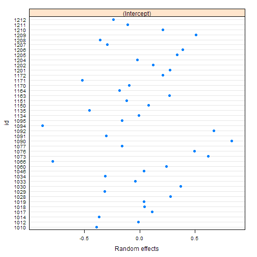
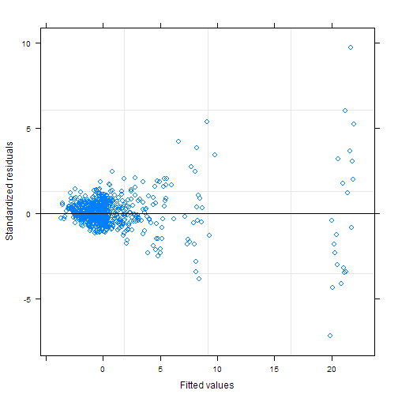

---

# Preamble

Load libraries.


```r
library(readxl)
library(magrittr)
library(dplyr)
```

```
## 
## Attaching package: 'dplyr'
```

```
## The following objects are masked from 'package:stats':
## 
##     filter, lag
```

```
## The following objects are masked from 'package:base':
## 
##     intersect, setdiff, setequal, union
```

```r
library(nlme)
```

```
## 
## Attaching package: 'nlme'
```

```
## The following object is masked from 'package:dplyr':
## 
##     collapse
```

```r
library(broom)
library(ggplot2)
library(svglite)
library(knitr)
library(doParallel)
```

```
## Loading required package: foreach
```

```
## Loading required package: iterators
```

```
## Loading required package: parallel
```

Reproducibility steps.


```r
sessionInfo()
```

```
## R version 3.5.3 (2019-03-11)
## Platform: x86_64-w64-mingw32/x64 (64-bit)
## Running under: Windows 10 x64 (build 17134)
## 
## Matrix products: default
## 
## locale:
## [1] LC_COLLATE=English_United States.1252 
## [2] LC_CTYPE=English_United States.1252   
## [3] LC_MONETARY=English_United States.1252
## [4] LC_NUMERIC=C                          
## [5] LC_TIME=English_United States.1252    
## 
## attached base packages:
## [1] parallel  stats     graphics  grDevices utils     datasets  methods  
## [8] base     
## 
## other attached packages:
##  [1] doParallel_1.0.14 iterators_1.0.10  foreach_1.4.4    
##  [4] svglite_1.2.1     ggplot2_3.1.0     broom_0.5.1      
##  [7] nlme_3.1-137      dplyr_0.8.0.1     magrittr_1.5     
## [10] readxl_1.3.1      rmarkdown_1.12    knitr_1.22       
## [13] checkpoint_0.4.5 
## 
## loaded via a namespace (and not attached):
##  [1] Rcpp_1.0.1       cellranger_1.1.0 pillar_1.3.1     compiler_3.5.3  
##  [5] plyr_1.8.4       tools_3.5.3      digest_0.6.18    evaluate_0.13   
##  [9] tibble_2.1.1     gtable_0.3.0     lattice_0.20-38  pkgconfig_2.0.2 
## [13] rlang_0.3.3      xfun_0.5         withr_2.1.2      stringr_1.4.0   
## [17] gdtools_0.1.8    generics_0.0.2   grid_3.5.3       tidyselect_0.2.5
## [21] glue_1.3.1       R6_2.4.0         purrr_0.3.2      tidyr_0.8.3     
## [25] codetools_0.2-16 backports_1.1.3  scales_1.0.0     htmltools_0.3.6 
## [29] assertthat_0.2.1 colorspace_1.4-1 stringi_1.4.3    lazyeval_0.2.2  
## [33] munsell_0.5.0    crayon_1.3.4
```

```r
set.seed(as.integer(as.Date("2016-11-18")))
```

Source user-defined functions.


```r
sapply(list.files("lib", full.names = TRUE), source)
```

```
##         lib/library.R
## value   ?            
## visible FALSE
```

---

# Read data

Import the data.
Data files are locally stored.

## Aim 1-a

Import Aim 1 Amino Acids and TCA Cycle intermediates (Neg).


```r
f <- "data/raw/Z scores Aim 1 Neg-aa.xlsx"
levels <- c("wtrest", "wtex", "korest", "koex")
L1a <- importDataToList(f, levels)
L1a[["file"]]
```

```
## [1] "data/raw/Z scores Aim 1 Neg-aa.xlsx"
```

```r
L1a[["dim"]]
```

```
## [1] 984   4
```

```r
L1a[["names"]]
```

```
## [1] "condition"  "id"         "metabolite" "z_value"
```

```r
L1a[["head"]]
```

```
## # A tibble: 6 x 4
##   condition    id metabolite z_value
##   <fct>     <dbl> <fct>        <dbl>
## 1 KOEX       1010 FUMARIC     -0.934
## 2 KOEX       1012 FUMARIC     -1.21 
## 3 KOEX       1014 FUMARIC      0.196
## 4 KOEX       1017 FUMARIC      0.455
## 5 KOEX       1018 FUMARIC     -0.580
## 6 KOEX       1019 FUMARIC     -0.593
```

```r
L1a[["data"]] %>% pull(condition) %>% levels()
```

```
## [1] "WTREST" "WTEX"   "KOREST" "KOEX"
```

```r
L1a[["data"]] %>% pull(metabolite) %>% levels()
```

```
##  [1] "alanine + sarcosine" "arginine"            "asparagine"         
##  [4] "Aspartic Acid"       "CITRIC"              "FUMARIC"            
##  [7] "glutamic"            "glutamine"           "glycine"            
## [10] "histidine"           "isoleucine"          "LACTIC"             
## [13] "leucine"             "lysine"              "MALIC"              
## [16] "methionine"          "METHYLSUCCINIC"      "Phenylalanine"      
## [19] "serine"              "SUCCINIC-2"          "threonine"          
## [22] "Tryptophan"          "Tyrosine"            "valine"
```

```r
D1a <- L1a[["data"]]
```

## Aim 1-b

Import Aim 1 Acylcarnitines.


```r
f <- "data/raw/Z scores Aim 1 AC.xlsx"
L1b <- importDataToList(f, levels)
L1b[["file"]]
```

```
## [1] "data/raw/Z scores Aim 1 AC.xlsx"
```

```r
L1b[["dim"]]
```

```
## [1] 899   4
```

```r
L1b[["names"]]
```

```
## [1] "condition"  "id"         "metabolite" "z_value"
```

```r
L1b[["head"]]
```

```
## # A tibble: 6 x 4
##   condition    id metabolite      z_value
##   <fct>     <dbl> <fct>             <dbl>
## 1 KOEX       1010 acetylcarnitine   -1.84
## 2 KOEX       1012 acetylcarnitine   -2.15
## 3 KOEX       1014 acetylcarnitine   -2.04
## 4 KOEX       1017 acetylcarnitine   -2.43
## 5 KOEX       1018 acetylcarnitine   -2.49
## 6 KOEX       1019 acetylcarnitine   -1.83
```

```r
L1b[["data"]] %>% pull(condition) %>% levels()
```

```
## [1] "WTREST" "WTEX"   "KOREST" "KOEX"
```

```r
L1b[["data"]] %>% pull(metabolite) %>% levels()
```

```
##  [1] "2-methylbutyrylcarnitine" "3HMG"                    
##  [3] "acetylcarnitine"          "butyrylcarnitine"        
##  [5] "C10:1 total"              "C12"                     
##  [7] "C14:1 total"              "C14:2 total"             
##  [9] "C15:1 total"              "C16:1 total"             
## [11] "C17:1 total"              "C18:1 total"             
## [13] "C18:2 total"              "C19:1 total"             
## [15] "carnitine"                "ethylmalonylcarnitine"   
## [17] "isobutyrylcarnitine"      "methylsuccinylcarnitine" 
## [19] "n-decanoylcarnitine"      "n-hexanoylcarnitine"     
## [21] "n-octanoylcarnitine"      "propionylcarnitine"
```

```r
D1b <- L1b[["data"]]
```

## Aim 2-a

Import Aim 2 Amino Acids and TCA Cycle intermediates (Neg).


```r
f <- "data/raw/Z scores Aim 2 Neg-aa.xlsx"
levels <- c("wtex", "koex", "koc7", "koc8")
L2a <- importDataToList(f, levels)
L2a[["file"]]
```

```
## [1] "data/raw/Z scores Aim 2 Neg-aa.xlsx"
```

```r
L2a[["dim"]]
```

```
## [1] 1035    4
```

```r
L2a[["names"]]
```

```
## [1] "condition"  "id"         "metabolite" "z_value"
```

```r
L2a[["head"]]
```

```
## # A tibble: 6 x 4
##   condition    id metabolite z_value
##   <fct>     <dbl> <fct>        <dbl>
## 1 KOC7       1120 FUMARIC      -3.23
## 2 KOC7       1126 FUMARIC      -3.22
## 3 KOC7       1127 FUMARIC      -3.49
## 4 KOC7       1128 FUMARIC      -2.31
## 5 KOC7       1142 FUMARIC      -1.73
## 6 KOC7       1144 FUMARIC      -1.71
```

```r
L2a[["data"]] %>% pull(condition) %>% levels()
```

```
## [1] "WTEX" "KOEX" "KOC7" "KOC8"
```

```r
L2a[["data"]] %>% pull(metabolite) %>% levels()
```

```
##  [1] "alanine + sarcosine" "arginine"            "asparagine"         
##  [4] "Aspartic Acid"       "CITRIC"              "FUMARIC"            
##  [7] "glutamic"            "glutamine"           "glycine"            
## [10] "histidine"           "isoleucine"          "LACTIC"             
## [13] "leucine"             "lysine"              "MALIC"              
## [16] "methionine"          "METHYLSUCCINIC"      "Phenylalanine"      
## [19] "serine"              "SUCCINIC-2"          "threonine"          
## [22] "Tryptophan"          "Tyrosine"            "valine"
```

```r
D2a <- L2a[["data"]]
```

## Aim 2-b

Import Aim 2 Acylcarnitines.


```r
f <- "data/raw/Z scores Aim 2 AC.xlsx"
L2b <- importDataToList(f, levels)
L2b[["file"]]
```

```
## [1] "data/raw/Z scores Aim 2 AC.xlsx"
```

```r
L2b[["dim"]]
```

```
## [1] 948   4
```

```r
L2b[["names"]]
```

```
## [1] "condition"  "id"         "metabolite" "z_value"
```

```r
L2b[["head"]]
```

```
## # A tibble: 6 x 4
##   condition    id metabolite      z_value
##   <fct>     <dbl> <fct>             <dbl>
## 1 KOC7       1120 acetylcarnitine   -2.57
## 2 KOC7       1126 acetylcarnitine   -2.43
## 3 KOC7       1127 acetylcarnitine   -2.58
## 4 KOC7       1128 acetylcarnitine   -2.11
## 5 KOC7       1142 acetylcarnitine   -2.67
## 6 KOC7       1143 acetylcarnitine   -2.55
```

```r
L2b[["data"]] %>% pull(condition) %>% levels()
```

```
## [1] "WTEX" "KOEX" "KOC7" "KOC8"
```

```r
L2b[["data"]] %>% pull(metabolite) %>% levels()
```

```
##  [1] "2-methylbutyrylcarnitine" "3HMG"                    
##  [3] "acetylcarnitine"          "butyrylcarnitine"        
##  [5] "C10:1 total"              "C12"                     
##  [7] "C14:1 total"              "C14:2 total"             
##  [9] "C15:1 total"              "C16:1 total"             
## [11] "C17:1 total"              "C18:1 total"             
## [13] "C18:2 total"              "C19:1 total"             
## [15] "carnitine"                "ethylmalonylcarnitine"   
## [17] "isobutyrylcarnitine"      "methylsuccinylcarnitine" 
## [19] "n-decanoylcarnitine"      "n-hexanoylcarnitine"     
## [21] "n-octanoylcarnitine"      "propionylcarnitine"
```

```r
D2b <- L2b[["data"]]
```

---

# Model

Basic data preprocessing steps:

1. Find and remove outliers using Grubbs.
2. Standardize by Z score.
3. Check for normality.
4. Transform and recheck normality. We decided not to use transformed data as it did not correct the few conditions with multiple skewed groups.


## Methods

A mixed linear effects model was estimated for each aim.
Fixed effects for Aim 1 were condition (wildtype-rest (ref), wildtype-exercise, knockout-rest, knockout-exercise), and metabolite.
Fixed effects for Aim 2 were condition (wildtype-exercise (ref), knockout-exercise, knockout-C7, knockout-C8), and metabolite.
All 2-way interactions between fixed effects were included in the models.
Animal ID was the random effect.
A general correlation structure was assumed.
Estimates for the contrasts comparing each combination of condition and metabolite are presented.
P-values were adjusted to control the false discovery rate, the expected proportion of false discoveries amongst the rejected hypotheses.
The data was analyzed using R version 3.5.3 (2019-03-11) and the `nlme` package version 3.1.137.

Estimate model.
Specify the correlation structure using `cs`.
Use `corCompSymm`, *compound symmetry structure corresponding to a constant correlation*.

**References**

Benjamini, Y., and Hochberg, Y.
(1995).
Controlling the false discovery rate: a practical and powerful approach to multiple testing.
*Journal of the Royal Statistical Society Series B* 57, 289–300.


```r
citation()
```

```
## 
## To cite R in publications use:
## 
##   R Core Team (2019). R: A language and environment for
##   statistical computing. R Foundation for Statistical Computing,
##   Vienna, Austria. URL https://www.R-project.org/.
## 
## A BibTeX entry for LaTeX users is
## 
##   @Manual{,
##     title = {R: A Language and Environment for Statistical Computing},
##     author = {{R Core Team}},
##     organization = {R Foundation for Statistical Computing},
##     address = {Vienna, Austria},
##     year = {2019},
##     url = {https://www.R-project.org/},
##   }
## 
## We have invested a lot of time and effort in creating R, please
## cite it when using it for data analysis. See also
## 'citation("pkgname")' for citing R packages.
```

```r
citation("nlme")
```

```
## 
## Pinheiro J, Bates D, DebRoy S, Sarkar D, R Core Team (2018).
## _nlme: Linear and Nonlinear Mixed Effects Models_. R package
## version 3.1-137, <URL: https://CRAN.R-project.org/package=nlme>.
## 
## A BibTeX entry for LaTeX users is
## 
##   @Manual{,
##     title = {{nlme}: Linear and Nonlinear Mixed Effects Models},
##     author = {Jose Pinheiro and Douglas Bates and Saikat DebRoy and Deepayan Sarkar and {R Core Team}},
##     year = {2018},
##     note = {R package version 3.1-137},
##     url = {https://CRAN.R-project.org/package=nlme},
##   }
```


## Aim 1

* WT-rest (ref)
* WT-exercise
* KO-rest
* KO-exercise

### Aim 1-a: Amino Acids and TCA Cycle intermediates (Neg)


```r
t0 <- Sys.time()
M <- estimateModel(data = D1a)
Sys.time() - t0
```

```
## Time difference of 1.860424 secs
```

```r
M %>% plot()
```


```r
M %>% ranef() %>% plot()
```



```r
M %>% anova() %>% kable()
```


|                     | numDF| denDF|    F-value|   p-value|
|:--------------------|-----:|-----:|----------:|---------:|
|(Intercept)          |     1|   850|  0.6111944| 0.4345562|
|condition            |     3|    38|  0.3369410| 0.7986948|
|metabolite           |    23|   850| 10.5263614| 0.0000000|
|condition:metabolite |    69|   850|  3.9513981| 0.0000000|

```r
fixef <- M %>% tidy(effects = "fixed") %>% filter(grepl("condition", term)) %>% adjustPvalue()
fixef %>% filter(sig) %>% kable()
```


|term                               | estimate| std.error| statistic|   p.value| p.adjustBH|sig  |
|:----------------------------------|--------:|---------:|---------:|---------:|----------:|:----|
|conditionWTEX:metaboliteTryptophan | 3.233007| 0.8846537|  3.654545| 0.0002734|  0.0065626|TRUE |
|conditionKOEX:metaboliteTryptophan | 3.333077| 0.8781535|  3.795551| 0.0001578|  0.0056798|TRUE |
|conditionKOEX:metaboliteTyrosine   | 4.075732| 0.8893361|  4.582893| 0.0000053|  0.0003797|TRUE |

```r
fixef %>% write.csv(file = "data/processed/lmeFixedCoefAim1a.csv", row.names = FALSE)
M1a <- M
```

### Aim 1-b: Acylcarnitines


```r
t0 <- Sys.time()
M <- estimateModel(data = D1b)
Sys.time() - t0
```

```
## Time difference of 0.5644641 secs
```

```r
M %>% plot()
```



```r
M %>% ranef() %>% plot()
```


```r
M %>% anova() %>% kable()
```


|                     | numDF| denDF|   F-value|   p-value|
|:--------------------|-----:|-----:|---------:|---------:|
|(Intercept)          |     1|   773| 28.400453| 0.0000001|
|condition            |     3|    38|  5.345096| 0.0035915|
|metabolite           |    21|   773| 87.087957| 0.0000000|
|condition:metabolite |    63|   773| 33.515134| 0.0000000|

```r
fixef <- M %>% tidy(effects = "fixed") %>% filter(grepl("condition", term)) %>% adjustPvalue()
fixef %>% filter(sig) %>% kable()
```


|term                                        |  estimate| std.error| statistic|   p.value| p.adjustBH|sig  |
|:-------------------------------------------|---------:|---------:|---------:|---------:|----------:|:----|
|conditionWTEX                               |  2.349382| 0.8565498|  2.742843| 0.0092402|  0.0469119|TRUE |
|conditionWTEX:metabolitebutyrylcarnitine    | -2.989893| 1.1313121| -2.642854| 0.0083875|  0.0461311|TRUE |
|conditionKOEX:metabolitebutyrylcarnitine    | -3.136631| 1.1313224| -2.772535| 0.0056960|  0.0367162|TRUE |
|conditionWTEX:metaboliteC14:2 total         | -2.848202| 1.1313121| -2.517609| 0.0120165|  0.0495681|TRUE |
|conditionWTEX:metaboliteC16:1 total         | -3.252180| 1.1474238| -2.834332| 0.0047119|  0.0345541|TRUE |
|conditionKOREST:metaboliteC16:1 total       |  4.882666| 1.2299025|  3.969962| 0.0000786|  0.0008644|TRUE |
|conditionKOEX:metaboliteC16:1 total         |  5.442940| 1.1480122|  4.741187| 0.0000025|  0.0000334|TRUE |
|conditionWTEX:metaboliteC17:1 total         | -2.913825| 1.1313121| -2.575616| 0.0101909|  0.0480427|TRUE |
|conditionWTEX:metaboliteC18:1 total         | -2.894564| 1.1474238| -2.522663| 0.0118466|  0.0495681|TRUE |
|conditionKOREST:metaboliteC18:1 total       |  7.640952| 1.2299025|  6.212649| 0.0000000|  0.0000000|TRUE |
|conditionKOEX:metaboliteC18:1 total         |  8.566622| 1.1477120|  7.464086| 0.0000000|  0.0000000|TRUE |
|conditionWTEX:metaboliteC18:2 total         | -3.654027| 1.1474238| -3.184549| 0.0015079|  0.0124405|TRUE |
|conditionKOREST:metaboliteC18:2 total       |  4.118645| 1.2299025|  3.348757| 0.0008511|  0.0080243|TRUE |
|conditionKOREST:metaboliteC19:1 total       | 21.312344| 1.2299025| 17.328483| 0.0000000|  0.0000000|TRUE |
|conditionKOEX:metaboliteC19:1 total         | 20.451609| 1.1475001| 17.822752| 0.0000000|  0.0000000|TRUE |
|conditionWTEX:metaboliten-decanoylcarnitine | -3.109847| 1.1313121| -2.748885| 0.0061194|  0.0367162|TRUE |

```r
fixef %>% write.csv(file = "data/processed/lmeFixedCoefAim1b.csv", row.names = FALSE)
M1b <- M
```


## Aim 2

* WT-exer (ref)
* KO-C7
* KO-C8
* KO-exer

### Aim 2-a: Amino Acids and TCA Cycle intermediates (Neg)


```r
t0 <- Sys.time()
M <- estimateModel(data = D2a)
Sys.time() - t0
```

```
## Time difference of 2.013413 secs
```

```r
M %>% plot()
```


```r
M %>% ranef() %>% plot()
```


```r
M %>% anova() %>% kable()
```


|                     | numDF| denDF|  F-value| p-value|
|:--------------------|-----:|-----:|--------:|-------:|
|(Intercept)          |     1|   899| 42.19271|       0|
|condition            |     3|    40| 24.34463|       0|
|metabolite           |    23|   899| 67.07559|       0|
|condition:metabolite |    69|   899| 52.36200|       0|

```r
fixef <- M %>% tidy(effects = "fixed") %>% filter(grepl("condition", term)) %>% adjustPvalue()
fixef %>% filter(sig) %>% kable()
```


|term                                   |  estimate| std.error| statistic|   p.value| p.adjustBH|sig  |
|:--------------------------------------|---------:|---------:|---------:|---------:|----------:|:----|
|conditionKOC8:metaboliteLACTIC         | -5.304379|  1.296769| -4.090457| 0.0000469|  0.0008445|TRUE |
|conditionKOC8:metaboliteMALIC          | -3.826061|  1.296769| -2.950456| 0.0032554|  0.0468777|TRUE |
|conditionKOC8:metaboliteMETHYLSUCCINIC | 42.229398|  1.312515| 32.174409| 0.0000000|  0.0000000|TRUE |
|conditionKOC7:metabolitethreonine      | 10.938718|  1.295064|  8.446467| 0.0000000|  0.0000000|TRUE |
|conditionKOC8:metabolitethreonine      |  7.869407|  1.311278|  6.001326| 0.0000000|  0.0000001|TRUE |

```r
fixef %>% write.csv(file = "data/processed/lmeFixedCoefAim2a.csv", row.names = FALSE)
M2a <- M
```

### Aim 2-b: Acylcarnitines


```r
t0 <- Sys.time()
M <- estimateModel(data = D2b)
Sys.time() - t0
```

```
## Time difference of 0.957823 secs
```

```r
M %>% plot()
```


```r
M %>% ranef() %>% plot()
```


```r
M %>% anova() %>% kable()
```


|                     | numDF| denDF|  F-value| p-value|
|:--------------------|-----:|-----:|--------:|-------:|
|(Intercept)          |     1|   820| 168.6622|       0|
|condition            |     3|    40| 108.6826|       0|
|metabolite           |    21|   820| 403.8874|       0|
|condition:metabolite |    63|   820| 165.8649|       0|

```r
fixef <- M %>% tidy(effects = "fixed") %>% filter(grepl("condition", term)) %>% adjustPvalue()
fixef %>% filter(sig) %>% kable()
```


|term                                            |  estimate| std.error| statistic|   p.value| p.adjustBH|sig  |
|:-----------------------------------------------|---------:|---------:|---------:|---------:|----------:|:----|
|conditionKOC7:metaboliteC15:1 total             |  9.208719|  1.483728|  6.206472| 0.0000000|  0.0000000|TRUE |
|conditionKOEX:metaboliteC16:1 total             |  5.460242|  1.466148|  3.724210| 0.0002093|  0.0010628|TRUE |
|conditionKOC7:metaboliteC16:1 total             |  5.984736|  1.483728|  4.033580| 0.0000601|  0.0003303|TRUE |
|conditionKOC8:metaboliteC16:1 total             |  6.067134|  1.464926|  4.141597| 0.0000381|  0.0002284|TRUE |
|conditionKOEX:metaboliteC17:1 total             |  4.184319|  1.460055|  2.865863| 0.0042652|  0.0165588|TRUE |
|conditionKOC7:metaboliteC17:1 total             | 26.966290|  1.483728| 18.174682| 0.0000000|  0.0000000|TRUE |
|conditionKOEX:metaboliteC18:1 total             |  6.052491|  1.460708|  4.143531| 0.0000378|  0.0002284|TRUE |
|conditionKOC8:metaboliteC18:1 total             |  6.816555|  1.464926|  4.653174| 0.0000038|  0.0000359|TRUE |
|conditionKOEX:metaboliteC18:2 total             |  6.978799|  1.460354|  4.778841| 0.0000021|  0.0000230|TRUE |
|conditionKOC7:metaboliteC18:2 total             |  6.568055|  1.483728|  4.426723| 0.0000109|  0.0000896|TRUE |
|conditionKOC8:metaboliteC18:2 total             |  6.288241|  1.464926|  4.292532| 0.0000198|  0.0001450|TRUE |
|conditionKOEX:metaboliteC19:1 total             | 20.687379|  1.460994| 14.159795| 0.0000000|  0.0000000|TRUE |
|conditionKOC7:metaboliteC19:1 total             | 95.314868|  1.483728| 64.240110| 0.0000000|  0.0000000|TRUE |
|conditionKOC8:metaboliteC19:1 total             | 16.448668|  1.464926| 11.228327| 0.0000000|  0.0000000|TRUE |
|conditionKOEX:metaboliteethylmalonylcarnitine   | -4.017887|  1.462915| -2.746494| 0.0061556|  0.0225706|TRUE |
|conditionKOC7:metaboliteethylmalonylcarnitine   | -4.840066|  1.502560| -3.221213| 0.0013268|  0.0062550|TRUE |
|conditionKOC8:metaboliteethylmalonylcarnitine   | -3.732030|  1.483728| -2.515307| 0.0120830|  0.0419726|TRUE |
|conditionKOC7:metabolitemethylsuccinylcarnitine | -4.333283|  1.502560| -2.883933| 0.0040302|  0.0165588|TRUE |
|conditionKOC8:metaboliten-decanoylcarnitine     |  4.479240|  1.483794|  3.018776| 0.0026166|  0.0115130|TRUE |

```r
fixef %>% write.csv(file = "data/processed/lmeFixedCoefAim2b.csv", row.names = FALSE)
M2b <- M
```


## Save

Save `lme` objects for interactive work.


```r
save(M1a, M1b, M2a, M2b, file = "data/processed/lmeObjects.RData")
```
