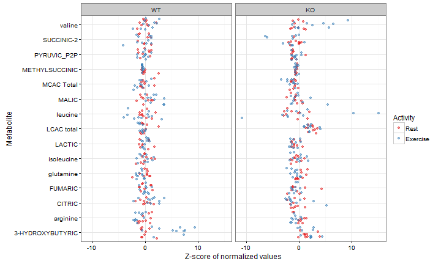
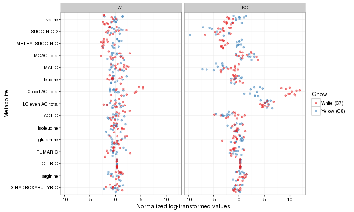
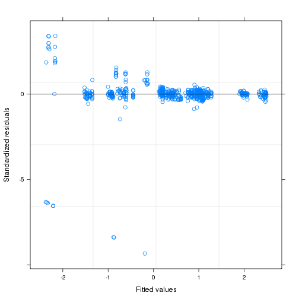
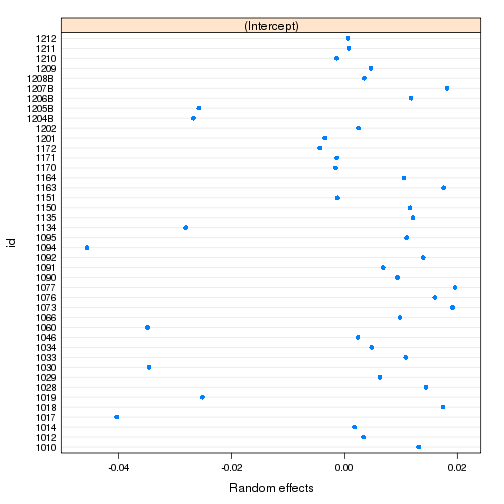
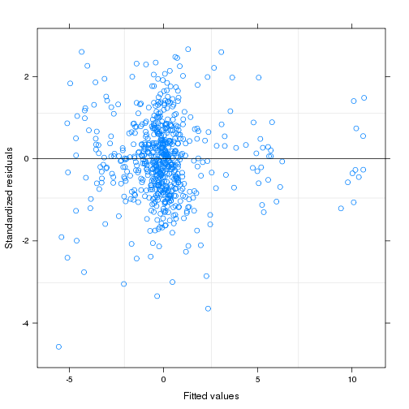
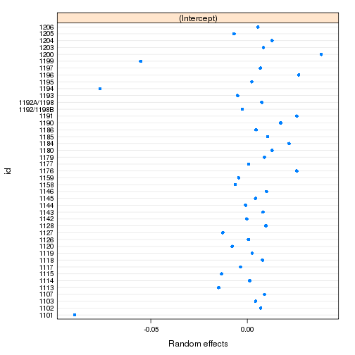

---

# Preamble

Set working directory.


```r
setwd("~/Projects/GillinghamMetabolomics/scripts")
```

Load libraries.


```r
library(readxl)
library(magrittr)
library(dplyr)
```

```
## 
## Attaching package: 'dplyr'
```

```
## The following objects are masked from 'package:stats':
## 
##     filter, lag
```

```
## The following objects are masked from 'package:base':
## 
##     intersect, setdiff, setequal, union
```

```r
library(nlme)
```

```
## 
## Attaching package: 'nlme'
```

```
## The following object is masked from 'package:dplyr':
## 
##     collapse
```

```r
library(broom)
library(ggplot2)
library(knitr)
library(doParallel)
```

```
## Loading required package: foreach
```

```
## Loading required package: iterators
```

```
## Loading required package: parallel
```

Reproducibility steps.


```r
sessionInfo()
```

```
## R version 3.3.2 (2016-10-31)
## Platform: x86_64-redhat-linux-gnu (64-bit)
## Running under: CentOS release 6.8 (Final)
## 
## locale:
##  [1] LC_CTYPE=en_US.iso885915       LC_NUMERIC=C                  
##  [3] LC_TIME=en_US.iso885915        LC_COLLATE=en_US.iso885915    
##  [5] LC_MONETARY=en_US.iso885915    LC_MESSAGES=en_US.iso885915   
##  [7] LC_PAPER=en_US.iso885915       LC_NAME=C                     
##  [9] LC_ADDRESS=C                   LC_TELEPHONE=C                
## [11] LC_MEASUREMENT=en_US.iso885915 LC_IDENTIFICATION=C           
## 
## attached base packages:
## [1] parallel  stats     graphics  grDevices utils     datasets  base     
## 
## other attached packages:
##  [1] doParallel_1.0.10 iterators_1.0.8   foreach_1.4.3    
##  [4] ggplot2_2.1.0     broom_0.4.1       nlme_3.1-128     
##  [7] dplyr_0.5.0       magrittr_1.5      readxl_0.1.1     
## [10] rmarkdown_1.0     knitr_1.14        checkpoint_0.3.16
## 
## loaded via a namespace (and not attached):
##  [1] Rcpp_0.12.7      munsell_0.4.3    mnormt_1.5-4     colorspace_1.2-6
##  [5] lattice_0.20-34  R6_2.1.3         stringr_1.1.0    plyr_1.8.4      
##  [9] tools_3.3.2      grid_3.3.2       gtable_0.2.0     psych_1.6.9     
## [13] DBI_0.5-1        htmltools_0.3.5  assertthat_0.1   digest_0.6.10   
## [17] tibble_1.2       reshape2_1.4.1   formatR_1.4      tidyr_0.6.0     
## [21] codetools_0.2-14 evaluate_0.9     stringi_1.1.1    scales_0.4.0    
## [25] methods_3.3.2    foreign_0.8-67
```

```r
set.seed(as.integer(as.Date("2016-11-18")))
```

Source user-defined functions.


```r
sapply(list.files("../lib", full.names = TRUE), source)
```

```
##         ../lib/library.R
## value   ?               
## visible FALSE
```

---

# Read data

Import the data.
Data files are locally stored.

Import Aim 1: Exercise data


```r
L1 <- importDataToList("../data/raw/Ultragenyx Aim 1 Z score.xlsx")
```

```
## Warning in `levels<-`(`*tmp*`, value = if (nl == nL) as.character(labels)
## else paste0(labels, : duplicated levels in factors are deprecated

## Warning in `levels<-`(`*tmp*`, value = if (nl == nL) as.character(labels)
## else paste0(labels, : duplicated levels in factors are deprecated

## Warning in `levels<-`(`*tmp*`, value = if (nl == nL) as.character(labels)
## else paste0(labels, : duplicated levels in factors are deprecated

## Warning in `levels<-`(`*tmp*`, value = if (nl == nL) as.character(labels)
## else paste0(labels, : duplicated levels in factors are deprecated
```

```r
L1[["file"]]
```

```
## [1] "../data/raw/Ultragenyx Aim 1 Z score.xlsx"
```

```r
L1[["dim"]]
```

```
## [1] 622  11
```

```r
L1[["names"]]
```

```
##  [1] "id"              "genotype"        "activity"       
##  [4] "chow"            "metabolite_type" "metabolite"     
##  [7] "value"           "logValue"        "zValue"         
## [10] "zLogValue"       "important"
```

```r
L1[["head"]]
```

```
## # A tibble: 6 × 11
##      id genotype activity    chow metabolite_type metabolite   value
##   <chr>   <fctr>   <fctr>  <fctr>          <fctr>     <fctr>   <dbl>
## 1  1170       WT     Rest Regular  Acylcarnitines LCAC total  4.8986
## 2  1171       WT     Rest Regular  Acylcarnitines LCAC total  5.8048
## 3  1172       WT     Rest Regular  Acylcarnitines LCAC total  5.7869
## 4  1201       WT     Rest Regular  Acylcarnitines LCAC total 10.1177
## 5  1202       WT     Rest Regular  Acylcarnitines LCAC total  6.7489
## 6  1209       WT     Rest Regular  Acylcarnitines LCAC total  7.6464
## # ... with 4 more variables: logValue <dbl>, zValue <dbl>,
## #   zLogValue <dbl>, important <lgl>
```

```r
D1 <- L1[["data"]]
```

Import Aim 2: Diet data.
Metabolite `LCAC total` is the sum of `LC even AC total` and `LC odd AC total`; remove `LCAC total` data.


```r
L2 <- importDataToList("../data/raw/Ultragenyx Aim 2 Z score.xlsx")
```

```
## Warning in read_xlsx_(path, sheet, col_names = col_names, col_types =
## col_types, : [4173, 23]: expecting numeric: got ' ctrl mean val'
```

```
## Warning in read_xlsx_(path, sheet, col_names = col_names, col_types =
## col_types, : [4173, 24]: expecting numeric: got 'stdev ctrl val'
```

```
## Warning in read_xlsx_(path, sheet, col_names = col_names, col_types =
## col_types, : [4173, 25]: expecting numeric: got 'mean log ctrl val'
```

```
## Warning in read_xlsx_(path, sheet, col_names = col_names, col_types =
## col_types, : [4173, 26]: expecting numeric: got 'stdev log ctrl val'
```

```
## Warning in `levels<-`(`*tmp*`, value = if (nl == nL) as.character(labels)
## else paste0(labels, : duplicated levels in factors are deprecated

## Warning in `levels<-`(`*tmp*`, value = if (nl == nL) as.character(labels)
## else paste0(labels, : duplicated levels in factors are deprecated

## Warning in `levels<-`(`*tmp*`, value = if (nl == nL) as.character(labels)
## else paste0(labels, : duplicated levels in factors are deprecated

## Warning in `levels<-`(`*tmp*`, value = if (nl == nL) as.character(labels)
## else paste0(labels, : duplicated levels in factors are deprecated
```

```r
L2[["file"]]
```

```
## [1] "../data/raw/Ultragenyx Aim 2 Z score.xlsx"
```

```r
L2[["dim"]]
```

```
## [1] 688  11
```

```r
L2[["names"]]
```

```
##  [1] "id"              "genotype"        "activity"       
##  [4] "chow"            "metabolite_type" "metabolite"     
##  [7] "value"           "logValue"        "zValue"         
## [10] "zLogValue"       "important"
```

```r
L2[["head"]]
```

```
## # A tibble: 6 × 11
##      id genotype activity        chow metabolite_type       metabolite
##   <chr>   <fctr>   <fctr>      <fctr>          <fctr>           <fctr>
## 1  1101       WT Exercise Yellow (C8)  Acylcarnitines LC even AC total
## 2  1102       WT Exercise Yellow (C8)  Acylcarnitines LC even AC total
## 3  1103       WT Exercise Yellow (C8)  Acylcarnitines LC even AC total
## 4  1184       WT Exercise Yellow (C8)  Acylcarnitines LC even AC total
## 5  1185       WT Exercise Yellow (C8)  Acylcarnitines LC even AC total
## 6  1186       WT Exercise Yellow (C8)  Acylcarnitines LC even AC total
## # ... with 5 more variables: value <dbl>, logValue <dbl>, zValue <dbl>,
## #   zLogValue <dbl>, important <lgl>
```

```r
D2 <- L2[["data"]] %>% filter(metabolite != "LCAC total") %>% mutate(metabolite = droplevels(metabolite))
```


## Check data

Check the `value` and `logValue`.


```r
kable(summarizeOutcome(D1))
```


|              |       Min.| X1st.Qu.| Median|    Mean| X3rd.Qu.|    Max.|
|:-------------|----------:|--------:|------:|-------:|--------:|-------:|
|nominal       |  0.0000001|  1.06900| 3.0360| 28.4200|   12.070| 438.700|
|log-transform | -6.9550000|  0.02907| 0.4823|  0.4017|    1.082|   2.642|

```r
ggplot(D1) +
  aes(x = logValue, y = metabolite, color = activity, fill = activity) +
  geom_jitter(alpha = 1/2) +
  facet_wrap(~ genotype) +
  scale_x_continuous("log10 scale") +
  scale_y_discrete("Metabolite") +
  scale_color_brewer("Activity", palette = "Set1") +
  scale_fill_brewer("Activity", palette = "Set1") +
  theme_bw()
```



```r
ggsave("../figures/plotDataAim1.png", width = 10, height = 8, units = "in")
```


```r
kable(summarizeOutcome(D2))
```


|              |       Min.| X1st.Qu.| Median|    Mean| X3rd.Qu.|    Max.|
|:-------------|----------:|--------:|------:|-------:|--------:|-------:|
|nominal       |  0.0000001|  0.84630| 3.2620| 24.7700|   12.070| 408.800|
|log-transform | -6.9550000| -0.07246| 0.5134|  0.4957|    1.082|   2.612|

```r
ggplot(D2) +
  aes(x = logValue, y = metabolite, color = chow, fill = chow) +
  geom_jitter(alpha = 1/2) +
  facet_wrap(~ genotype) +
  scale_x_continuous("log10 scale") +
  scale_y_discrete("Metabolite") +
  scale_color_brewer("Chow", palette = "Set1") +
  scale_fill_brewer("Chow", palette = "Set1") +
  theme_bw()
```



```r
ggsave("../figures/plotDataAim2.png", width = 10, height = 8, units = "in")
```


Check fixed effects factors.


```r
D1 %>% group_by(genotype, activity) %>% tally
```

```
## Source: local data frame [4 x 3]
## Groups: genotype [?]
## 
##   genotype activity     n
##     <fctr>   <fctr> <int>
## 1       WT     Rest   142
## 2       WT Exercise   165
## 3       KO     Rest   150
## 4       KO Exercise   165
```

```r
D1 %>% group_by(genotype, metabolite) %>% tally %>% print(n = nrow(.))
```

```
## Source: local data frame [30 x 3]
## Groups: genotype [?]
## 
##    genotype       metabolite     n
##      <fctr>           <fctr> <int>
## 1        WT 3-HYDROXYBUTYRIC    20
## 2        WT         arginine    21
## 3        WT           CITRIC    20
## 4        WT          FUMARIC    20
## 5        WT        glutamine    21
## 6        WT       isoleucine    21
## 7        WT           LACTIC    20
## 8        WT       LCAC total    21
## 9        WT          leucine    21
## 10       WT            MALIC    20
## 11       WT       MCAC Total    21
## 12       WT   METHYLSUCCINIC    20
## 13       WT      PYRUVIC_P2P    20
## 14       WT       SUCCINIC-2    20
## 15       WT           valine    21
## 16       KO 3-HYDROXYBUTYRIC    21
## 17       KO         arginine    21
## 18       KO           CITRIC    21
## 19       KO          FUMARIC    21
## 20       KO        glutamine    21
## 21       KO       isoleucine    21
## 22       KO           LACTIC    21
## 23       KO       LCAC total    21
## 24       KO          leucine    21
## 25       KO            MALIC    21
## 26       KO       MCAC Total    21
## 27       KO   METHYLSUCCINIC    21
## 28       KO      PYRUVIC_P2P    21
## 29       KO       SUCCINIC-2    21
## 30       KO           valine    21
```

```r
D1 %>% group_by(activity, metabolite) %>% tally %>% print(n = nrow(.))
```

```
## Source: local data frame [30 x 3]
## Groups: activity [?]
## 
##    activity       metabolite     n
##      <fctr>           <fctr> <int>
## 1      Rest 3-HYDROXYBUTYRIC    19
## 2      Rest         arginine    20
## 3      Rest           CITRIC    19
## 4      Rest          FUMARIC    19
## 5      Rest        glutamine    20
## 6      Rest       isoleucine    20
## 7      Rest           LACTIC    19
## 8      Rest       LCAC total    20
## 9      Rest          leucine    20
## 10     Rest            MALIC    19
## 11     Rest       MCAC Total    20
## 12     Rest   METHYLSUCCINIC    19
## 13     Rest      PYRUVIC_P2P    19
## 14     Rest       SUCCINIC-2    19
## 15     Rest           valine    20
## 16 Exercise 3-HYDROXYBUTYRIC    22
## 17 Exercise         arginine    22
## 18 Exercise           CITRIC    22
## 19 Exercise          FUMARIC    22
## 20 Exercise        glutamine    22
## 21 Exercise       isoleucine    22
## 22 Exercise           LACTIC    22
## 23 Exercise       LCAC total    22
## 24 Exercise          leucine    22
## 25 Exercise            MALIC    22
## 26 Exercise       MCAC Total    22
## 27 Exercise   METHYLSUCCINIC    22
## 28 Exercise      PYRUVIC_P2P    22
## 29 Exercise       SUCCINIC-2    22
## 30 Exercise           valine    22
```


```r
D2 %>% group_by(genotype, chow) %>% tally
```

```
## Source: local data frame [4 x 3]
## Groups: genotype [?]
## 
##   genotype        chow     n
##     <fctr>      <fctr> <int>
## 1       WT  White (C7)   165
## 2       WT Yellow (C8)   165
## 3       KO  White (C7)   165
## 4       KO Yellow (C8)   150
```

```r
D2 %>% group_by(genotype, metabolite) %>% tally %>% print(n = nrow(.))
```

```
## Source: local data frame [30 x 3]
## Groups: genotype [?]
## 
##    genotype       metabolite     n
##      <fctr>           <fctr> <int>
## 1        WT 3-HYDROXYBUTYRIC    22
## 2        WT         arginine    22
## 3        WT           CITRIC    22
## 4        WT          FUMARIC    22
## 5        WT        glutamine    22
## 6        WT       isoleucine    22
## 7        WT           LACTIC    22
## 8        WT LC even AC total    22
## 9        WT  LC odd AC total    22
## 10       WT          leucine    22
## 11       WT            MALIC    22
## 12       WT       MCAC total    22
## 13       WT   METHYLSUCCINIC    22
## 14       WT       SUCCINIC-2    22
## 15       WT           valine    22
## 16       KO 3-HYDROXYBUTYRIC    21
## 17       KO         arginine    21
## 18       KO           CITRIC    21
## 19       KO          FUMARIC    21
## 20       KO        glutamine    21
## 21       KO       isoleucine    21
## 22       KO           LACTIC    21
## 23       KO LC even AC total    21
## 24       KO  LC odd AC total    21
## 25       KO          leucine    21
## 26       KO            MALIC    21
## 27       KO       MCAC total    21
## 28       KO   METHYLSUCCINIC    21
## 29       KO       SUCCINIC-2    21
## 30       KO           valine    21
```

```r
D2 %>% group_by(chow, metabolite) %>% tally %>% print(n = nrow(.))
```

```
## Source: local data frame [30 x 3]
## Groups: chow [?]
## 
##           chow       metabolite     n
##         <fctr>           <fctr> <int>
## 1   White (C7) 3-HYDROXYBUTYRIC    22
## 2   White (C7)         arginine    22
## 3   White (C7)           CITRIC    22
## 4   White (C7)          FUMARIC    22
## 5   White (C7)        glutamine    22
## 6   White (C7)       isoleucine    22
## 7   White (C7)           LACTIC    22
## 8   White (C7) LC even AC total    22
## 9   White (C7)  LC odd AC total    22
## 10  White (C7)          leucine    22
## 11  White (C7)            MALIC    22
## 12  White (C7)       MCAC total    22
## 13  White (C7)   METHYLSUCCINIC    22
## 14  White (C7)       SUCCINIC-2    22
## 15  White (C7)           valine    22
## 16 Yellow (C8) 3-HYDROXYBUTYRIC    21
## 17 Yellow (C8)         arginine    21
## 18 Yellow (C8)           CITRIC    21
## 19 Yellow (C8)          FUMARIC    21
## 20 Yellow (C8)        glutamine    21
## 21 Yellow (C8)       isoleucine    21
## 22 Yellow (C8)           LACTIC    21
## 23 Yellow (C8) LC even AC total    21
## 24 Yellow (C8)  LC odd AC total    21
## 25 Yellow (C8)          leucine    21
## 26 Yellow (C8)            MALIC    21
## 27 Yellow (C8)       MCAC total    21
## 28 Yellow (C8)   METHYLSUCCINIC    21
## 29 Yellow (C8)       SUCCINIC-2    21
## 30 Yellow (C8)           valine    21
```

---

# Model


## Methods

A mixed linear effects model was estimated for each aim.
Metabolomic values were transformed to the log-10 scale.
Fixed effects for Aim 1 were activity, genotype, and metabolite.
Fixed effects for Aim 2 were chow, genotype, and metabolite.
All 2-way and 3-way interactions between fixed effects were included in the models.
Animal ID was the random effect.
A general correlation structure was assumed.
Estimates for the contrasts comparing exercise versus rest for Aim 1, and yellow C8 chow versus white C7 chow for Aim 2, for each combination of genotype and metabolite are presented
The data was analyzed using R version 3.3.2 (2016-10-31) and the `nlme` package version 3.1.128.


## References


```r
citation()
```

```
## 
## To cite R in publications use:
## 
##   R Core Team (2016). R: A language and environment for
##   statistical computing. R Foundation for Statistical Computing,
##   Vienna, Austria. URL https://www.R-project.org/.
## 
## A BibTeX entry for LaTeX users is
## 
##   @Manual{,
##     title = {R: A Language and Environment for Statistical Computing},
##     author = {{R Core Team}},
##     organization = {R Foundation for Statistical Computing},
##     address = {Vienna, Austria},
##     year = {2016},
##     url = {https://www.R-project.org/},
##   }
## 
## We have invested a lot of time and effort in creating R, please
## cite it when using it for data analysis. See also
## 'citation("pkgname")' for citing R packages.
```

```r
citation("nlme")
```

```
## 
## Pinheiro J, Bates D, DebRoy S, Sarkar D and R Core Team (2016).
## _nlme: Linear and Nonlinear Mixed Effects Models_. R package
## version 3.1-128, <URL: http://CRAN.R-project.org/package=nlme>.
## 
## A BibTeX entry for LaTeX users is
## 
##   @Manual{,
##     title = {{nlme}: Linear and Nonlinear Mixed Effects Models},
##     author = {Jose Pinheiro and Douglas Bates and Saikat DebRoy and Deepayan Sarkar and {R Core Team}},
##     year = {2016},
##     note = {R package version 3.1-128},
##     url = {http://CRAN.R-project.org/package=nlme},
##   }
```


## Aim 1: Exercise

**Rest versus exhaustive exercise**

Estimate model.
Specify the correlation structure using `cs`.
Use `corSymm`, *general correlation matrix, with no additional structure*.


```r
fixed <- formula(logValue ~
                   genotype +
                   activity +
                   metabolite +
                   genotype * activity +
                   genotype * metabolite +
                   activity * metabolite +
                   activity * metabolite * genotype)
random <- formula(~ 1 | id)
ctrl <- lmeControl(opt = "optim",
                   maxIter = 500, msMaxIter = 500)
cs <-
  corSymm(form = random, fixed = FALSE) %>%
  Initialize(data = D1)
Dim(cs)
```

```
## $N
## [1] 622
## 
## $M
## [1] 42
## 
## $maxLen
## [1] 15
## 
## $sumLenSq
## [1] 9274
## 
## $len
## groups
##   1170   1171   1172   1201   1202   1209   1210   1211   1212 1208B  
##     15     15     15     15      7     15     15     15     15     15 
##   1028   1029   1030   1033   1034   1046   1090   1091   1092   1094 
##     15     15     15     15     15     15     15     15     15     15 
##   1095   1134   1135   1150   1151   1163   1164 1204B  1205B  1206B  
##     15     15     15     15     15     15     15     15     15     15 
## 1207B    1010   1012   1014   1017   1018   1019   1060   1066   1073 
##     15     15     15     15     15     15     15     15     15     15 
##   1076   1077 
##     15     15 
## 
## $start
##  [1]  0  1  2  3  4  5  6  7  8  9 10 11 12 13 14 15 16 17 18 19 20 21 22
## [24] 23 24 25 26 27 28 29 30 31 32 33 34 35 36 37 38 39 40 41
```

```r
M1 <- D1 %>% lme(fixed, data = ., random = random, correlation = cs, control = ctrl)
M1 %>% plot
```



```r
M1 %>% ranef %>% plot
```



```r
M1 %>% anova %>% kable
```


|                             | numDF| denDF|      F-value|   p-value|
|:----------------------------|-----:|-----:|------------:|---------:|
|(Intercept)                  |     1|   524| 1.191794e+04| 0.0000000|
|genotype                     |     1|    38| 1.551776e+04| 0.0000000|
|activity                     |     1|    38| 1.443118e+04| 0.0000000|
|metabolite                   |    14|   524| 1.421757e+06| 0.0000000|
|genotype:activity            |     1|    38| 1.304574e-01| 0.7199587|
|genotype:metabolite          |    14|   524| 3.671942e+00| 0.0000071|
|activity:metabolite          |    14|   524| 5.168172e-01| 0.9238893|
|genotype:activity:metabolite |    14|   524| 1.586157e+00| 0.0786948|

```r
M1 %>% tidy(effects = "fixed") %>% kable
```


|term                                                 |   estimate| std.error|  statistic|   p.value|
|:----------------------------------------------------|----------:|---------:|----------:|---------:|
|(Intercept)                                          |  0.7800090| 0.2425439|  3.2159495| 0.0013804|
|genotypeKO                                           |  0.1111820| 0.3343264|  0.3325551| 0.7412978|
|activityExercise                                     |  0.2776503| 0.3270487|  0.8489572| 0.4012218|
|metabolitearginine                                   | -0.3534200| 0.3331907| -1.0607138| 0.2893086|
|metaboliteCITRIC                                     |  0.2699043| 0.3417847|  0.7896910| 0.4300654|
|metaboliteFUMARIC                                    | -1.7086321| 0.3417847| -4.9991472| 0.0000008|
|metaboliteglutamine                                  |  1.2559135| 0.3331907|  3.7693533| 0.0001823|
|metaboliteisoleucine                                 | -0.5368570| 0.3331907| -1.6112603| 0.1077252|
|metaboliteLACTIC                                     |  1.6755101| 0.3417847|  4.9022379| 0.0000013|
|metaboliteLCAC total                                 |  0.1169659| 0.3331907|  0.3510480| 0.7256935|
|metaboliteleucine                                    | -0.3706275| 0.3331907| -1.1123584| 0.2664942|
|metaboliteMALIC                                      |  0.1387884| 0.3417847|  0.4060697| 0.6848572|
|metaboliteMCAC Total                                 | -1.2621451| 0.3331907| -3.7880560| 0.0001694|
|metaboliteMETHYLSUCCINIC                             | -2.0968883| 0.3417847| -6.1351140| 0.0000000|
|metabolitePYRUVIC_P2P                                | -0.9377425| 0.3417847| -2.7436642| 0.0062840|
|metaboliteSUCCINIC-2                                 |  0.3515290| 0.3417847|  1.0285100| 0.3041845|
|metabolitevaline                                     | -0.3999409| 0.3331907| -1.2003362| 0.2305512|
|genotypeKO:activityExercise                          | -0.2908137| 0.4303946| -0.6756909| 0.5033284|
|genotypeKO:metabolitearginine                        | -0.0846091| 0.4649206| -0.1819861| 0.8556640|
|genotypeKO:metaboliteCITRIC                          | -0.1808884| 0.4711177| -0.3839559| 0.7011669|
|genotypeKO:metaboliteFUMARIC                         | -0.1459773| 0.4711177| -0.3098531| 0.7567959|
|genotypeKO:metaboliteglutamine                       | -0.0934294| 0.4649206| -0.2009579| 0.8408095|
|genotypeKO:metaboliteisoleucine                      | -0.1551750| 0.4649206| -0.3337666| 0.7386892|
|genotypeKO:metaboliteLACTIC                          | -0.2130032| 0.4711177| -0.4521231| 0.6513674|
|genotypeKO:metaboliteLCAC total                      |  0.2585752| 0.4649206|  0.5561706| 0.5783316|
|genotypeKO:metaboliteleucine                         | -0.1519815| 0.4649206| -0.3268978| 0.7438758|
|genotypeKO:metaboliteMALIC                           | -0.1775990| 0.4711177| -0.3769738| 0.7063457|
|genotypeKO:metaboliteMCAC Total                      | -0.2590321| 0.4649206| -0.5571534| 0.5776605|
|genotypeKO:metaboliteMETHYLSUCCINIC                  | -0.3177490| 0.4711177| -0.6744576| 0.5003179|
|genotypeKO:metabolitePYRUVIC_P2P                     | -2.5513187| 0.4711177| -5.4154588| 0.0000001|
|genotypeKO:metaboliteSUCCINIC-2                      | -0.1502577| 0.4711177| -0.3189388| 0.7499000|
|genotypeKO:metabolitevaline                          | -0.1344934| 0.4649206| -0.2892825| 0.7724796|
|activityExercise:metabolitearginine                  | -0.5175298| 0.4545255| -1.1386155| 0.2553838|
|activityExercise:metaboliteCITRIC                    | -0.2035335| 0.4608624| -0.4416361| 0.6589347|
|activityExercise:metaboliteFUMARIC                   | -0.2704327| 0.4608624| -0.5867970| 0.5575927|
|activityExercise:metaboliteglutamine                 | -0.3376680| 0.4545255| -0.7429021| 0.4578739|
|activityExercise:metaboliteisoleucine                | -0.2834727| 0.4545255| -0.6236674| 0.5331174|
|activityExercise:metaboliteLACTIC                    | -0.2581078| 0.4608624| -0.5600539| 0.5756820|
|activityExercise:metaboliteLCAC total                | -0.4170798| 0.4545255| -0.9176157| 0.3592422|
|activityExercise:metaboliteleucine                   | -0.3161141| 0.4545255| -0.6954815| 0.4870619|
|activityExercise:metaboliteMALIC                     | -0.1439485| 0.4608624| -0.3123460| 0.7549019|
|activityExercise:metaboliteMCAC Total                | -0.3740108| 0.4545255| -0.8228598| 0.4109620|
|activityExercise:metaboliteMETHYLSUCCINIC            | -0.3997036| 0.4608624| -0.8672948| 0.3861775|
|activityExercise:metabolitePYRUVIC_P2P               | -1.3300154| 0.4608624| -2.8859271| 0.0040635|
|activityExercise:metaboliteSUCCINIC-2                | -0.3087569| 0.4608624| -0.6699545| 0.5031819|
|activityExercise:metabolitevaline                    | -0.2501914| 0.4545255| -0.5504453| 0.5822485|
|genotypeKO:activityExercise:metabolitearginine       |  0.3748411| 0.5791115|  0.6472694| 0.5177411|
|genotypeKO:activityExercise:metaboliteCITRIC         |  0.2206466| 0.6134004|  0.3597105| 0.7192086|
|genotypeKO:activityExercise:metaboliteFUMARIC        |  0.1920021| 0.5978287|  0.3211658| 0.7482128|
|genotypeKO:activityExercise:metaboliteglutamine      |  0.1846255| 0.5811352|  0.3176980| 0.7508406|
|genotypeKO:activityExercise:metaboliteisoleucine     |  0.3597893| 0.5935793|  0.6061352| 0.5446875|
|genotypeKO:activityExercise:metaboliteLACTIC         |  0.2242323| 0.6059730|  0.3700368| 0.7115046|
|genotypeKO:activityExercise:metaboliteLCAC total     |  0.3760820| 0.6082746|  0.6182767| 0.5366616|
|genotypeKO:activityExercise:metaboliteleucine        | -0.4842152| 0.6065173| -0.7983536| 0.4250270|
|genotypeKO:activityExercise:metaboliteMALIC          |  0.1908207| 0.6066488|  0.3145489| 0.7532294|
|genotypeKO:activityExercise:metaboliteMCAC Total     |  0.3701566| 0.6055197|  0.6113039| 0.5412635|
|genotypeKO:activityExercise:metaboliteMETHYLSUCCINIC |  0.5323673| 0.6026102|  0.8834356| 0.3774061|
|genotypeKO:activityExercise:metabolitePYRUVIC_P2P    |  2.1692702| 0.6193383|  3.5025608| 0.0005002|
|genotypeKO:activityExercise:metaboliteSUCCINIC-2     |  0.1089766| 0.6191092|  0.1760217| 0.8603449|
|genotypeKO:activityExercise:metabolitevaline         |  0.4109778| 0.5960044|  0.6895551| 0.4907793|

```r
M1 %>% tidy(effects = "fixed") %>% write.csv(file = "../data/processed/lmeFixedCoefAim1.csv", row.names = FALSE)
```

Calculate contrasts of *Exercise vs Rest* given metabolite and genotype.


```r
metabolites <- c("3-HYDROXYBUTYRIC",
                 "arginine",
                 "CITRIC",  # Returns "Singularity in backsolve at level 0, block 1" error
                 "FUMARIC",
                 "glutamine",
                 "isoleucine",
                 "LACTIC",
                 "LCAC total",  # Returns "Singularity in backsolve at level 0, block 1" error
                 "leucine",
                 "MALIC",
                 "MCAC Total",
                 "METHYLSUCCINIC",
                 "PYRUVIC_P2P",
                 "SUCCINIC-2",
                 "valine")
Ftests <- runClusters(D1, metabolites, fixed, "activity", "Exercise")
```

```
## Loading required package: data.table
```

```
## -------------------------------------------------------------------------
```

```
## data.table + dplyr code now lives in dtplyr.
## Please library(dtplyr)!
```

```
## -------------------------------------------------------------------------
```

```
## 
## Attaching package: 'data.table'
```

```
## The following objects are masked from 'package:dplyr':
## 
##     between, last
```

```r
Ftests %>% kable
```


|contrast |metabolite       |genotype |       beta| numDF| denDF|    F.value|   p.value|
|:--------|:----------------|:--------|----------:|-----:|-----:|----------:|---------:|
|Exercise |3-HYDROXYBUTYRIC |WT       |  0.2775026|     1|    38|  0.7064025| 0.4058982|
|Exercise |arginine         |WT       | -0.2398795|     1|    38|  0.5585389| 0.4594494|
|Exercise |CITRIC           |WT       |  0.0739691|     1|    38|  0.0501903| 0.8239326|
|Exercise |FUMARIC          |WT       |  0.0070699|     1|    38|  0.0004585| 0.9830284|
|Exercise |glutamine        |WT       | -0.0600176|     1|    38|  0.0349643| 0.8526654|
|Exercise |isoleucine       |WT       | -0.0058224|     1|    38|  0.0003291| 0.9856221|
|Exercise |LACTIC           |WT       |  0.0193948|     1|    38|  0.0034506| 0.9534659|
|Exercise |LCAC total       |WT       | -0.1394294|     1|    38|  0.1887018| 0.6664561|
|Exercise |leucine          |WT       | -0.0384637|     1|    38|  0.0143605| 0.9052449|
|Exercise |MALIC            |WT       |  0.1335541|     1|    38|  0.1636185| 0.6881145|
|Exercise |MCAC Total       |WT       | -0.0963604|     1|    38|  0.0901290| 0.7656495|
|Exercise |METHYLSUCCINIC   |WT       | -0.1222010|     1|    38|  0.1369833| 0.7133536|
|Exercise |PYRUVIC_P2P      |WT       | -1.0525127|     1|    38| 10.1618649| 0.0028675|
|Exercise |SUCCINIC-2       |WT       | -0.0312542|     1|    38|  0.0089606| 0.9250820|
|Exercise |valine           |WT       |  0.0274589|     1|    38|  0.0073187| 0.9322738|
|Exercise |3-HYDROXYBUTYRIC |KO       |  0.0616776|     1|    38|  0.0374923| 0.8474974|
|Exercise |arginine         |KO       | -0.2605428|     1|    38|  0.6539945| 0.4237226|
|Exercise |CITRIC           |KO       | -0.0510394|     1|    38|  0.0289215| 0.8658626|
|Exercise |FUMARIC          |KO       | -0.4386049|     1|    38|  2.2111528| 0.1452674|
|Exercise |glutamine        |KO       | -0.2908682|     1|    38|  0.9009122| 0.3485350|
|Exercise |isoleucine       |KO       |  0.1530777|     1|    38|  0.2406967| 0.6265246|
|Exercise |LACTIC           |KO       | -0.0004029|     1|    38|  0.0000017| 0.9989720|
|Exercise |LCAC total       |KO       | -0.0266989|     1|    38|  0.0070361| 0.9335910|
|Exercise |leucine          |KO       | -0.7551267|     1|    38|  5.6788329| 0.0222750|
|Exercise |MALIC            |KO       |  0.0569946|     1|    38|  0.0319777| 0.8590266|
|Exercise |MCAC Total       |KO       |  0.0535780|     1|    38|  0.0321037| 0.8587523|
|Exercise |METHYLSUCCINIC   |KO       |  0.1824572|     1|    38|  0.3406711| 0.5628908|
|Exercise |PYRUVIC_P2P      |KO       |  0.7999029|     1|    38|  6.1354664| 0.0178141|
|Exercise |SUCCINIC-2       |KO       | -0.1315532|     1|    38|  0.1743352| 0.6786371|
|Exercise |valine           |KO       |  0.1171038|     1|    38|  0.1500517| 0.7006472|

```r
Ftests %>% write.csv(file = "../data/processed/contrastsAim1.csv", row.names = FALSE)
```

Click [link to figure](../figures/plotDataAim1.png).


## Aim 2: Chow

**MCT chow versus experimental chow with triheptanoin**

Estimate model.
Specify the correlation structure using `cs`.
Use `corSymm`, *general correlation matrix, with no additional structure*.


```r
rm(M)
```

```
## Warning in rm(M): object 'M' not found
```

```r
fixed <- formula(logValue ~
                   genotype +
                   chow +
                   metabolite +
                   genotype * chow +
                   genotype * metabolite +
                   chow * metabolite +
                   chow * metabolite * genotype)
cs <-
  corSymm(form = random, fixed = FALSE) %>%
  Initialize(data = D2)
Dim(cs)
```

```
## $N
## [1] 645
## 
## $M
## [1] 43
## 
## $maxLen
## [1] 15
## 
## $sumLenSq
## [1] 9675
## 
## $len
## groups
##       1101       1102       1103       1184       1185       1186 
##         15         15         15         15         15         15 
##       1195       1196       1197       1203 1192/1198B       1176 
##         15         15         15         15         15         15 
##       1177       1179       1180       1190       1191       1193 
##         15         15         15         15         15         15 
##       1194       1199       1200 1192A/1198       1107       1113 
##         15         15         15         15         15         15 
##       1114       1115       1117       1118       1119       1204 
##         15         15         15         15         15         15 
##       1205       1206       1120       1126       1127       1128 
##         15         15         15         15         15         15 
##       1142       1143       1144       1145       1146       1158 
##         15         15         15         15         15         15 
##       1159 
##         15 
## 
## $start
##  [1]  0  1  2  3  4  5  6  7  8  9 10 11 12 13 14 15 16 17 18 19 20 21 22
## [24] 23 24 25 26 27 28 29 30 31 32 33 34 35 36 37 38 39 40 41 42
```

```r
M2 <- D2 %>% lme(fixed, data = ., random = random, correlation = cs, control = ctrl)
M2 %>% plot   
```



```r
M2 %>% ranef %>% plot
```



```r
M2 %>% anova %>% kable
```


|                         | numDF| denDF|      F-value|   p-value|
|:------------------------|-----:|-----:|------------:|---------:|
|(Intercept)              |     1|   546| 2.021074e+07| 0.0000000|
|genotype                 |     1|    39| 3.965986e+11| 0.0000000|
|chow                     |     1|    39| 1.796863e+10| 0.0000000|
|metabolite               |    14|   546| 1.190649e+11| 0.0000000|
|genotype:chow            |     1|    39| 1.384699e+00| 0.2464347|
|genotype:metabolite      |    14|   546| 2.995756e+00| 0.0001879|
|chow:metabolite          |    14|   546| 3.258287e+00| 0.0000532|
|genotype:chow:metabolite |    14|   546| 1.429536e+00| 0.1342854|

```r
M2 %>% tidy(effects = "fixed") %>% kable
```


|term                                                  |   estimate| std.error|  statistic|   p.value|
|:-----------------------------------------------------|----------:|---------:|----------:|---------:|
|(Intercept)                                           |  0.2557123| 0.1585529|  1.6127887| 0.1073682|
|genotypeKO                                            |  0.6626366| 0.2242276|  2.9551958| 0.0052773|
|chowYellow (C8)                                       |  0.8126004| 0.1998129|  4.0668069| 0.0002242|
|metabolitearginine                                    |  0.1236579| 0.2220236|  0.5569583| 0.5777841|
|metaboliteCITRIC                                      |  0.0395968| 0.2220236|  0.1783450| 0.8585182|
|metaboliteFUMARIC                                     | -1.0066586| 0.2220236| -4.5340163| 0.0000071|
|metaboliteglutamine                                   |  1.7844750| 0.2220236|  8.0373211| 0.0000000|
|metaboliteisoleucine                                  | -0.0276526| 0.2220236| -0.1245482| 0.9009270|
|metaboliteLACTIC                                      |  2.1516434| 0.2220236|  9.6910569| 0.0000000|
|metaboliteLC even AC total                            |  0.4067190| 0.2220236|  1.8318730| 0.0675149|
|metaboliteLC odd AC total                             | -0.5647188| 0.2220236| -2.5435082| 0.0112492|
|metaboliteleucine                                     |  0.0958975| 0.2220236|  0.4319248| 0.6659666|
|metaboliteMALIC                                       |  0.7454015| 0.2220236|  3.3573075| 0.0008419|
|metaboliteMCAC total                                  | -0.7176324| 0.2220236| -3.2322345| 0.0013024|
|metaboliteMETHYLSUCCINIC                              | -1.4975941| 0.2220236| -6.7452020| 0.0000000|
|metaboliteSUCCINIC-2                                  |  0.9674087| 0.2220236|  4.3572334| 0.0000157|
|metabolitevaline                                      |  0.1464322| 0.2220236|  0.6595346| 0.5098306|
|genotypeKO:chowYellow (C8)                            | -0.7550492| 0.3049169| -2.4762460| 0.0177229|
|genotypeKO:metabolitearginine                         | -0.6736076| 0.3139888| -2.1453237| 0.0323674|
|genotypeKO:metaboliteCITRIC                           |  0.0088516| 0.3139888|  0.0281909| 0.9775202|
|genotypeKO:metaboliteFUMARIC                          | -0.9692841| 0.3139888| -3.0870022| 0.0021245|
|genotypeKO:metaboliteglutamine                        | -0.7667286| 0.3139888| -2.4418981| 0.0149265|
|genotypeKO:metaboliteisoleucine                       | -0.7247245| 0.3139888| -2.3081221| 0.0213652|
|genotypeKO:metaboliteLACTIC                           | -0.8237407| 0.3139888| -2.6234716| 0.0089472|
|genotypeKO:metaboliteLC even AC total                 | -0.1083540| 0.3139888| -0.3450887| 0.7301606|
|genotypeKO:metaboliteLC odd AC total                  |  0.0839471| 0.3139888|  0.2673570| 0.7892952|
|genotypeKO:metaboliteleucine                          | -0.6996743| 0.3139888| -2.2283416| 0.0262642|
|genotypeKO:metaboliteMALIC                            | -0.7985721| 0.3139888| -2.5433141| 0.0112553|
|genotypeKO:metaboliteMCAC total                       | -0.5409875| 0.3139888| -1.7229516| 0.0854635|
|genotypeKO:metaboliteMETHYLSUCCINIC                   | -0.9184289| 0.3139888| -2.9250372| 0.0035873|
|genotypeKO:metaboliteSUCCINIC-2                       | -0.7749538| 0.3139888| -2.4680940| 0.0138888|
|genotypeKO:metabolitevaline                           | -0.7162648| 0.3139888| -2.2811794| 0.0229221|
|chowYellow (C8):metabolitearginine                    | -1.2413157| 0.2639916| -4.7021036| 0.0000033|
|chowYellow (C8):metaboliteCITRIC                      | -0.6129138| 0.2926379| -2.0944445| 0.0366808|
|chowYellow (C8):metaboliteFUMARIC                     | -0.9830757| 0.2868311| -3.4273681| 0.0006554|
|chowYellow (C8):metaboliteglutamine                   | -1.0439093| 0.2800363| -3.7277643| 0.0002133|
|chowYellow (C8):metaboliteisoleucine                  | -1.2275117| 0.2854542| -4.3002050| 0.0000202|
|chowYellow (C8):metaboliteLACTIC                      | -0.9093718| 0.2812578| -3.2332324| 0.0012979|
|chowYellow (C8):metaboliteLC even AC total            | -0.8901603| 0.2841531| -3.1326785| 0.0018251|
|chowYellow (C8):metaboliteLC odd AC total             | -0.8495484| 0.2906921| -2.9225026| 0.0036162|
|chowYellow (C8):metaboliteleucine                     | -1.1263002| 0.2944155| -3.8255472| 0.0001455|
|chowYellow (C8):metaboliteMALIC                       | -0.9341117| 0.2838329| -3.2910618| 0.0010626|
|chowYellow (C8):metaboliteMCAC total                  | -0.9559385| 0.2828646| -3.3794919| 0.0007781|
|chowYellow (C8):metaboliteMETHYLSUCCINIC              | -0.3956889| 0.2997406| -1.3201047| 0.1873532|
|chowYellow (C8):metaboliteSUCCINIC-2                  | -0.8582813| 0.2811783| -3.0524446| 0.0023803|
|chowYellow (C8):metabolitevaline                      | -0.6527503| 0.2820782| -2.3140760| 0.0210339|
|genotypeKO:chowYellow (C8):metabolitearginine         |  1.0981167| 0.4172791|  2.6316121| 0.0087383|
|genotypeKO:chowYellow (C8):metaboliteCITRIC           |  0.6094242| 0.4336637|  1.4052922| 0.1605031|
|genotypeKO:chowYellow (C8):metaboliteFUMARIC          |  0.9729843| 0.4311637|  2.2566469| 0.0244247|
|genotypeKO:chowYellow (C8):metaboliteglutamine        |  1.0613479| 0.4285957|  2.4763382| 0.0135757|
|genotypeKO:chowYellow (C8):metaboliteisoleucine       |  1.1372894| 0.4282081|  2.6559266| 0.0081402|
|genotypeKO:chowYellow (C8):metaboliteLACTIC           |  0.7259855| 0.4276124|  1.6977653| 0.0901219|
|genotypeKO:chowYellow (C8):metaboliteLC even AC total |  0.9004668| 0.4303059|  2.0926200| 0.0368441|
|genotypeKO:chowYellow (C8):metaboliteLC odd AC total  |  0.0943498| 0.4338328|  0.2174796| 0.8279158|
|genotypeKO:chowYellow (C8):metaboliteleucine          |  1.0749705| 0.4354059|  2.4688930| 0.0138582|
|genotypeKO:chowYellow (C8):metaboliteMALIC            |  0.7405320| 0.4296304|  1.7236489| 0.0853373|
|genotypeKO:chowYellow (C8):metaboliteMCAC total       |  0.8903186| 0.4299068|  2.0709572| 0.0388321|
|genotypeKO:chowYellow (C8):metaboliteMETHYLSUCCINIC   |  1.0742047| 0.4397853|  2.4425662| 0.0148992|
|genotypeKO:chowYellow (C8):metaboliteSUCCINIC-2       |  0.7506405| 0.4276202|  1.7553907| 0.0797533|
|genotypeKO:chowYellow (C8):metabolitevaline           |  0.7982500| 0.4278468|  1.8657378| 0.0626141|

```r
M2 %>% tidy(effects = "fixed") %>% write.csv(file = "../data/processed/lmeFixedCoefAim2.csv", row.names = FALSE)
```

Calculate contrasts of *Yellow (C8) vs White (C7)* given metabolite and genotype.


```r
metabolites <- c("3-HYDROXYBUTYRIC",
                 "arginine",
                 "CITRIC",
                 "FUMARIC",
                 "glutamine",
                 "isoleucine",
                 "LACTIC",
                 "LC even AC total",
                 "LC odd AC total",
                 "leucine",
                 "MALIC",
                 "MCAC total",
                 "METHYLSUCCINIC",
                 "SUCCINIC-2",
                 "valine")
Ftests <- runClusters(D2, metabolites, fixed, "chow", "Yellow (C8)")
Ftests %>% kable
```


|contrast    |metabolite       |genotype |       beta| numDF| denDF|    F.value|   p.value|
|:-----------|:----------------|:--------|----------:|-----:|-----:|----------:|---------:|
|Yellow (C8) |3-HYDROXYBUTYRIC |WT       |  0.7699814|     1|    39| 10.1843508| 0.0027968|
|Yellow (C8) |arginine         |WT       | -0.1768796|     1|    39|  0.5373620| 0.4679116|
|Yellow (C8) |CITRIC           |WT       |  0.0560104|     1|    39|  0.0538978| 0.8176285|
|Yellow (C8) |FUMARIC          |WT       | -0.2225284|     1|    39|  0.8509084| 0.3619673|
|Yellow (C8) |glutamine        |WT       | -0.0404211|     1|    39|  0.0280623| 0.8678281|
|Yellow (C8) |isoleucine       |WT       | -0.0405170|     1|    39|  0.0281946| 0.8675199|
|Yellow (C8) |LACTIC           |WT       | -0.0326401|     1|    39|  0.0182987| 0.8930921|
|Yellow (C8) |LC even AC total |WT       | -0.0218490|     1|    39|  0.0081992| 0.9283142|
|Yellow (C8) |LC odd AC total  |WT       | -0.2338612|     1|    39|  0.9394228| 0.3383991|
|Yellow (C8) |leucine          |WT       |  0.0379888|     1|    39|  0.0247856| 0.8757148|
|Yellow (C8) |MALIC            |WT       | -0.0627027|     1|    39|  0.0675237| 0.7963440|
|Yellow (C8) |MCAC total       |WT       | -0.0103446|     1|    39|  0.0018385| 0.9660181|
|Yellow (C8) |METHYLSUCCINIC   |WT       |  0.4846495|     1|    39|  4.0340614| 0.0515508|
|Yellow (C8) |SUCCINIC-2       |WT       |  0.0028106|     1|    39|  0.0001357| 0.9907658|
|Yellow (C8) |valine           |WT       |  0.1339410|     1|    39|  0.3081282| 0.5820012|
|Yellow (C8) |3-HYDROXYBUTYRIC |KO       |  0.0503851|     1|    39|  0.0415231| 0.8395911|
|Yellow (C8) |arginine         |KO       | -0.0843134|     1|    39|  0.1162809| 0.7349340|
|Yellow (C8) |CITRIC           |KO       |  0.0499625|     1|    39|  0.0408297| 0.8409174|
|Yellow (C8) |FUMARIC          |KO       |  0.0635858|     1|    39|  0.0661311| 0.7984074|
|Yellow (C8) |glutamine        |KO       |  0.0648647|     1|    39|  0.0688144| 0.7944516|
|Yellow (C8) |isoleucine       |KO       | -0.0292205|     1|    39|  0.0139659| 0.9065335|
|Yellow (C8) |LACTIC           |KO       | -0.1244118|     1|    39|  0.2531682| 0.6176831|
|Yellow (C8) |LC even AC total |KO       |  0.0439015|     1|    39|  0.0315243| 0.8599947|
|Yellow (C8) |LC odd AC total  |KO       | -0.6956386|     1|    39|  7.9150581| 0.0076402|
|Yellow (C8) |leucine          |KO       |  0.0037373|     1|    39|  0.0002285| 0.9880177|
|Yellow (C8) |MALIC            |KO       | -0.1346308|     1|    39|  0.2964659| 0.5892064|
|Yellow (C8) |MCAC total       |KO       |  0.0032441|     1|    39|  0.0001721| 0.9895986|
|Yellow (C8) |METHYLSUCCINIC   |KO       |  0.7374647|     1|    39|  8.8954586| 0.0049092|
|Yellow (C8) |SUCCINIC-2       |KO       | -0.0486919|     1|    39|  0.0387793| 0.8449093|
|Yellow (C8) |valine           |KO       |  0.1987965|     1|    39|  0.6464121| 0.4262721|

```r
Ftests %>% write.csv(file = "../data/processed/contrastsAim2.csv", row.names = FALSE)
```

Click [link to figure](../figures/plotDataAim2.png).


## Save

Save `lme` objects for interactive work.


```r
save(M1, M2, file = "../data/processed/lmeObjects.RData")
```
