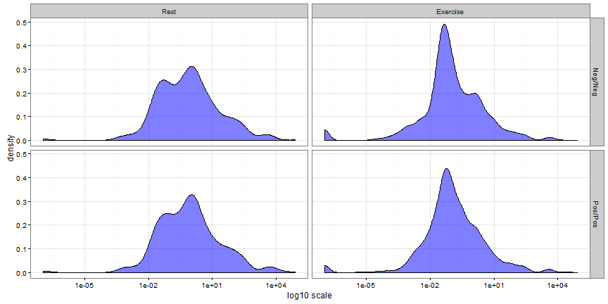
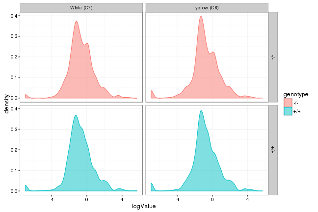

---

# Preamble

Set working directory.


```r
setwd("~/Projects/GillinghamMetabolomics/scripts")
```

Load libraries.


```r
library(readxl)
library(magrittr)
library(dplyr)
```

```
## 
## Attaching package: 'dplyr'
```

```
## The following objects are masked from 'package:stats':
## 
##     filter, lag
```

```
## The following objects are masked from 'package:base':
## 
##     intersect, setdiff, setequal, union
```

```r
library(nlme)
```

```
## 
## Attaching package: 'nlme'
```

```
## The following object is masked from 'package:dplyr':
## 
##     collapse
```

```r
library(ggplot2)
```

Reproducibility steps.


```r
sessionInfo()
```

```
## R version 3.3.1 (2016-06-21)
## Platform: x86_64-redhat-linux-gnu (64-bit)
## Running under: CentOS release 6.8 (Final)
## 
## locale:
##  [1] LC_CTYPE=en_US.iso885915       LC_NUMERIC=C                  
##  [3] LC_TIME=en_US.iso885915        LC_COLLATE=en_US.iso885915    
##  [5] LC_MONETARY=en_US.iso885915    LC_MESSAGES=en_US.iso885915   
##  [7] LC_PAPER=en_US.iso885915       LC_NAME=C                     
##  [9] LC_ADDRESS=C                   LC_TELEPHONE=C                
## [11] LC_MEASUREMENT=en_US.iso885915 LC_IDENTIFICATION=C           
## 
## attached base packages:
## [1] stats     graphics  grDevices utils     datasets  base     
## 
## other attached packages:
## [1] ggplot2_2.1.0     nlme_3.1-128      dplyr_0.5.0       magrittr_1.5     
## [5] readxl_0.1.1      rmarkdown_1.0     knitr_1.14        checkpoint_0.3.16
## 
## loaded via a namespace (and not attached):
##  [1] Rcpp_0.12.7      lattice_0.20-34  digest_0.6.10    assertthat_0.1  
##  [5] plyr_1.8.4       grid_3.3.1       R6_2.1.3         gtable_0.2.0    
##  [9] DBI_0.5-1        formatR_1.4      scales_0.4.0     evaluate_0.9    
## [13] stringi_1.1.1    tools_3.3.1      stringr_1.1.0    munsell_0.4.3   
## [17] colorspace_1.2-6 htmltools_0.3.5  methods_3.3.1    tibble_1.2
```

```r
set.seed(as.integer(as.Date("2016-11-18")))
```

Source user-defined functions.


```r
sapply(list.files("../lib", full.names = TRUE), source)
```

```
##         ../lib/library.R
## value   ?               
## visible FALSE
```

---

# Read data

Import the data.
Data files are locally stored.

Import Aim 1: Exercise data


```r
L1 <- importDataToList("../data/raw/Ultragenyx Aim 1 combined.xlsx")
L1[["file"]]
```

```
## [1] "../data/raw/Ultragenyx Aim 1 combined.xlsx"
```

```r
L1[["nrow"]]
```

```
## [1] 6854
```

```r
L1[["ncol"]]
```

```
## [1] 8
```

```r
L1[["names"]]
```

```
## [1] "id"              "genotype"        "activity"        "chow"           
## [5] "metabolite_type" "metabolite"      "value"           "logValue"
```

```r
L1[["head"]]
```

```
## # A tibble: 6 × 8
##       id genotype activity  chow metabolite_type               metabolite
##    <chr>    <chr>   <fctr> <chr>           <chr>                    <chr>
## 1 1208B       +/+       ex   reg  acylcarnitines                carnitine
## 2 1208B       +/+       ex   reg  acylcarnitines          acetylcarnitine
## 3 1208B       +/+       ex   reg  acylcarnitines       propionylcarnitine
## 4 1208B       +/+       ex   reg  acylcarnitines      isobutyrylcarnitine
## 5 1208B       +/+       ex   reg  acylcarnitines         butyrylcarnitine
## 6 1208B       +/+       ex   reg  acylcarnitines 2-methylbutyrylcarnitine
## # ... with 2 more variables: value <dbl>, logValue <dbl>
```

```r
D1 <- L1[["data"]]
```


```r
L2 <- importDataToList("../data/raw/Ultragenyx Aim 2 combined.xlsx")
L2[["file"]]
```

```
## [1] "../data/raw/Ultragenyx Aim 2 combined.xlsx"
```

```r
L2[["nrow"]]
```

```
## [1] 7436
```

```r
L2[["ncol"]]
```

```
## [1] 8
```

```r
L2[["names"]]
```

```
## [1] "id"              "genotype"        "activity"        "chow"           
## [5] "metabolite_type" "metabolite"      "value"           "logValue"
```

```r
L2[["head"]]
```

```
## # A tibble: 6 × 8
##      id genotype activity       chow metabolite_type
##   <chr>    <chr>   <fctr>      <chr>           <chr>
## 1  1120      -/-       ex White (C7)  acylcarnitines
## 2  1120      -/-       ex White (C7)  acylcarnitines
## 3  1120      -/-       ex White (C7)  acylcarnitines
## 4  1120      -/-       ex White (C7)  acylcarnitines
## 5  1120      -/-       ex White (C7)  acylcarnitines
## 6  1120      -/-       ex White (C7)  acylcarnitines
## # ... with 3 more variables: metabolite <chr>, value <dbl>, logValue <dbl>
```

```r
D2 <- L2[["data"]]
```


## Check data

Check the `value` and `logValue`.


```r
summary(D1$value)
```

```
##     Min.  1st Qu.   Median     Mean  3rd Qu.     Max. 
##     0.00     0.03     0.12    87.51     1.34 81090.00
```

```r
summary(D1$logValue)
```

```
##    Min. 1st Qu.  Median    Mean 3rd Qu.    Max. 
## -6.9550 -1.5010 -0.9060 -0.7525  0.1281  4.9090
```

```r
ggplot(D1) +
  aes(x = logValue, color = genotype, fill = genotype) +
  geom_density(alpha = 1/2) +
  facet_grid(genotype ~ activity) +
  theme_bw()
```




```r
summary(D2$value)
```

```
##     Min.  1st Qu.   Median     Mean  3rd Qu.     Max. 
##      0.0      0.0      0.1    276.5      1.3 494900.0
```

```r
summary(D2$logValue)
```

```
##    Min. 1st Qu.  Median    Mean 3rd Qu.    Max. 
## -6.9550 -1.5100 -0.8891 -0.7612  0.1025  5.6950
```

```r
ggplot(D2) +
  aes(x = logValue, color = genotype, fill = genotype) +
  geom_density(alpha = 1/2) +
  facet_grid(genotype ~ chow) +
  theme_bw()
```




Check experimental design.


```r
table(D1$genotype, D1$metabolite_type)
```

```
##      
##       acylcarnitines amino acids organic acids
##   -/-           1659        1071           714
##   +/+           1659        1071           680
```

```r
table(D1$activity, D1$metabolite_type)
```

```
##              
##               acylcarnitines amino acids organic acids
##   rest                     0           0           646
##   rest/fasted              0        1020             0
##   ex                    3318        1122           748
```

```r
table(D1$chow, D1$metabolite_type)
```

```
##      
##       acylcarnitines amino acids organic acids
##   reg           3318        2142          1394
```


```r
table(D2$genotype, D2$metabolite_type)
```

```
##      
##       acylcarnitines Amino Acids organic acids
##   -/-           1848        1100           770
##   +/+           1848        1100           770
```

```r
table(D2$activity, D2$metabolite_type)
```

```
##              
##               acylcarnitines Amino Acids organic acids
##   rest                     0           0             0
##   rest/fasted              0           0             0
##   ex                    3696        2200          1540
```

```r
table(D2$chow, D2$metabolite_type)
```

```
##              
##               acylcarnitines Amino Acids organic acids
##   White (C7)            1848        1100           770
##   yellow (C8)           1848        1100           770
```

---

# Model


## Aim 1: Exercise

**Rest versus exhaustive exercise**

Estimate model.
Default to `correlation = NULL`, corresponding to no within-group correlations.


```r
fixed <- formula(logValue ~
                   genotype +
                   activity +
                   metabolite_type +
                   genotype * activity +
                   genotype * metabolite_type)
random <- formula(~ 1 | id)
M <- lme(fixed, data = D1, random = random, correlation = NULL)
summary(M)
```

```
## Linear mixed-effects model fit by REML
##  Data: D1 
##        AIC      BIC    logLik
##   23856.84 23938.81 -11916.42
## 
## Random effects:
##  Formula: ~1 | id
##          (Intercept) Residual
## StdDev: 5.141345e-05   1.3738
## 
## Fixed effects: list(fixed) 
##                                               Value  Std.Error   DF
## (Intercept)                              -1.5307847 0.10832785 6799
## genotype+/+                               0.1201729 0.15519865   45
## activityrest/fasted                       0.0991141 0.13289904 6799
## activityex                                0.0531783 0.10294316 6799
## metabolite_typeamino acids                1.4831683 0.06709583 6799
## metabolite_typeorganic acids              1.1334153 0.07863816 6799
## genotype+/+:activityrest/fasted          -0.0770885 0.18958134 6799
## genotype+/+:activityex                   -0.0324641 0.14768670 6799
## genotype+/+:metabolite_typeamino acids   -0.0704755 0.09488783 6799
## genotype+/+:metabolite_typeorganic acids -0.0155407 0.11121115 6799
##                                             t-value p-value
## (Intercept)                              -14.131035  0.0000
## genotype+/+                                0.774316  0.4428
## activityrest/fasted                        0.745785  0.4558
## activityex                                 0.516579  0.6055
## metabolite_typeamino acids                22.105224  0.0000
## metabolite_typeorganic acids              14.413045  0.0000
## genotype+/+:activityrest/fasted           -0.406625  0.6843
## genotype+/+:activityex                    -0.219818  0.8260
## genotype+/+:metabolite_typeamino acids    -0.742724  0.4577
## genotype+/+:metabolite_typeorganic acids  -0.139741  0.8889
##  Correlation: 
##                                          (Intr) gnt+/+ actvt/ actvty
## genotype+/+                              -0.698                     
## activityrest/fasted                      -0.736  0.514              
## activityex                               -0.950  0.663  0.775       
## metabolite_typeamino acids               -0.157  0.109 -0.377  0.000
## metabolite_typeorganic acids             -0.726  0.507  0.483  0.623
## genotype+/+:activityrest/fasted           0.516 -0.741 -0.701 -0.543
## genotype+/+:activityex                    0.662 -0.952 -0.540 -0.697
## genotype+/+:metabolite_typeamino acids    0.111 -0.155  0.267  0.000
## genotype+/+:metabolite_typeorganic acids  0.513 -0.717 -0.341 -0.441
##                                          mtblt_typma mtblt_typra g+/+:/
## genotype+/+                                                            
## activityrest/fasted                                                    
## activityex                                                             
## metabolite_typeamino acids                                             
## metabolite_typeorganic acids              0.216                        
## genotype+/+:activityrest/fasted           0.264      -0.338            
## genotype+/+:activityex                    0.000      -0.435       0.779
## genotype+/+:metabolite_typeamino acids   -0.707      -0.152      -0.374
## genotype+/+:metabolite_typeorganic acids -0.152      -0.707       0.479
##                                          gn+/+: gntyp+/+:mtblt_typma
## genotype+/+                                                         
## activityrest/fasted                                                 
## activityex                                                          
## metabolite_typeamino acids                                          
## metabolite_typeorganic acids                                        
## genotype+/+:activityrest/fasted                                     
## genotype+/+:activityex                                              
## genotype+/+:metabolite_typeamino acids    0.000                     
## genotype+/+:metabolite_typeorganic acids  0.614  0.216              
## 
## Standardized Within-Group Residuals:
##         Min          Q1         Med          Q3         Max 
## -5.09984914 -0.51306654  0.06401784  0.49368065  3.86250922 
## 
## Number of Observations: 6854
## Number of Groups: 47
```

Estimate model.
Specify the correlation structure using `cs`.
Use `corCompSymm`, *compound symmetry structure corresponding to a constant correlation*.


```r
cs <-
  corCompSymm(form = random, fixed = FALSE) %>%
  Initialize(data = D1)
Dim(cs)
```

```
## $N
## [1] 6854
## 
## $M
## [1] 47
## 
## $maxLen
## [1] 164
## 
## $sumLenSq
## [1] 1052486
## 
## $len
## groups
## 1208B   1208B 1207B   1207B 1206B   1206B 1205B   1205B 1204B   1204B 
##     79     85     79     85     79     85     79     85     79     85 
##   1212   1211   1210   1209   1202   1201   1172   1171   1170   1164 
##    164    164    164    164    130    164    164    164    164    164 
##   1163   1151   1150   1135   1134   1095   1094   1092   1091   1090 
##    164    164    164    164    164    164    164    164    164    164 
##   1077   1076   1073   1066   1060   1046   1034   1033   1030   1029 
##    164    164    164    164    164    164    164    164    164    164 
##   1028   1019   1018   1017   1014   1012   1010 
##    164    164    164    164    164    164    164 
## 
## $start
##  [1]    0   79  164  243  328  407  492  571  656  735  820  984 1148 1312
## [15] 1476 1606 1770 1934 2098 2262 2426 2590 2754 2918 3082 3246 3410 3574
## [29] 3738 3902 4066 4230 4394 4558 4722 4886 5050 5214 5378 5542 5706 5870
## [43] 6034 6198 6362 6526 6690
```

```r
M <- lme(fixed, data = D1, random = random, correlation = cs)
summary(M)
```

```
## Linear mixed-effects model fit by REML
##  Data: D1 
##        AIC      BIC    logLik
##   23843.31 23932.11 -11908.65
## 
## Random effects:
##  Formula: ~1 | id
##          (Intercept) Residual
## StdDev: 0.0001499943 1.373532
## 
## Correlation Structure: Compound symmetry
##  Formula: ~1 | id 
##  Parameter estimate(s):
##          Rho 
## -0.004071416 
## Fixed effects: list(fixed) 
##                                               Value  Std.Error   DF
## (Intercept)                              -1.5333593 0.09536617 6799
## genotype+/+                               0.1033359 0.13712279   45
## activityrest/fasted                       0.1022098 0.13309930 6799
## activityex                                0.0585958 0.09284570 6799
## metabolite_typeamino acids                1.4803151 0.06159546 6799
## metabolite_typeorganic acids              1.1336579 0.07323305 6799
## genotype+/+:activityrest/fasted          -0.0719068 0.18925652 6799
## genotype+/+:activityex                   -0.0242793 0.13245286 6799
## genotype+/+:metabolite_typeamino acids   -0.0495536 0.08752971 6799
## genotype+/+:metabolite_typeorganic acids  0.0022855 0.10450047 6799
##                                             t-value p-value
## (Intercept)                              -16.078650  0.0000
## genotype+/+                                0.753601  0.4550
## activityrest/fasted                        0.767921  0.4426
## activityex                                 0.631110  0.5280
## metabolite_typeamino acids                24.032859  0.0000
## metabolite_typeorganic acids              15.480140  0.0000
## genotype+/+:activityrest/fasted           -0.379943  0.7040
## genotype+/+:activityex                    -0.183306  0.8546
## genotype+/+:metabolite_typeamino acids    -0.566135  0.5713
## genotype+/+:metabolite_typeorganic acids   0.021870  0.9826
##  Correlation: 
##                                          (Intr) gnt+/+ actvt/ actvty
## genotype+/+                              -0.696                     
## activityrest/fasted                      -0.834  0.580              
## activityex                               -0.958  0.666  0.858       
## metabolite_typeamino acids                0.014 -0.010 -0.418 -0.186
## metabolite_typeorganic acids             -0.706  0.491  0.513  0.584
## genotype+/+:activityrest/fasted           0.586 -0.836 -0.703 -0.604
## genotype+/+:activityex                    0.671 -0.958 -0.602 -0.701
## genotype+/+:metabolite_typeamino acids   -0.010  0.000  0.294  0.131
## genotype+/+:metabolite_typeorganic acids  0.494 -0.703 -0.359 -0.410
##                                          mtblt_typma mtblt_typra g+/+:/
## genotype+/+                                                            
## activityrest/fasted                                                    
## activityex                                                             
## metabolite_typeamino acids                                             
## metabolite_typeorganic acids              0.081                        
## genotype+/+:activityrest/fasted           0.294      -0.361            
## genotype+/+:activityex                    0.130      -0.410       0.864
## genotype+/+:metabolite_typeamino acids   -0.698      -0.052      -0.406
## genotype+/+:metabolite_typeorganic acids -0.051      -0.697       0.513
##                                          gn+/+: gntyp+/+:mtblt_typma
## genotype+/+                                                         
## activityrest/fasted                                                 
## activityex                                                          
## metabolite_typeamino acids                                          
## metabolite_typeorganic acids                                        
## genotype+/+:activityrest/fasted                                     
## genotype+/+:activityex                                              
## genotype+/+:metabolite_typeamino acids   -0.178                     
## genotype+/+:metabolite_typeorganic acids  0.580  0.094              
## 
## Standardized Within-Group Residuals:
##         Min          Q1         Med          Q3         Max 
## -5.09914690 -0.51494943  0.06254845  0.49551259  3.86496131 
## 
## Number of Observations: 6854
## Number of Groups: 47
```


## Aim 2: Chow

**MCT chow versus experimental chow with triheptanoin**

Estimate model.
Default to `correlation = NULL`, corresponding to no within-group correlations.


```r
fixed <- formula(logValue ~
                   genotype +
                   chow +
                   metabolite_type +
                   genotype * chow +
                   genotype * metabolite_type)
random <- formula(~ 1 | id)
M <- lme(fixed, data = D2, random = random, correlation = NULL)
summary(M)
```

```
## Linear mixed-effects model fit by REML
##  Data: D2 
##        AIC      BIC    logLik
##   26233.49 26302.62 -13106.75
## 
## Random effects:
##  Formula: ~1 | id
##          (Intercept) Residual
## StdDev: 9.091544e-05 1.407474
## 
## Fixed effects: list(fixed) 
##                                               Value  Std.Error   DF
## (Intercept)                              -1.3072088 0.04005958 7388
## genotype+/+                              -0.1382761 0.05665281   40
## chowyellow (C8)                          -0.1224580 0.04616532   40
## metabolite_typeAmino Acids                1.4396406 0.05359902 7388
## metabolite_typeorganic acids              1.0233612 0.06037107 7388
## genotype+/+:chowyellow (C8)               0.0580403 0.06528762   40
## genotype+/+:metabolite_typeAmino Acids    0.0753990 0.07580046 7388
## genotype+/+:metabolite_typeorganic acids  0.1235755 0.08537759 7388
##                                            t-value p-value
## (Intercept)                              -32.63161  0.0000
## genotype+/+                               -2.44076  0.0192
## chowyellow (C8)                           -2.65260  0.0114
## metabolite_typeAmino Acids                26.85946  0.0000
## metabolite_typeorganic acids              16.95118  0.0000
## genotype+/+:chowyellow (C8)                0.88899  0.3793
## genotype+/+:metabolite_typeAmino Acids     0.99470  0.3199
## genotype+/+:metabolite_typeorganic acids   1.44740  0.1478
##  Correlation: 
##                                          (Intr) gnt+/+ ch(C8) mtb_AA
## genotype+/+                              -0.707                     
## chowyellow (C8)                          -0.576  0.407              
## metabolite_typeAmino Acids               -0.499  0.353  0.000       
## metabolite_typeorganic acids             -0.443  0.313  0.000  0.331
## genotype+/+:chowyellow (C8)               0.407 -0.576 -0.707  0.000
## genotype+/+:metabolite_typeAmino Acids    0.353 -0.499  0.000 -0.707
## genotype+/+:metabolite_typeorganic acids  0.313 -0.443  0.000 -0.234
##                                          mtbl_a g+/+:( g+/+:A
## genotype+/+                                                  
## chowyellow (C8)                                              
## metabolite_typeAmino Acids                                   
## metabolite_typeorganic acids                                 
## genotype+/+:chowyellow (C8)               0.000              
## genotype+/+:metabolite_typeAmino Acids   -0.234  0.000       
## genotype+/+:metabolite_typeorganic acids -0.707  0.000  0.331
## 
## Standardized Within-Group Residuals:
##         Min          Q1         Med          Q3         Max 
## -5.03533870 -0.47485373  0.05099419  0.50934516  4.29841962 
## 
## Number of Observations: 7436
## Number of Groups: 44
```

Estimate model.
Specify the correlation structure using `cs`.
Use `corCompSymm`, *compound symmetry structure corresponding to a constant correlation*.


```r
cs <-
  corCompSymm(form = random, fixed = FALSE) %>%
  Initialize(data = D2)
Dim(cs)
```

```
## $N
## [1] 7436
## 
## $M
## [1] 44
## 
## $maxLen
## [1] 169
## 
## $sumLenSq
## [1] 1256684
## 
## $len
## groups
##       1120       1126       1127       1128       1142       1143 
##        169        169        169        169        169        169 
##       1144       1145       1146       1158       1159       1176 
##        169        169        169        169        169        169 
##       1177       1179       1180       1190       1191       1193 
##        169        169        169        169        169        169 
##       1194       1199       1200 1192A/1198       1107       1113 
##        169        169        169        169        169        169 
##       1114       1115       1117       1118       1119       1204 
##        169        169        169        169        169        169 
##       1205       1206       1208       1101       1102       1103 
##        169        169        169        169        169        169 
##       1184       1185       1186       1195       1196       1197 
##        169        169        169        169        169        169 
##       1203 1192/1198B 
##        169        169 
## 
## $start
##  [1]    0   84  168  252  336  420  504  588  672  756  840  924 1008 1092
## [15] 1176 1260 1344 1428 1512 1596 1680 1764 1848 1932 2016 2100 2184 2268
## [29] 2352 2436 2520 2604 2688 2772 2856 2940 3024 3108 3192 3276 3360 3444
## [43] 3528 3612
```

```r
M <- lme(fixed, data = D2, random = random, correlation = cs)
summary(M)
```

```
## Linear mixed-effects model fit by REML
##  Data: D2 
##        AIC      BIC    logLik
##   26233.52 26309.57 -13105.76
## 
## Random effects:
##  Formula: ~1 | id
##          (Intercept) Residual
## StdDev: 0.0002081388 1.407446
## 
## Correlation Structure: Compound symmetry
##  Formula: ~1 | id 
##  Parameter estimate(s):
##          Rho 
## -0.001858115 
## Fixed effects: list(fixed) 
##                                               Value  Std.Error   DF
## (Intercept)                              -1.3195677 0.03418592 7388
## genotype+/+                              -0.1229449 0.05186768   40
## chowyellow (C8)                          -0.1348985 0.03962217   40
## metabolite_typeAmino Acids                1.4723764 0.04954797 7388
## metabolite_typeorganic acids              1.0586409 0.05650870 7388
## genotype+/+:chowyellow (C8)               0.0664998 0.05951222   40
## genotype+/+:metabolite_typeAmino Acids    0.0409294 0.07211022 7388
## genotype+/+:metabolite_typeorganic acids  0.0865998 0.08171472 7388
##                                            t-value p-value
## (Intercept)                              -38.59975  0.0000
## genotype+/+                               -2.37036  0.0227
## chowyellow (C8)                           -3.40462  0.0015
## metabolite_typeAmino Acids                29.71618  0.0000
## metabolite_typeorganic acids              18.73412  0.0000
## genotype+/+:chowyellow (C8)                1.11741  0.2705
## genotype+/+:metabolite_typeAmino Acids     0.56759  0.5703
## genotype+/+:metabolite_typeorganic acids   1.05978  0.2893
##  Correlation: 
##                                          (Intr) gnt+/+ ch(C8) mtb_AA
## genotype+/+                              -0.658                     
## chowyellow (C8)                          -0.546  0.362              
## metabolite_typeAmino Acids               -0.508  0.330  0.002       
## metabolite_typeorganic acids             -0.441  0.287 -0.002  0.231
## genotype+/+:chowyellow (C8)               0.363 -0.570 -0.667  0.000
## genotype+/+:metabolite_typeAmino Acids    0.347 -0.499 -0.003 -0.681
## genotype+/+:metabolite_typeorganic acids  0.304 -0.434  0.000 -0.157
##                                          mtbl_a g+/+:( g+/+:A
## genotype+/+                                                  
## chowyellow (C8)                                              
## metabolite_typeAmino Acids                                   
## metabolite_typeorganic acids                                 
## genotype+/+:chowyellow (C8)               0.003              
## genotype+/+:metabolite_typeAmino Acids   -0.157  0.001       
## genotype+/+:metabolite_typeorganic acids -0.690 -0.003  0.269
## 
## Standardized Within-Group Residuals:
##         Min          Q1         Med          Q3         Max 
## -5.04991618 -0.47538509  0.05242169  0.51131403  4.29105732 
## 
## Number of Observations: 7436
## Number of Groups: 44
```
